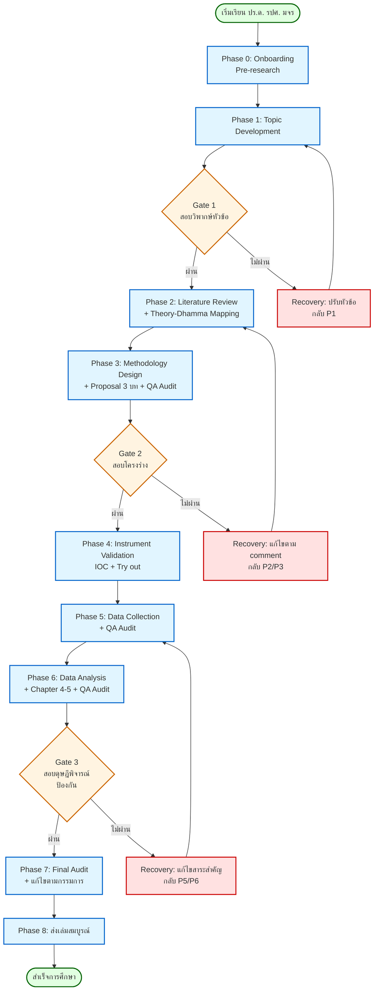
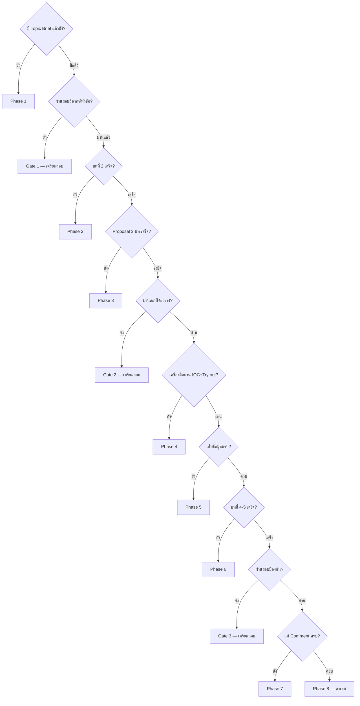

# 00 — Lifecycle Map
## ดุษฎีนิพนธ์ หลักสูตรปรัชญาดุษฎีบัณฑิต สาขาวิชารัฐประศาสนศาสตร์ มจร

**Version:** V01R01 | **Date:** 2026-05-03

---

## 1. Mission of this Reference

ไฟล์นี้คือ **แผนที่นำทาง (Lifecycle Map)** ของการทำดุษฎีนิพนธ์ ปร.ด. รปศ. มจร ตั้งแต่วันแรกที่นิสิตเริ่มเรียน จนถึงวันส่งเล่มสมบูรณ์

Skill จะอ่านไฟล์นี้เมื่อ:
1. เริ่มต้นเซสชันใหม่ (เพื่อ orient ผู้ใช้)
2. ผู้ใช้ถามเชิง Lifecycle ("ขั้นตอนคืออะไร", "ตอนนี้อยู่ Phase ไหน", "ต้องทำอะไรต่อ")
3. ก่อนเขยิบ Phase (เพื่อตรวจ Exit Criteria ของ Phase ปัจจุบัน)
4. หลังพบปัญหา (เพื่อหา Recovery Path)

---

## 2. Architecture Principles (4 หลักการบังคับ)

**(P1) 9 Phase + 3 Stage Gate**
9 Phase เรียงเป็นเส้นตรง คั่นด้วย Stage Gate 3 จุดที่เป็นการสอบกับกรรมการ — Gate ผ่านแล้วเขยิบ ไม่ผ่านต้อง Recovery

**(P2) Continuous QA Loop**
Format Audit + Fact Audit + AI Detection **ฝังที่ทุก Phase** ไม่รอท้าย — หลักการ "Quality Built-In, Not Inspected-In"

**(P3) Bidirectional NotebookLM Integration**
ตั้งแต่ Phase 2 เป็นต้นไป ผู้ใช้ใช้ NotebookLM คู่กับ Skill — Claude ออก prompt, ผู้ใช้ paste output กลับ, Skill เก็บใน corpus

**(P4) Theory-Dhamma Mapping เป็นหัวใจ**
ทุก Phase ที่เกี่ยวกับเนื้อหา (1, 2, 3, 6) ต้องผ่าน Mapping Layer — ทฤษฎี รปศ. คู่กับหลักพุทธธรรม + อ้างเลขพระไตรปิฎกถูก

---

## 3. Master Lifecycle Diagram

---

## 4. Continuous QA Layer (รันที่ทุก Phase)

ก่อนปิดทุก Phase ต้องผ่าน 3 Audit ดังนี้

| Audit | สิ่งที่ตรวจ | Reference |
|-------|-------------|-----------|
| **Format Audit** | TH SarabunPSK, ขนาด, ขอบ, เลขหน้า, เชิงอรรถ, บรรณานุกรม | `08-template-audit.md` + `11-citation-footnote.md` |
| **Fact Audit** | Citation มีจริง, ตัวเลขสอดคล้องผลจริง, ไม่มี Hallucination | `09-fact-audit.md` |
| **AI Detection** | AI Score < threshold, Voice Profile ตรง, ไม่มี AI Vocabulary | `10-ai-detection.md` + `07-academic-thai-voice.md` |

**กฎเหล็ก:** หาก Audit ใด FAIL → ห้ามเขยิบ Phase จนกว่าจะ FIX

---

## 5. Phase Detail (9 Phase + 3 Gate)

### PHASE 0 — Onboarding / Pre-research
**Mission:** ตั้งสถานะนักศึกษาและเตรียมเครื่องมือก่อนเริ่มงานวิจัย

**Entry Criteria:**
- ผู้ใช้เป็นนิสิต ปร.ด. รปศ. มจร (Track 2.1)
- เริ่มเซสชันใหม่กับ Skill หรือ project-state.json ว่างเปล่า

**Activities:**
1. ยืนยัน Track, ปีที่, อาจารย์ที่ปรึกษา (ถ้ามี)
2. ติดตั้ง NotebookLM และเชื่อมโยง corpus
3. สร้าง `state/project-state.json` ฉบับเริ่มต้น
4. ทำความเข้าใจคู่มือการเขียนดุษฎีนิพนธ์ฯ มจร 2563

**Outputs:**
- `state/project-state.json` (initialized)
- บัญชี NotebookLM พร้อมใช้
- Reading list คู่มือฯ + ระเบียบวิธีวิจัยขั้นสูง

**QA Audit:** ไม่มี (ยังไม่มี deliverable)

**Exit Criteria:**
- project-state.json มีข้อมูลพื้นฐานครบ
- ผู้ใช้พร้อมเข้าสู่ Phase 1

**Common Pitfalls:** ไม่อ่านคู่มือฯ ก่อนเริ่ม → ไปติดกฎที่ Phase 3-6

---

### PHASE 1 — Topic Development
**Mission:** กำหนดหัวข้อ, Research Question 3 ข้อ, ตัวแปรเบื้องต้น และเหตุผลของการวิจัย

**Entry Criteria:**
- ผ่าน Phase 0
- มีพื้นที่สนใจการวิจัยเบื้องต้น (Research Interest)

**Activities:**
1. ใช้กรอบ "ศึกษาอะไร / กับใคร / ที่ไหน" สร้างชื่อเรื่อง
2. เขียน Working Title 3-5 ทางเลือก
3. กำหนด RQ 3 ข้อที่สอดคล้องกัน
4. ระบุ IV/DV เบื้องต้น
5. หาเหตุผล "Why Now / Why Here / Why Buddhist Integration"
6. ตรวจซ้ำกับฐาน TDC + ดุษฎีนิพนธ์เดิม มจร ว่าหัวข้อไม่ซ้ำ

**Outputs:**
- Topic Brief (1-2 หน้า)
- ชื่อเรื่องอนุมัติเบื้องต้น
- RQ 3 ข้อ + วัตถุประสงค์ 3 ข้อ
- ตัวแปรเบื้องต้น

**QA Audit:**
- Format: Topic Brief พิมพ์ตามมาตรฐาน TH SarabunPSK
- Fact: หัวข้อไม่ซ้ำ TDC + ไม่ซ้ำ มจร
- AI: Topic Brief ผ่าน AI Detection

**Exit Criteria:** Topic Brief พร้อมยื่นสอบวิพากษ์หัวข้อ

---

### GATE 1 — สอบวิพากษ์หัวข้อ (Topic Critique)
**Nature:** Turning Point จุดหักเหสำคัญ — แยกออกจากการสอบโครงร่าง

**Required Deliverables:**
- Topic Brief 1-2 หน้า
- Working Title พร้อมเหตุผล
- RQ 3 ข้อ + วัตถุประสงค์ 3 ข้อ
- ตัวแปรเบื้องต้น
- เหตุผล Why Buddhist Integration

**Common Reasons for Failure:**
1. หัวข้อกว้างเกินไป (ไม่เห็น "เฉพาะที่ไหน")
2. ทับซ้อนงานวิจัยเดิมโดยไม่เพิ่มมุม
3. RQ ไม่สามารถตอบได้เชิงประจักษ์
4. หาตัวแปรในกรอบทฤษฎีไม่ได้
5. การบูรณาการพุทธธรรมเป็นเพียงเปลือก

**Sample Committee Questions:**
- "หัวข้อนี้ใหม่ตรงไหน เมื่อเทียบกับ X (2563), Y (2564)?"
- "ตัวแปรต้น 4 ด้านนี้ ที่มาจากทฤษฎีของใคร?"
- "หลักธรรมที่บูรณาการ ตรงกับเรื่องอย่างไร? ไม่ใช่แค่ใส่ลงไป?"
- "ทำไมต้องวิจัยพื้นที่นี้ ไม่ใช่พื้นที่อื่น?"

**Recovery Path (ถ้าไม่ผ่าน):**
1. รับคำแนะนำจากกรรมการ (commenting layer)
2. แก้ไขตาม Comment ที่ระบุชัดที่สุด
3. ปรับ Topic Brief ให้ตอบประเด็นกรรมการ
4. กลับเข้า Phase 1 → ยื่นสอบวิพากษ์รอบใหม่

---

### PHASE 2 — Literature Review + Theory-Dhamma Mapping
**Mission:** สังเคราะห์วรรณกรรมครอบคลุมทุกตัวแปร + จับคู่ทฤษฎี รปศ. กับหลักพุทธธรรม

**Entry Criteria:**
- ผ่าน Gate 1 — สอบวิพากษ์หัวข้อ
- หัวข้ออนุมัติแล้ว

**Activities:**
1. รวบรวมวรรณกรรมเข้า NotebookLM (ดุษฎีนิพนธ์ มจร ≥ 60% + งานวิจัยอื่น + บทความวิจัย)
2. แต่ละหัวข้อย่อยมีอ้างอิง ≥ 5 แหล่ง
3. ใช้ NotebookLM Bidirectional → Claude ออก prompt → user paste output → corpus
4. Map ตัวแปรกับหลักพุทธธรรม (load `04-pa-dhamma-mapping.md`)
5. อ้างเลขพระไตรปิฎกฉบับ มจร (เล่ม/ข้อ/หน้า)
6. สร้างกรอบแนวคิด (Conceptual Framework) แผนภาพ + ลูกศร IV→DV
7. ทุกตัวแปรในกรอบต้องมาจากทบทวนในบทนี้เท่านั้น

**Outputs:**
- บทที่ 2 ฉบับร่าง (มจร อ้างอิง ≥ 60%)
- ตารางสรุปท้ายแต่ละหัวข้อย่อย
- Theory-Dhamma Mapping Table
- กรอบแนวคิดในการวิจัย (แผนภาพ)
- `state/notebooklm-corpus.md` updated

**QA Audit:**
- Format: เชิงอรรถ 14pt indent 0.7 นิ้ว, ตารางสรุปทุกหัวข้อ
- Fact: ทุก Citation มีจริง, มจร ≥ 60%, พระไตรปิฎกเลขถูกต้อง
- AI: เนื้อหาผ่าน AI Detection, ไม่มี AI Vocabulary

**Exit Criteria:**
- บทที่ 2 ครบทุกตัวแปร + ตารางสรุป + กรอบแนวคิด
- มจร อ้างอิง ≥ 60% ตรวจแล้ว
- พร้อมส่ง Phase 3

---

### PHASE 3 — Methodology Design + Proposal (3 บท) + QA Audit
**Mission:** ออกแบบระเบียบวิธีวิจัย + ร่าง Proposal 3 บท พร้อมส่งสอบโครงร่าง

**Entry Criteria:** ผ่าน Phase 2

**Activities:**
1. เลือกรูปแบบวิจัย: Mixed Methods (Default ปร.ด. รปศ. มจร) หรือ Qualitative อย่างเดียว
2. กำหนดผู้ให้ข้อมูลสำคัญ (Mixed: ≥ 17 / Qual: ≥ 25)
3. กำหนดผู้ทรงคุณวุฒิสนทนากลุ่มเฉพาะ 8-12 รูป/คน
4. กำหนดผู้เชี่ยวชาญตรวจเครื่องมือ 5 รูป/คน (ภายนอก ≥ 2)
5. ออกแบบเครื่องมือ (แบบสัมภาษณ์, แบบสอบถาม) ให้ครบทุกตัวแปร
6. กำหนดประชากร + กลุ่มตัวอย่าง + วิธีสุ่ม
7. ร่างบทที่ 1 (บทนำ) + บทที่ 2 (Lit Review) + บทที่ 3 (Methodology) — ฉบับ Proposal
8. **QA Audit (Format/Fact/AI) ทั้ง Proposal**

**Outputs:**
- Proposal 3 บท ฉบับร่าง
- รายชื่อผู้เชี่ยวชาญ + ผู้ให้ข้อมูลสำคัญ
- เครื่องมือวิจัยฉบับร่าง

**QA Audit:**
- Format: ครบทุกหัวข้อย่อยตามคู่มือ มจร, เลขหน้าถูก
- Fact: นิยามศัพท์ไม่มีอ้างอิง, มจร ≥ 60%, RQ = วัตถุประสงค์ จำนวนเท่ากัน
- AI: บทที่ 1-3 ผ่าน AI Detection ทั้งหมด

**Exit Criteria:** Proposal พร้อมส่งกรรมการสอบโครงร่าง

---

### GATE 2 — สอบโครงร่าง (Proposal Defense)
**Required Deliverables:**
- บทที่ 1, 2, 3 ฉบับสมบูรณ์ (Proposal)
- เครื่องมือวิจัย (ร่าง)
- รายชื่อผู้เชี่ยวชาญ
- กรอบแนวคิด

**Required Comment Processing:**
ที่ Gate นี้ กรรมการจะให้ Comment เป็นเอกสารแนบ — Skill ต้องช่วยผู้ใช้
1. รับ Comment file (ผู้ใช้แนบมา)
2. จำแนกเป็น Major/Minor/Editorial
3. แมป Comment กลับ Section ใน Proposal
4. ร่างคำตอบ (Response to Reviewer)
5. แก้ไข Proposal ตาม Comment
6. ส่งเวอร์ชันแก้ไขกลับ

**Common Reasons for Failure:**
1. นิยามศัพท์มีอ้างอิง
2. มจร อ้างอิง < 60%
3. คำถามวิจัย ≠ จำนวนวัตถุประสงค์
4. สมมติฐานไม่ทดสอบทางสถิติได้
5. กรอบแนวคิดมีตัวแปรไม่ตรงกับบทที่ 2
6. ผู้เชี่ยวชาญ < 5 หรือไม่มีภายนอก
7. เครื่องมือไม่ครบทุกตัวแปร
8. ขนาดกลุ่มตัวอย่างคำนวณผิด

**Sample Committee Questions:**
- "ทำไมต้องใช้ Mixed Methods? Qualitative อย่างเดียวไม่พอหรือ?"
- "ผู้ให้ข้อมูล 17 คน เลือกอย่างไร ครอบคลุมไหม?"
- "เครื่องมือสัมภาษณ์ตอบ RQ ข้อ 2 ตรงไหน?"
- "ตัวแปรนี้สังเคราะห์จากใคร? ทำไมไม่ใช้ของ Y?"

**Recovery Path:**
1. แยก Comment เป็น Must-fix / Should-fix / Nice-to-have
2. แก้ Must-fix ก่อน → re-audit ทั้ง 3 บท
3. ถ้า Comment เกี่ยวกับ Methodology → กลับ Phase 3
4. ถ้า Comment เกี่ยวกับ Lit Review → กลับ Phase 2
5. ยื่นสอบโครงร่างรอบใหม่

---

### PHASE 4 — Instrument Validation (IOC + Try out)
**Mission:** ตรวจสอบคุณภาพเครื่องมือก่อนใช้เก็บข้อมูลจริง

**Entry Criteria:** ผ่าน Gate 2 — สอบโครงร่าง

**Activities:**
1. ส่งเครื่องมือให้ผู้เชี่ยวชาญ 5 รูป/คน (ภายนอก ≥ 2, ครอบ 3 ด้าน: เนื้อหา, ระเบียบวิธี, พุทธ/ปฏิบัติ)
2. คำนวณค่า IOC (เกณฑ์ ≥ 0.50 รายข้อ)
3. แก้ไขเครื่องมือตามผู้เชี่ยวชาญ
4. Try out 30 ชุด กับกลุ่มใกล้เคียง (สำหรับเชิงปริมาณ)
5. คำนวณค่า Reliability (Cronbach's Alpha ≥ 0.70)
6. ปรับเครื่องมือฉบับสุดท้าย

**Outputs:**
- เครื่องมือฉบับ Final
- ตาราง IOC + ผลแก้ไข
- ผล Try out + Cronbach's Alpha
- หนังสือเชิญผู้เชี่ยวชาญ + ผลตอบรับ

**QA Audit:**
- Format: ตาราง IOC ตามมาตรฐาน
- Fact: ค่า IOC, Alpha จากคำนวณจริง
- AI: รายงานผลตรวจไม่มี AI Voice

**Exit Criteria:** เครื่องมือ Final ผ่านเกณฑ์คุณภาพทั้ง Validity + Reliability

---

### PHASE 5 — Data Collection + QA Audit
**Mission:** เก็บข้อมูลจริงตามแผน Methodology

**Entry Criteria:** ผ่าน Phase 4

**Activities:**
1. เก็บข้อมูลเชิงคุณภาพ — สัมภาษณ์เชิงลึก ≥ 17 (Mixed) / ≥ 25 (Qual)
2. เก็บข้อมูลเชิงปริมาณ — แจกแบบสอบถามตามขนาดกลุ่มตัวอย่าง
3. สนทนากลุ่มเฉพาะ 8-12 รูป/คน — มีอาจารย์ประจำหลักสูตร ≥ 1
4. บันทึก audio + ถอดเทป + ทำ field note
5. นำเข้า NotebookLM (ถ้าต้องการสกัดประเด็น)
6. **QA Audit ทุกชุดข้อมูล** ก่อนเก็บถัดไป

**Outputs:**
- ไฟล์เสียง + ถอดเทปทุกราย
- แบบสอบถามตอบกลับครบ + คำนวณ Response Rate
- Field Notes
- รายชื่อผู้ให้ข้อมูลพร้อมหลักฐานความหลากหลาย

**QA Audit (รันทุกชุดข้อมูล):**
- Format: ถอดเทปตามมาตรฐาน, anonymization PII
- Fact: ผู้ให้ข้อมูลตรงตามที่กำหนด, ผู้ทรงคุณวุฒิไม่ซ้ำกับสัมภาษณ์
- AI: ถอดเทปจากเสียงจริง ไม่ใช่สรุปด้วย AI

**Exit Criteria:** ข้อมูลครบทุกกลุ่ม + ผ่าน Audit

---

### PHASE 6 — Data Analysis + Chapter 4-5 + QA Audit
**Mission:** วิเคราะห์ข้อมูล + เขียนบทที่ 4 (ผลวิเคราะห์) และบทที่ 5 (สรุป-อภิปราย-ข้อเสนอแนะ)

**Entry Criteria:** ผ่าน Phase 5

**Activities:**
1. วิเคราะห์เชิงคุณภาพ — Content Analysis, Thematic, ตามที่ระบุใน Methodology
2. วิเคราะห์เชิงปริมาณ — Descriptive + Inferential ตามที่ระบุ
3. เขียนบทที่ 4: นำเสนอผล + ตารางความถี่/แผนภาพ + องค์ความรู้ (≥ 3 หน้า) + สังเคราะห์ (≥ 2 หน้า)
4. เขียนบทที่ 5: สรุปรวม + อภิปรายเชื่อมบทที่ 2 + ข้อเสนอแนะ 3 ระดับ
5. **QA Audit แต่ละบท** ก่อนรวมเป็นเล่ม

**Outputs:**
- บทที่ 4 ฉบับร่าง
- บทที่ 5 ฉบับร่าง
- แผนภาพองค์ความรู้
- แผนภาพองค์ความรู้สังเคราะห์ (เชิงนวัตกรรม)
- ดุษฎีนิพนธ์ฉบับครบ 5 บท

**QA Audit:**
- Format: ตาราง+แผนภาพตามคู่มือ, สรุป OMF บทคัดย่อ ≤ 2 หน้า
- Fact: **ผลวิจัยจากสัมภาษณ์/แบบสอบถามจริงเท่านั้น** (ห้ามจากหนังสือ), อ้างงานวิจัย ป.เอก ใน Discussion
- AI: ทั้ง 5 บท + บทคัดย่อผ่าน AI Detection

**Exit Criteria:** ดุษฎีนิพนธ์ครบ 5 บท พร้อมส่งสอบป้องกัน

---

### GATE 3 — สอบดุษฎีพิจารณ์ / สอบป้องกัน (Final Defense)
**Required Deliverables:**
- ดุษฎีนิพนธ์ฉบับครบ 5 บท
- บทคัดย่อ OMF ≤ 2 หน้า ไทย+อังกฤษ
- ภาคผนวก (เครื่องมือ, รายชื่อผู้ให้ข้อมูล, IOC, Cronbach's Alpha)
- บรรณานุกรม
- ประวัติผู้วิจัย

**Comment Processing:**
1. รับ Comment file จากกรรมการ
2. จำแนก Major/Minor/Editorial
3. แมป Comment กลับ Section
4. ร่าง Response to Reviewer
5. แก้ไข + Re-audit (Format/Fact/AI)
6. ส่งเล่มที่แก้

**Common Reasons for Failure:**
1. ผลวิจัยบทที่ 4 ดึงจากหนังสือ (ห้าม)
2. องค์ความรู้ < 3 หน้า + สังเคราะห์ < 2 หน้า
3. อภิปรายผลไม่เชื่อมบทที่ 2
4. อ้างงานวิจัยปริญญาโทใน Discussion (ห้าม — ต้อง ป.เอก)
5. บทคัดย่อ > 2 หน้า
6. ข้อเสนอแนะ 3 ระดับไม่สอดคล้องผลจริง
7. หลักธรรมในข้อสรุปไม่ตรงกับที่ใช้ในบทที่ 2
8. Format Compliance ตก (TH SarabunPSK, ขอบ, เชิงอรรถ)

**Sample Committee Questions:**
- "ผลในตารางที่ 4.3 มาจากผู้ให้ข้อมูลกี่ราย? ตรงกับ Methodology ไหม?"
- "องค์ความรู้ที่สังเคราะห์ใหม่ ใหม่ตรงไหนเมื่อเทียบกับบทที่ 2?"
- "ข้อเสนอแนะเชิงนโยบายข้อนี้ — มาจากผลข้อใด?"
- "หลักธรรม X ในบทที่ 2 ปรากฏในบทที่ 4-5 อย่างไร?"
- "ทำไมไม่อภิปรายเชื่อมกับ Y (2566) ที่อ้างใน 2.4?"

**Recovery Path:**
1. แยก Comment ตามความสำคัญ
2. ถ้า Comment เกี่ยวข้อมูล → ตรวจ raw data, อาจต้องเก็บเพิ่ม → กลับ Phase 5
3. ถ้า Comment เกี่ยวการวิเคราะห์ → กลับ Phase 6
4. ถ้า Comment เกี่ยว Discussion → แก้บทที่ 5
5. Re-audit ทั้งเล่ม + ยื่นสอบรอบใหม่

---

### PHASE 7 — Final Audit + แก้ไขตามกรรมการ
**Mission:** ปรับปรุงตาม Comment กรรมการ + Final QA ก่อนส่งเล่มสมบูรณ์

**Entry Criteria:** ผ่าน Gate 3

**Activities:**
1. รวบรวม Comment กรรมการทุกคน
2. ทำ Response Matrix (Comment → Section → Action → Page)
3. แก้ไขทุกจุดที่ระบุ
4. **Full QA Audit ทั้งเล่ม** (Format/Fact/AI)
5. ตรวจ Cross-reference (อ้างอิงในเนื้อหา ↔ บรรณานุกรม)
6. ตรวจ Pagination + ปก + สารบัญ + สารบัญตาราง + สารบัญแผนภาพ

**Outputs:**
- Response Matrix (สำหรับกรรมการ)
- ดุษฎีนิพนธ์ฉบับสมบูรณ์ผ่าน QA

**QA Audit:**
- Format: ครบทุกหัวข้อมาตรฐาน มจร 100%
- Fact: ทุก Citation cross-checked, ไม่มี dead reference
- AI: AI Score ต่ำกว่า threshold ทั้งเล่ม

**Exit Criteria:** เล่มผ่าน QA ทั้ง 3 มิติ + Comment Resolution Matrix ครบ

---

### PHASE 8 — ส่งเล่มสมบูรณ์
**Mission:** ส่งเล่มสมบูรณ์ตามรูปแบบที่บัณฑิตวิทยาลัย มจร กำหนด

**Entry Criteria:** ผ่าน Phase 7

**Activities:**
1. รับลายเซ็นกรรมการสอบ + อาจารย์ที่ปรึกษา
2. แปลงเป็น PDF/A สำหรับส่ง E-Thesis
3. ส่งเล่มกระดาษตามจำนวนที่กำหนด (พิมพ์หน้าเดียว A4 80 แกรม)
4. ส่งไฟล์เข้าระบบ TDC + คลังของ มจร
5. รับใบรับรองการส่งเล่ม

**Outputs:**
- เล่มกระดาษส่งบัณฑิตวิทยาลัย
- PDF/A E-Thesis
- หลักฐานส่ง TDC + คลัง มจร

**QA Audit:** ไม่มี (เล่มถือเป็น Final State)

**Exit Criteria:** หลักฐานการส่งครบทุกช่องทาง

**Note:** Publication (บทความวิจัย) ไม่อยู่ในขอบเขตของ Skill นี้ — ใช้ Skill อื่น (`agj-academic-article` หรือ `soc-sci-academic-article`) แทน

---

## 6. Decision Tree (Mermaid + Lookup Table)

### 6.1 Mermaid: "ผมอยู่ Phase ไหน?"

### 6.2 Lookup Table: "ผมต้องทำอะไร?"

| Signal จากผู้ใช้ | Phase ปัจจุบัน | ต้องโหลด Reference | Action ถัดไป |
|---|---|---|---|
| "เพิ่งเข้าเรียน" | P0 | `00-lifecycle-map.md` | ตั้ง project-state.json |
| "ตั้งหัวข้อ", "เลือกประเด็น" | P1 | `02-topic-development.md` | สร้าง Topic Brief 3 ทางเลือก |
| "เตรียมสอบหัวข้อ" | G1 | `02-topic-development.md` + ส่วนนี้ | Sample Q + Recovery |
| "ทบทวนวรรณกรรม", "บทที่ 2" | P2 | `03-literature-review.md` + `04-pa-dhamma-mapping.md` | สังเคราะห์ + Mapping |
| "ระเบียบวิธี", "บทที่ 3", "Mixed Methods" | P3 | `05-methodology-design.md` + `06-writing-standard.md` | ออกแบบ + ร่าง |
| "เตรียมสอบโครงร่าง", "comment proposal" | G2 | ส่วนนี้ + `09-fact-audit.md` | Comment processing |
| "ตรวจเครื่องมือ", "IOC", "Try out" | P4 | `05-methodology-design.md` | คำนวณ IOC + Alpha |
| "เก็บข้อมูล", "สัมภาษณ์", "แบบสอบถาม" | P5 | `05-methodology-design.md` | กำกับการเก็บ |
| "วิเคราะห์ข้อมูล", "บทที่ 4", "บทที่ 5" | P6 | `06-writing-standard.md` + templates | เขียน + Audit |
| "เตรียมสอบป้องกัน", "comment final" | G3 | ส่วนนี้ + `09-fact-audit.md` | Comment processing |
| "แก้ตามกรรมการ" | P7 | ทุก reference + `08-template-audit.md` | Full Audit |
| "ส่งเล่ม", "E-Thesis" | P8 | `08-template-audit.md` | Format Final |

---

## 7. Master Pitfall Library (12 ข้อ)

> **หมายเหตุ:** ตารางนี้เป็น Master Index — รายละเอียด Common Mistakes จากการรีวิวจริง (เชิง Phase-specific) อยู่ในแต่ละ MD ของ Phase นั้น (02, 03, 05, 06, 08, 09, 11) และ Cross-cutting Pattern อยู่ใน `12-common-review-mistakes.md`

| # | Pitfall | Phase | Severity | Signal | Fix |
|---|---------|-------|----------|--------|-----|
| 1 | นิยามศัพท์มีอ้างอิง | P3, G2 | Critical | พบเชิงอรรถใน 1.6 | ลบอ้างอิง — นิยามต้องเป็นของผู้วิจัยเอง |
| 2 | มจร อ้างอิง < 60% ในบทที่ 2 | P2 | Critical | นับร้อยละ มจร ในบรรณานุกรมบทที่ 2 | เพิ่มอ้างอิงดุษฎีนิพนธ์ มจร |
| 3 | ผลวิจัยบทที่ 4 ดึงจากหนังสือ | P6, G3 | Critical | พบเชิงอรรถหนังสือใน 4.x | ลบ — ใช้เฉพาะสัมภาษณ์/แบบสอบถามจริง |
| 4 | อ้างงานวิจัย ป.โท ในบทที่ 2/5 | P2, P6 | Critical | ตรวจ degree ของอ้างอิง | แทนด้วย ป.เอก หรือบทความวิจัย |
| 5 | RQ ≠ จำนวนวัตถุประสงค์ | P1, P3 | Critical | นับข้อ | ปรับให้เท่ากัน (โดยทั่วไป 3) |
| 6 | สมมติฐานไม่ทดสอบทางสถิติได้ | P3 | Critical | ตรวจ Verb (เปรียบเทียบ/ความสัมพันธ์/ส่งผล) | เขียนใหม่ให้ทดสอบได้ |
| 7 | กรอบแนวคิดมีตัวแปรไม่ตรงกับบทที่ 2 | P2, P3 | Critical | Cross-check IV/DV กับ 2.x | ลบหรือเพิ่มทบทวนให้ครอบ |
| 8 | ผู้ให้ข้อมูล < 17 (Mixed) / < 25 (Qual) | P3, G2 | Critical | นับใน 3.2.1 | เพิ่มจนถึงเกณฑ์ |
| 9 | ผู้เชี่ยวชาญ < 5 หรือไม่มีภายนอก ≥ 2 | P3, G2 | Critical | ตรวจรายชื่อ | เพิ่มผู้เชี่ยวชาญภายนอก |
| 10 | Try out < 30 ชุด | P4 | Critical | ตรวจรายงาน Reliability | เพิ่มจนครบ 30 |
| 11 | บทคัดย่อ > 2 หน้า | P6, G3 | Major | นับจำนวนหน้าบทคัดย่อ | บีบ OMF ให้กระชับ |
| 12 | องค์ความรู้ < 3 หน้า + สังเคราะห์ < 2 หน้า | P6, G3 | Major | นับหน้าใน 4.3.1 + 4.3.2 | ขยายเนื้อหา |

---

## 8. Stage Gate Recovery Playbook (สรุป)

| Gate | ไม่ผ่านเพราะ | กลับไปที่ | เวลาประมาณ |
|------|--------------|-----------|------------|
| Gate 1 | หัวข้อกว้าง / ซ้ำ / RQ ตอบไม่ได้ | Phase 1 | 2-4 สัปดาห์ |
| Gate 2 | Methodology / Lit Review / Format | Phase 2 หรือ 3 | 1-3 เดือน |
| Gate 3 | ผลวิเคราะห์ / Discussion / Format | Phase 5 หรือ 6 | 1-6 เดือน |

**กฎเหล็ก Recovery:**
1. อย่าตอบ Comment ทันทีในห้องสอบ — รอเป็นลายลักษณ์อักษร
2. แยก Major / Minor / Editorial
3. ถาม Advisor ก่อนตอบ Comment ที่ไม่เห็นด้วย
4. Re-audit (Format/Fact/AI) ทั้งเล่มก่อนยื่นใหม่

---

## 9. Routing Map ออกจากไฟล์นี้

| สถานการณ์ | Load Reference ถัดไป |
|-----------|---------------------|
| ต้องการเข้า Phase 1 | `02-topic-development.md` |
| ต้องการ NotebookLM workflow | `01-notebooklm-protocol.md` |
| ต้องการเข้า Phase 2 | `03-literature-review.md` + `04-pa-dhamma-mapping.md` |
| ต้องการเข้า Phase 3 | `05-methodology-design.md` + `06-writing-standard.md` |
| ต้องการเขียน chapter | `06-writing-standard.md` + `templates/chapter-X.md` |
| ต้องการอ้างอิง/เชิงอรรถ | `11-citation-footnote.md` |
| ต้องการ AI Detection | `07-academic-thai-voice.md` + `10-ai-detection.md` |
| ต้องการ Format Audit | `08-template-audit.md` |
| ต้องการ Fact Audit | `09-fact-audit.md` |
| ต้องการ Pre-defense Checklist | `12-common-review-mistakes.md` |

---

## 10. Versioning

**Version:** V01R01
**Date:** 2026-05-03
**Source:**
- คู่มือการเขียนดุษฎีนิพนธ์ฯ มจร (กันยายน 2563)
- ระเบียบวิธีวิจัยขั้นสูงทาง รปศ. และ รศ.
- ตัวอย่างวิจัยบทที่ 1-5 (PPTX)
**Update Rule:** Minor edit → V01R02; Major rewrite → V02R01
