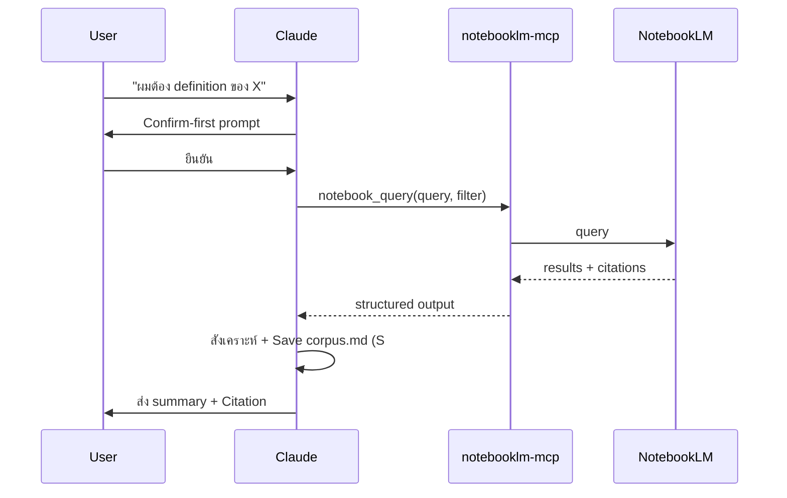
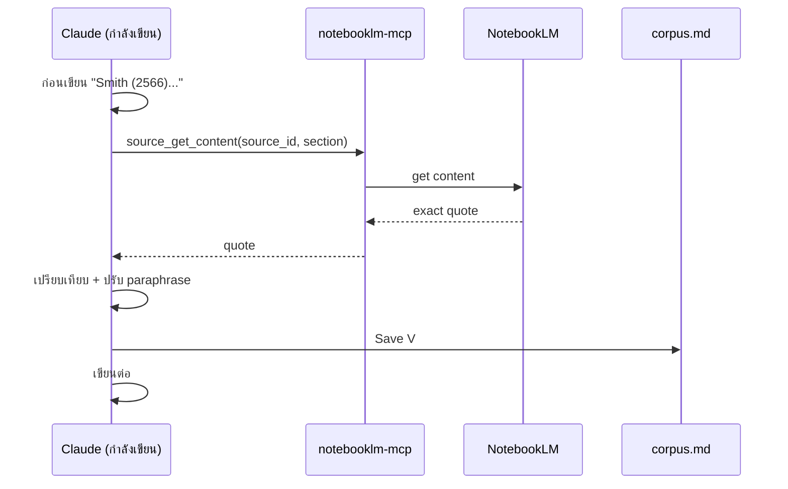
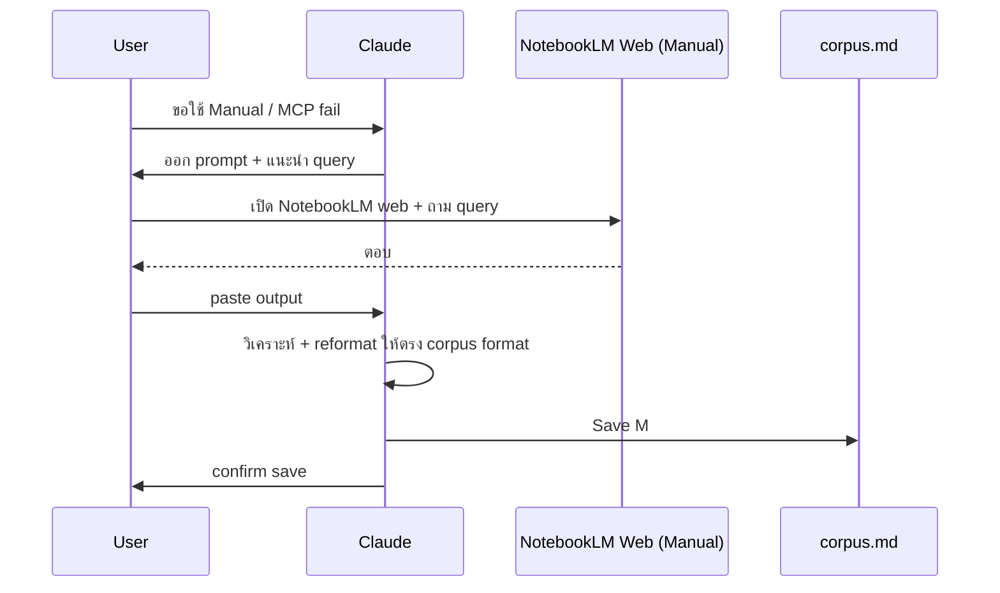

# 01 — NotebookLM Protocol
## Bidirectional MCP-first Workflow สำหรับดุษฎีนิพนธ์ ปร.ด. รปศ. มจร

**Version:** V01R01 | **Date:** 2026-05-03

---

## 1. Mission

ไฟล์นี้กำหนด **Protocol การทำงานร่วมกันระหว่าง Claude ↔ NotebookLM** ผ่าน Custom MCP `notebooklm-mcp` เพื่อให้

- การค้นวรรณกรรมมี Citation Traceability ทุกครั้ง
- Claude ไม่สร้าง Citation ลอย ๆ (Anti-Hallucination)
- Cross-session knowledge ถูกเก็บใน Corpus File
- Process ตอบโจทย์ Bidirectional 3 Use Case ที่ผู้ใช้อนุมัติ

Skill จะอ่านไฟล์นี้เมื่อ
1. ผู้ใช้กล่าวถึง "NotebookLM", "ค้น corpus", "ถามจาก notebook", "MCP"
2. Claude ต้องค้นวรรณกรรมก่อนเขียน (Phase 2 เป็นต้นไป)
3. ก่อน Verify Citation ใน Fact Audit
4. เมื่อต้องการสร้าง Studio Artifact (Mind Map, Briefing) จาก Notebook

---

## 2. Architecture (Dual Path)

```
USER REQUEST
    ↓
Claude (อ่าน Skill)
    ↓
[Decision] Route Selection
    ├── PRIMARY PATH: MCP
    │   Claude → notebooklm-mcp → NotebookLM Cloud
    │   (programmatic, traceable, fast)
    │
    └── RECOMMENDED ALTERNATIVE: Manual
        Claude ออก prompt → User เปิด NotebookLM web → User paste กลับ
        (ใช้เมื่อ MCP ขัดข้อง / ผู้ใช้สั่ง / งานที่ต้องการ Human Review ก่อน)
    ↓
ทั้งสอง path → Save to corpus.md
```

**กฎเหล็ก:** ทั้งสองทางต้องจบที่ `state/notebooklm-corpus.md` เสมอ — Single Source of Truth

**MCP Path เป็น Primary** เพราะ traceable + ไม่ต้อง copy-paste manual
**Manual Path เป็น Recommended Alternative** เมื่อ
- MCP ไม่พร้อมใช้งาน (server down / no auth)
- ผู้ใช้ต้องการ Human Review output ก่อน save
- งาน sensitive ที่ผู้ใช้อยากเห็น UI ของ NotebookLM ก่อน
- การทดสอบ prompt ก่อน automate

---

## 3. Single Notebook Strategy

ผู้ใช้เลือกแบบ "Notebook เดียว แต่มี Section/Chapter ผ่าน label/tag"

### 3.1 Notebook Structure

| Notebook | ประเภท Source | Tag/Label |
|----------|--------------|-----------|
| `phd-mcu-pa-dissertation-corpus` (เดียว) | ดุษฎีนิพนธ์ มจร | `mcu-thesis` |
| | งานวิจัยอื่น (TDC) | `external-thesis` |
| | บทความวารสาร | `journal-article` |
| | เอกสารหน่วยงานเป้าหมาย | `target-org` |
| | พระไตรปิฎกฉบับ มจร | `tipitaka-mcu` |
| | หนังสือ ป.อ. ปยุตฺโต | `payutto` |
| | ทฤษฎี รปศ. (textbook) | `pa-theory` |

### 3.2 Section/Chapter Scope ใน Query

เวลาค้น Claude จะระบุ scope ผ่าน MCP filter
- ค้นเฉพาะดุษฎีนิพนธ์ มจร: `notebook_query(query=..., filter={tags:["mcu-thesis"]})`
- ค้นเฉพาะหลักธรรม: `notebook_query(query=..., filter={tags:["tipitaka-mcu","payutto"]})`
- ค้นทุก source: `notebook_query(query=...)` (no filter)

### 3.3 Notebook Initialization Workflow (ครั้งแรก)

ผู้ใช้สั่ง "Setup NotebookLM ของฉัน" → Claude เรียก
1. `notebook_create(name="phd-mcu-pa-dissertation-corpus")`
2. `source_add(...)` — เพิ่ม source ทีละไฟล์
3. `label(source_id, label="...")` — Tag แต่ละ source
4. `notebook_describe(notebook_id)` — Verify

---

## 4. MCP Tool Mapping (Use Case → Tool)

### 4.1 Use Case 2 — Extract Specific Points

**Goal:** Claude ออก prompt เจาะจง → MCP query → ได้ข้อมูล → สังเคราะห์

**Tool ที่ใช้:** `notebook_query(notebook_id, query, filter)` หรือ `notebook_query_start` + `notebook_query_status` (สำหรับ query หนัก)

**Workflow:**
```
1. User: "ผมต้อง definition ของ Good Governance จาก UNDP, World Bank"
2. Claude: "ผมจะค้น NotebookLM เรื่อง 'Good Governance นิยาม UNDP World Bank' ในกลุ่ม external-thesis และ journal-article ยืนยันหรือไม่"
3. User: "OK"
4. Claude → MCP: notebook_query(query="Good Governance นิยาม UNDP World Bank",
                                  filter={tags:["external-thesis","journal-article"]})
5. MCP returns: 5 results with citations
6. Claude: สังเคราะห์ + Save to corpus.md
7. Claude: "ผมพบ 5 แหล่ง สรุป + Citation เก็บไว้ใน corpus แล้ว"
```

### 4.2 Use Case 3 — Verify Citation

**Goal:** ก่อน Claude เขียน "ตามที่ Smith (2566) ระบุ..." ต้อง Verify quote จริง

**Tool ที่ใช้:** `source_get_content(source_id, page_or_section)` หรือ `notebook_query` พร้อม source filter

**Workflow:**
```
1. Claude กำลังเขียนบทที่ 2: "ตามที่ Smith (2566) ระบุว่า..."
2. Claude หยุด → ดู Pre-Write Verify Rule
3. Claude → MCP: source_get_content(source_id="smith-2566", section="page 23")
4. MCP returns: exact quote
5. Claude เปรียบเทียบ: ที่ตั้งใจเขียน vs quote จริง
6. ถ้าไม่ตรง → ปรับ paraphrase ให้ตรงเจตนา
7. Save Quote + Source to corpus.md (UC-3 entry)
```

### 4.3 Use Case 4 — Corpus Storage

**Goal:** ทุก output จาก MCP ที่จะใช้ในเล่ม → save ลง `state/notebooklm-corpus.md`

**Format:** ดู Section 6 ด้านล่าง

**Trigger:** Auto save หลังทุก MCP query ที่จะใช้ใน chapter

---

## 5. Trigger Rules

### 5.1 Confirm-first (Default)

เกือบทุก MCP call → Claude ขออนุญาตก่อน

**Template:**
```
"ผมจะ <action> ผ่าน NotebookLM ดังนี้
- Tool: notebook_query
- Query: '<query>'
- Filter: <filter>
- Expected Output: <expected>
ยืนยันหรือไม่ครับ?"
```

### 5.2 Manual Only (Heavy Operations)

Tool เหล่านี้ Claude **ห้ามเรียกอัตโนมัติ** ต้องให้ผู้ใช้สั่งเฉพาะ

| Tool | เหตุผล |
|------|--------|
| `research_start` | Deep Research ใช้เวลานาน + token เยอะ |
| `cross_notebook_query` | ข้าม notebook หลายอัน |
| `batch` / `pipeline` | Multi-step workflow ต้อง user oversight |
| `studio_create` (Audio/Video/Mind Map) | สร้าง artifact ใหญ่ |
| `notebook_delete` / `source_delete` | Destructive |
| `notebook_share_*` | Privacy |

### 5.3 No-Confirm (Read-only Light)

Tool เหล่านี้ Claude เรียกได้โดยไม่ต้องถาม (ไม่กระทบสถานะ)

| Tool | เหตุผล |
|------|--------|
| `notebook_list` | List only |
| `notebook_get` (metadata) | Read only |
| `source_describe` | Read only |
| `server_info` | Health check |

---

## 6. Corpus Format Specification

ไฟล์: `state/notebooklm-corpus.md`

### 6.1 File Structure

```markdown
# NotebookLM Corpus
## ดุษฎีนิพนธ์ ปร.ด. รปศ. มจร — Pichai

**Last Updated:** YYYY-MM-DD HH:mm
**Notebook:** phd-mcu-pa-dissertation-corpus
**Total Searches:** N
**Total Sources Cited:** M

---

## Index by Chapter Section

| Chapter Section | Search IDs |
|-----------------|------------|
| 1.1 ความเป็นมา | S001, S003 |
| 2.1 หลักธรรม | S002, S005 |
| 2.3 IV1 (Spencer) | S004, S007 |
| ... | ... |

---

## Search Entries

### S001 — 2026-05-03 14:30 — "Good Governance นิยาม UNDP World Bank"
**Type:** UC-2 Extract Specific Points
**MCP Call:**
\`\`\`
notebook_query(
  notebook_id="phd-mcu-pa-dissertation-corpus",
  query="Good Governance นิยาม UNDP World Bank",
  filter={tags:["external-thesis","journal-article"]}
)
\`\`\`
**Sources Returned:** 5 / 5 ที่ใช้ในเล่ม
**Linked Section:** บทที่ 1.1 ความเป็นมา + บทที่ 2.3.1
**Status:** ✅ Verified | ⏳ Pending

#### Result 1
**Source ID (in notebook):** src_undp_1997
**Citation (มาตรฐาน มจร):** UNDP, *Good Governance Framework*, (New York: UNDP, 1997), หน้า 12
**Quote (ภาษาต้นฉบับ):**
> "Good governance is participatory, consensus-oriented, accountable, transparent, responsive, effective and efficient, equitable and inclusive, and follows the rule of law."
**คำแปล/สรุปโดย Claude:**
ธรรมาภิบาล ตามนิยาม UNDP มี 8 องค์ประกอบ ได้แก่ การมีส่วนร่วม, การหาฉันทามติ, ความรับผิดชอบ, ความโปร่งใส, การตอบสนอง, ประสิทธิผล + ประสิทธิภาพ, ความเสมอภาค + การมีส่วนร่วม, และการปฏิบัติตามหลักนิติธรรม
**Use Plan:**
- บทที่ 1.1 — ใช้เป็น context ความสำคัญ
- บทที่ 2.3.1 — ใช้เป็นนิยาม IV ของ Good Governance
**Cited in Footnote:** เชิงอรรถที่ 12 บทที่ 2

#### Result 2
...

---

### S002 — 2026-05-03 15:10 — "ทศพิธราชธรรม 10 ประการ ความหมายแต่ละข้อ"
**Type:** UC-2 Extract Specific Points
**MCP Call:**
\`\`\`
notebook_query(
  query="ทศพิธราชธรรม ความหมาย",
  filter={tags:["payutto","tipitaka-mcu"]}
)
\`\`\`
...

---

## Verify Citation Log (UC-3)

### V001 — 2026-05-03 16:45
**Context:** Claude กำลังเขียน "ตามที่ พระพรหมคุณาภรณ์ (ป.อ. ปยุตฺโต) ระบุไว้ในธรรมนูญชีวิต..."
**MCP Call:**
\`\`\`
source_get_content(
  source_id="payutto-dhamma-life",
  section="หน้า 45-48"
)
\`\`\`
**Quote ที่ดึงมา:**
> [Exact quote from source]
**ผลการเปรียบเทียบ:**
✅ ตรง — เขียนต่อได้
🟡 ไม่ตรงเล็กน้อย — ปรับ paraphrase
❌ ไม่ตรง — ต้องเขียนใหม่
**Action Taken:**
[What Claude did after verification]

---

## Manual Path Entries

### M001 — 2026-05-03 17:00 — [Manual]
**Method:** Manual paste from NotebookLM Web
**Original Query:** "..."
**User-pasted Output:**
> [exact paste]
**Status:** ✅ Verified | ⏳ Pending
**Note:** ไม่มี source_id เพราะ paste เข้ามา — ผู้ใช้รับรองความถูกต้องของ paste
```

### 6.2 Field Definitions

| Field | คำอธิบาย | Required |
|-------|----------|----------|
| `Search ID` | S### (MCP) / V### (Verify) / M### (Manual) | ✓ |
| `Timestamp` | YYYY-MM-DD HH:mm | ✓ |
| `Query/Topic` | คำถามที่ส่ง MCP / paste กลับ | ✓ |
| `Type` | UC-2 / UC-3 / UC-4 / Manual | ✓ |
| `MCP Call` | Code block ของ tool call (เฉพาะ MCP path) | MCP only |
| `Sources Returned` | จำนวน + จำนวนที่ใช้ | ✓ |
| `Linked Section` | บทที่/ข้อย่อยที่จะใช้ | ✓ |
| `Status` | Verified / Pending | ✓ |
| `Source ID` | ID ใน notebook | MCP only |
| `Citation (มาตรฐาน มจร)` | รูปแบบเชิงอรรถ มจร | ✓ |
| `Quote` | ตัวอักษรต้นฉบับ | ✓ |
| `คำแปล/สรุป` | โดย Claude | ✓ |
| `Use Plan` | จะใช้ใน chapter ใด | ✓ |
| `Cited in Footnote` | เลขเชิงอรรถจริงในเล่ม | After write |

### 6.3 Status Lifecycle

```
[Pending] → MCP query สำเร็จ แต่ยังไม่ได้ใช้ในเล่ม
    ↓
[Verified] → ใช้แล้ว และตรวจ Citation ตรงกับ source
```

**หมายเหตุ:** ไม่กำหนด Stale Threshold เพราะข้อมูลที่ใช้ในงานวิจัยเป็นข้อมูลที่ผ่านการเลือกแล้ว ไม่ต้องการ expire อัตโนมัติ — จะ re-verify ก็ต่อเมื่อมีเหตุผลเฉพาะ (เช่น ผู้ใช้ update source)

---

## 7. Use Case Workflows (รายละเอียด)

### 7.1 Workflow A — Extract Specific Points (UC-2)



### 7.2 Workflow B — Verify Citation (UC-3)



### 7.3 Workflow C — Corpus Storage (UC-4)

ฝังใน Workflow A และ B — ทุก MCP call ที่ผลลัพธ์จะใช้ในเล่ม → save `S###` หรือ `V###`

### 7.4 Workflow D — Manual Path (Recommended Alternative)



---

## 8. MCP Quality Rules

(บังคับใช้ทุก MCP call)

**(R1) Confirm-first** สำหรับ Tool ใน Section 5.1
**(R2) Filter-first** ใช้ tag/label filter ทุกครั้งที่เป็นไปได้ — ลด token, เพิ่มความตรงประเด็น
**(R3) Save Always** — ทุก MCP query ต้อง save ลง corpus.md ทันที (ไม่ทิ้ง)
**(R4) Citation Format** — Citation ใน corpus.md ใช้รูปแบบ มจร เสมอ ไม่ใช่ APA หรืออื่น
**(R5) Quote Verbatim** — Quote ที่ดึงจาก MCP ต้องเป็นตัวอักษรต้นฉบับ ห้ามแก้ไข
**(R6) Translate Separately** — คำแปล/สรุปโดย Claude แยกจาก Quote ชัดเจน
**(R7) Status Tracking** — ทุก entry มี Status (Pending/Verified)

---

## 9. MCP Anti-patterns (ห้ามทำ)

**(A1) Auto-call Heavy Tools**
ห้ามเรียก `research_start`, `cross_notebook_query`, `batch`, `pipeline`, `studio_create` โดยไม่ขออนุญาต

**(A2) Skip Confirm**
ห้ามข้าม Confirm-first สำหรับ Tool ใน Section 5.1 แม้ผู้ใช้จะเร่ง

**(A3) Citation Fabrication**
ห้ามสร้าง Citation จากความจำของ Claude — ทุก Citation ต้องมี Search ID อ้างใน corpus.md

**(A4) Quote Modification**
ห้ามแก้ไข Quote เพื่อให้สอดคล้องกับเนื้อหา — ปรับ paraphrase ของผู้วิจัยแทน

**(A5) Skip Save**
ห้ามใช้ output จาก MCP โดยไม่ save ลง corpus.md

**(A6) Notebook Mutation Without Permission**
ห้ามเรียก `notebook_delete`, `source_delete`, `source_rename` โดยไม่ได้รับคำสั่งชัดเจน

**(A7) Cross-notebook ที่ไม่จำเป็น**
ห้ามใช้ `cross_notebook_query` ถ้า single notebook query ตอบโจทย์ได้

**(A8) Studio Generation ที่ไม่ได้สั่ง**
ห้ามสร้าง Audio/Video/Mind Map โดย user ไม่ได้ขอ — ใช้ token หนัก

---

## 10. Manual Path Workflow (Recommended Alternative)

(เลือกใช้เมื่อ MCP ไม่พร้อม / ผู้ใช้สั่ง / งานที่ต้องการ Human Review)

**ขั้นตอน:**
1. Claude ตรวจสอบ: `server_info()` — ถ้า fail หรือผู้ใช้ขอ Manual
2. Claude แจ้ง: "ผมจะใช้ Manual Path ครับ"
3. Claude ออก prompt สำหรับ User เปิด NotebookLM web ด้วยตนเอง:
   ```
   "กรุณาเปิด NotebookLM → Notebook ของท่าน → ถามคำถามนี้:
    [QUERY ที่ Claude แนะนำ]
   แล้ว paste คำตอบกลับมาให้ผม"
   ```
4. User paste output
5. Claude วิเคราะห์ + reformat + Save to corpus.md (Type: Manual, ID: M###)
6. Status ใน corpus.md: ตามที่ผู้ใช้รับรอง (Pending หรือ Verified)

**Manual Entry Format:** ดู Section 6.1 — `M001`

---

## 11. Security & Privacy

**(S1) ไฟล์ส่วนตัว** — ไม่ใส่ Source ที่มี PII โดยไม่ anonymize ก่อน
**(S2) Credential** — Claude ไม่ขอ/ไม่เก็บ MCP credential — ผู้ใช้ตั้งค่าผ่าน Claude Code config
**(S3) Sharing** — ห้ามเรียก `notebook_share_public` โดยไม่ได้รับคำสั่ง
**(S4) Audit Log** — corpus.md เก็บ MCP calls ทั้งหมด เพื่อ Audit

---

## 12. Routing Map ออกจากไฟล์นี้

| สถานการณ์ | Load Reference ถัดไป |
|-----------|---------------------|
| ค้นเสร็จ → เขียนบทที่ 2 | `03-literature-review.md` |
| ค้นเสร็จ → จับคู่หลักธรรม | `04-pa-dhamma-mapping.md` |
| Verify Citation ก่อนเขียน | `09-fact-audit.md` |
| Citation รูปแบบ มจร | `11-citation-footnote.md` |
| ขั้นตอน Phase ปัจจุบัน | `00-lifecycle-map.md` |

---

## 13. Versioning

**Version:** V01R01
**Date:** 2026-05-03
**Source:**
- ผู้ใช้ระบุ MCP `notebooklm-mcp` (35+ tools, 8 categories)
- ตัวอย่าง tool: notebook_query, source_get_content, cross_notebook_query, research_start, studio_create, label, tag
**Update Rule:**
- เมื่อ MCP มี Tool ใหม่ → เพิ่มใน Section 4
- เมื่อ Use Case เพิ่ม → เพิ่มใน Section 7
- Minor edit → V01R02; Major rewrite → V02R01
