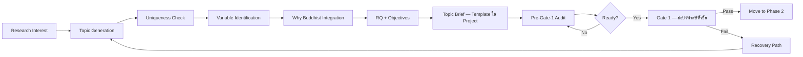
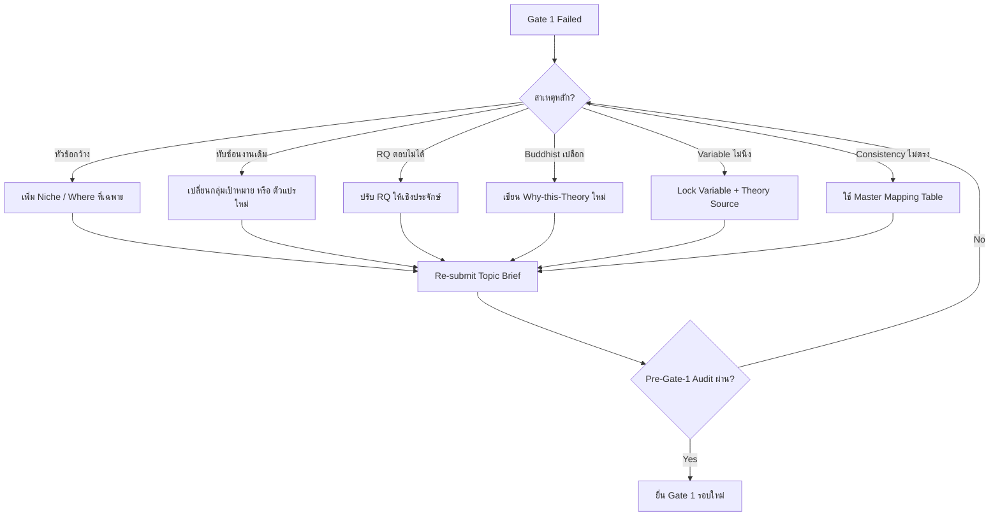

# 02 — Topic Development
## Phase 1 — การพัฒนาหัวข้อดุษฎีนิพนธ์ + เตรียม Gate 1 (สอบวิพากษ์หัวข้อ)

**Version:** V01R01 | **Date:** 2026-05-03

---

## 1. Mission

ไฟล์นี้เป็น Practical Toolkit สำหรับ Phase 1 ของ Lifecycle — ตั้งหัวข้อ → กำหนด RQ → กำหนดตัวแปรเบื้องต้น → ตรวจ uniqueness → เตรียมสอบวิพากษ์หัวข้อ

**Boundary (สำคัญ):**
- ไฟล์นี้ให้ **Process Knowledge + Common Mistakes + Toolkit**
- ไฟล์นี้ **ไม่มี Topic Brief Template** — Template อยู่ในชั้น Claude Project ของผู้ใช้
- Claude **ไม่สร้าง Template ให้ใหม่** เมื่อผู้ใช้มีอยู่แล้ว — ใช้ของผู้ใช้เป็นหลัก

Skill จะอ่านไฟล์นี้เมื่อ
1. ผู้ใช้กล่าวถึง "ตั้งหัวข้อ", "เลือกประเด็น", "research question", "วัตถุประสงค์", "ตัวแปร"
2. กำลังเตรียมสอบวิพากษ์หัวข้อ ("Gate 1", "สอบวิพากษ์", "เตรียมสอบหัวข้อ")
3. หลัง Gate 1 ไม่ผ่าน — ต้อง Recovery

---

## 2. Phase 1 Workflow Overview



---

## 3. Topic Generation — Conceptual Framework

ใช้กรอบ **"ศึกษาอะไร / กับใคร / ที่ไหน"** ซึ่งอาจารย์หลักสูตรเน้นเป็นกรอบหลัก (PPTX สไลด์ 17)

### 3.1 The Three Anchors

| Anchor | คำถาม | ตัวอย่าง (Illustration จากหัวข้อผู้ใช้) |
|--------|------|------------------------------------|
| **What** (ศึกษาอะไร) | ปรากฏการณ์/ตัวแปรหลักที่จะศึกษา | "การพัฒนาสมรรถนะเชิงพุทธ" |
| **With Whom** (กับใคร) | กลุ่มเป้าหมาย/ผู้ที่จะได้รับผลกระทบ | "บุคลากรมหาวิทยาลัยในกำกับของรัฐ" |
| **Where** (ที่ไหน) | บริบท/พื้นที่/หน่วยงาน | "มหาวิทยาลัยในกำกับของรัฐ" |

**หัวข้อที่ดี = What + With Whom + Where ครบทั้ง 3 + มี Buddhist Integration ชัดเจน**

### 3.2 Topic Quality Indicators

✅ **Strong Topic Signals:**
- เห็น "เฉพาะที่ไหน" ชัด (ไม่กว้างเกิน)
- ตัวแปรอ้างอิงทฤษฎีจริงได้
- Buddhist Integration ตรงประเด็น ไม่ใช่เปลือก
- ตอบได้เชิงประจักษ์ (ไม่ใช่ปรัชญาอย่างเดียว)
- ไม่ซ้ำงานเดิม + เพิ่มมุมใหม่

❌ **Weak Topic Signals:**
- กว้างเกินไป (เช่น "การพัฒนาประเทศไทย")
- ทับซ้อนงานเดิมโดยไม่เพิ่มมุม
- RQ ตอบไม่ได้เชิงประจักษ์ (เช่น "ทำไมจักรวาลมีอยู่")
- Buddhist Integration เป็นเพียงคำเปลือก (ใส่เพื่อให้ดูพุทธ)
- ตัวแปรหาทฤษฎีรองรับไม่ได้

---

## 4. Common Mistakes Library (20 Checkpoints)

ตรวจทุกครั้งก่อนยื่นสอบวิพากษ์หัวข้อ — สกัดจากการรีวิวจริง + Note อาจารย์

### 4.1 Topic & Title Layer

**[CP-1] ความยาวบทนำเกินหรือสั้นเกิน** [High]
- ✗ เขียน 3 หน้า (สั้น) หรือ 8 หน้า (ยาว)
- ✓ ความเป็นมา + ความสำคัญ รวมกัน 4-5 หน้า (ไม่เกิน 6)
- *Source: Checklist บทที่ 1.1.4*

**[CP-2] เนื้อหาไม่ Flow ไม่นำไปสู่คำถามวิจัย** [Critical]
- ✗ เขียนแต่ละย่อหน้าโดดๆ ไม่เชื่อมกัน
- ✓ Transition sentence เชื่อมทุกย่อหน้า + เรียงจากใหญ่→เล็ก + จบที่ Research Question
- *Source: Checklist 1.1.4*

**[CP-3] หน้าแรกความเป็นมาขาดเชิงอรรถ** [High]
- ✗ หน้าแรกของบทนำไม่มี Citation
- ✓ หน้าแรก ≥ 1-2 เชิงอรรถ
- *Source: Excel Note R6*

**[CP-4] Justify ไม่ชิดสองข้าง** [High]
- ✗ จัดกลาง / ชิดซ้ายอย่างเดียว
- ✓ Justify both sides ทุกย่อหน้า ห้ามจัดกลาง
- *Source: Excel Note R5*

### 4.2 Research Question / Objectives Layer

**[CP-5] วัตถุประสงค์ไม่ขึ้นต้นด้วย "เพื่อ"** [High]
- ✗ "ศึกษา..." / "วิเคราะห์..."
- ✓ "เพื่อศึกษา..." / "เพื่อวิเคราะห์..." / "เพื่อนำเสนอ..."
- *Source: Checklist 1.2.2*

**[CP-6] โครงสร้างวัตถุประสงค์ไม่ตรงรูปแบบ มจร** [Critical]
- ✓ ข้อ 1: เพื่อศึกษา [DV ของท่านเอง]
- ✓ ข้อ 2: เพื่อศึกษาปัจจัยที่ส่งผลต่อ [DV] — หลังคำว่า "ต่อ" คือ DV ของเรา
- ✓ ข้อ 3: เพื่อนำเสนอ [Output ของงาน เช่น รูปแบบ/แนวทาง/ข้อเสนอ]
- *Source: Excel Note R10*

**[CP-7] คำถามวิจัย ≠ จำนวนวัตถุประสงค์** [Critical]
- ✗ คำถามวิจัย 4 ข้อ แต่วัตถุประสงค์ 3
- ✓ จำนวนเท่ากัน (โดยทั่วไป 3) แต่ละข้อตอบกัน
- *Source: คู่มือ มจร P1.2*

**[CP-8] คำถามวิจัยรวมตัวแปรไม่ชัดเจน** [High]
- ✗ "ปัจจัยและสมรรถนะ ส่งผลต่อ Y อย่างไร" (รวม 2 IV ในคำถามเดียว)
- ✓ แยกเป็น 2 ข้อ หรือปรับให้ตัวแปรชัด
- *Source: Checklist P-บทที่ 1*

### 4.3 Variable Layer

**[CP-9] ที่มาของตัวแปรไม่ชัด** [Critical]
- ✗ "มี" ตัวแปรลอย ๆ
- ✓ ระบุที่มาแต่ละตัว (X1, X2, Y) พร้อมอ้างอิงนักวิชาการ/ทฤษฎีต้นทาง
- *Source: Excel Note R15*

**[CP-10] ตัวแปรในขอบเขตไม่ตรงกรอบบทที่ 2** [Critical]
- ✗ ขอบเขตเขียน 4 ด้าน แต่กรอบมี 5 ด้าน
- ✓ ตัวแปร X1, X2, Y ทุกตัวต้องตรงกัน 100%
- *Source: Excel Note R13 + Cross-H1, H2, H3*

**[CP-11] ตัวแปรตามไม่มีคำขยาย** [High]
- ✗ "การเรียนรู้เทคโนโลยีดิจิทัล" (ลอย)
- ✓ "การเรียนรู้เทคโนโลยีดิจิทัล ได้แก่ (สมรรถนะ ก, สมรรถนะ ข, ...)"
- *Source: Excel Note R16*

**[CP-12] ใช้ "ตัวแปรอิสระ"/"ตัวแปรต้น" สลับ** [High]
- ✗ ใช้สลับกันในเอกสารเดียวกัน
- ✓ เลือกชื่อเดียวใช้ตลอดทั้งฉบับ
- *Source: Excel Note R11*

### 4.4 Definition Layer

**[CP-13] นิยามศัพท์ไม่ consistency กับกรอบ** [Critical]
- ✗ กรอบเป็น "อิทธิบาท ๔" แต่นิยามใช้ชื่อต่างกัน
- ✓ ชื่อตัวแปรในนิยาม = ในกรอบ = ในสมมติฐาน 100%
- *Source: Excel Note R17 + Cross-H1*

**[CP-14] นิยามศัพท์มีอ้างอิง** [Critical]
- ✗ มีเชิงอรรถใน 1.6
- ✓ นิยามต้องเป็นของผู้วิจัยเอง ห้ามมีอ้างอิงใด ๆ
- *Source: คู่มือ มจร P1.6*

**[CP-15] คำสำคัญใส่ "หมายถึง..." ผิด** [High]
- ✗ Keyword ใส่ "หมายถึง..." (จะต้องสอดคล้องแบบสอบถามทุกตัว)
- ✓ Keyword ไม่ต้องใส่ / ตัวแปรหลักใส่ความหมาย (โครงสร้าง/รูปแบบ/ระบบ)
- *Source: Excel Note R18*

### 4.5 Hypothesis & Scope Layer

**[CP-16] สมมติฐานไม่ทดสอบทางสถิติได้** [Critical]
- ✗ "การวิจัยจะค้นพบว่า..." (เป็นข้อสรุปไม่ใช่สมมติฐาน)
- ✓ "เปรียบเทียบ..." / "ความสัมพันธ์ระหว่าง...กับ..." / "ปัจจัยที่ส่งผลต่อ..."
- *Source: คู่มือ มจร P1.5*

**[CP-17] สมมติฐานมากกว่าจำนวนชุดตัวแปรต้น** [High]
- ✗ มี IV 2 ชุด แต่สมมติฐาน 3 ข้อ
- ✓ สมมติฐาน = จำนวนชุด IV ที่ทดสอบ
- *Source: Checklist P-บทที่ 1*

**[CP-18] ขอบเขตประชากรไม่ชัดเจน** [High]
- ✗ "บุคลากรของมหาวิทยาลัย" (ไม่บอกชนิด)
- ✓ "บุคลากรของมหาวิทยาลัยในกำกับของรัฐ X แห่ง = N คน" + อ้างอิงข้อมูล
- *Source: Excel Note R14*

### 4.6 Cross-cutting

**[CP-19] เลข sub-section ไม่ตามลำดับชั้น** [Medium]
- ✗ 1.3 ลูกน้อง 1.2
- ✓ ไล่ลำดับชั้น 1.1 → 1.2 → 1.3 + ภายใน 1.1 → 1.1.1 → 1.1.2
- *Source: Excel Note R12*

**[CP-20] Consistency Chain ไม่ตรง** [CRITICAL]
- ✗ ขอบเขต ≠ สมมติฐาน ≠ นิยาม ≠ กรอบ
- ✓ Variable Consistency Chain: ขอบเขต → สมมติฐาน → นิยาม → กรอบ ตรงกันทุกจุด
- *Source: Excel Note R19 + Cross-H6, XL-50*

---

## 5. Why Buddhist Integration (Why-this-Theory)

ก่อน Gate 1 ผู้วิจัยต้องเขียนย่อหน้า **"Why-this-Theory"** ในความสำคัญของปัญหาและในกรอบแนวคิด — อย่างน้อย 1 ย่อหน้า

**Template Question (ที่ผู้วิจัยต้องตอบในย่อหน้านี้):**
1. หลักธรรมที่เลือก คืออะไร (ระบุชื่อหมวดธรรม + หมวดย่อย)
2. ทำไมหลักธรรมนี้ ไม่ใช่อื่น (หลักธรรมมี 80,000 พระธรรมขันธ์)
3. หลักธรรมนี้เชื่อมโยงกับปรากฏการณ์ที่ศึกษาอย่างไร (ไม่ใช่แค่ใส่ลงไป)
4. มีนักวิชาการ/งานวิจัยใดที่เคยใช้หลักธรรมนี้ในบริบทใกล้เคียง

**ตัวอย่าง Illustration (จากหัวข้อท่าน — การพัฒนาสมรรถนะเชิงพุทธ):**
- หลักธรรม: อิทธิบาท ๔ (ฉันทะ วิริยะ จิตตะ วิมังสา)
- เหตุผลที่เลือก: อิทธิบาท ๔ เป็นหลักของความสำเร็จในการเรียนรู้และพัฒนาสมรรถนะ ตรงกับ DV "การเรียนรู้เทคโนโลยีดิจิทัล" ที่ต้องการแรงขับเคลื่อนภายใน
- เชื่อมโยง: ฉันทะ = ความพอใจในการเรียนรู้ดิจิทัล / วิริยะ = ความเพียรในการฝึกฝน / จิตตะ = ความใส่ใจระหว่างเรียน / วิมังสา = การไตร่ตรองเพื่อปรับปรุง
- งานวิจัยที่เคยใช้: [ระบุ ต้องค้นจาก NotebookLM]

**ห้าม:**
- ใส่หลักธรรมแบบ "ใส่เพราะเป็นงาน มจร"
- เลือกหลักธรรมก่อนเข้าใจปรากฏการณ์
- ใช้หลักธรรมหลายหมวดผสมกันโดยไม่จัดลำดับ

---

## 6. Uniqueness Check Workflow (3-Tier)

ก่อนยืนยันหัวข้อ ต้องตรวจ uniqueness ผ่าน 3 ช่องทาง

### 6.1 Tier 1 — Internet Search (Web Search)

**ขออนุญาตก่อน:**
```
"ผมขอตรวจ uniqueness ของหัวข้อผ่าน Web Search ครับ
- Query: '[หัวข้อ + keyword หลัก]'
- ขอบเขต: Global + Thailand
- แหล่ง: Google Scholar, ResearchGate, ดุษฎีนิพนธ์ออนไลน์
ยืนยันหรือไม่?"
```

ผลที่คาดหวัง: รายชื่องานวิจัย 10-20 ชิ้นที่ใกล้เคียง

### 6.2 Tier 2 — TDC (ฐานข้อมูลวิทยานิพนธ์ไทย)

**Manual:** ผู้ใช้เปิด https://tdc.thailis.or.th → ค้นด้วย Keyword → แจ้งผลกลับ

**Output ที่ต้องเก็บ:**
- จำนวนงานในฐาน TDC ที่ใกล้เคียง
- ชื่อ + ปี + มหาวิทยาลัย ของ Top 5 ที่ใกล้สุด
- จุดที่ทับซ้อน + จุดที่งานใหม่ของเราต่าง

### 6.3 Tier 3 — NotebookLM Corpus Check

**ใช้ MCP `notebook_query`:**
```
notebook_query(
  query="[หัวข้อ + keyword]",
  filter={tags:["mcu-thesis","external-thesis"]}
)
```

ผลที่คาดหวัง: source ใน corpus ที่ทับซ้อน + การวิเคราะห์ gap

### 6.4 Uniqueness Decision Matrix

| ผลการตรวจ | การตัดสินใจ |
|----------|-------------|
| ไม่พบงานใกล้เคียง | ✅ Topic Confirmed |
| พบงานใกล้เคียง 1-3 ชิ้น แต่ต่างมุม | ⚠️ ระบุความต่างให้ชัด → Confirmed |
| พบงานทับซ้อน 4+ ชิ้น | ❌ ปรับ Topic — เพิ่ม Niche / เปลี่ยนพื้นที่ / เปลี่ยนกลุ่มเป้าหมาย |
| พบงานทับซ้อนเต็ม + มหาวิทยาลัยเดียวกัน | 🚫 ห้ามทำ — เลือกหัวข้อใหม่ |

---

## 7. Pre-Gate-1 Checklist (ก่อนยื่นสอบวิพากษ์หัวข้อ)

✅ Topic Brief ครบทุกองค์ประกอบ (ใช้ Template ของท่านใน Project)
✅ Working Title มีโครงสร้าง What + With Whom + Where
✅ RQ 3 ข้อ + วัตถุประสงค์ 3 ข้อ ตรงกัน
✅ ตัวแปรเบื้องต้นมีที่มาทฤษฎีรองรับ
✅ Why-this-Theory paragraph ครบ 4 คำถาม
✅ Uniqueness Check ครบ 3 Tier (Web + TDC + NotebookLM)
✅ ผ่าน Common Mistakes 20 Checkpoints (CP-1 ถึง CP-20)
✅ Justify ทั้งฉบับ + เลขลำดับชั้น + เชิงอรรถหน้าแรก
✅ Variable Consistency Chain ตรง 100%

---

## 8. Mock Q&A Drill (ซ้อมตอบกรรมการ)

ก่อน Gate 1 ฝึกตอบคำถามเหล่านี้ 3 รอบ

### 8.1 คำถามมาตรฐาน 10 ข้อ

**Q1.** "หัวข้อนี้ใหม่ตรงไหน เมื่อเทียบกับ X (ปี), Y (ปี)?"
*แนะ:* ตอบจาก Uniqueness Check Tier 1+2+3 พร้อมระบุ gap

**Q2.** "ตัวแปรต้น 4 ด้านนี้ มาจากทฤษฎีของใคร?"
*แนะ:* ตอบชื่อนักวิชาการ + ปี + ทำไมเลือก ไม่ใช่ของอื่น

**Q3.** "หลักธรรมที่บูรณาการตรงกับเรื่องอย่างไร? ไม่ใช่แค่ใส่ลงไป?"
*แนะ:* ตอบจาก Why-this-Theory paragraph (4 คำถาม)

**Q4.** "ทำไมต้องวิจัยพื้นที่นี้ ไม่ใช่พื้นที่อื่น?"
*แนะ:* Where Anchor — เหตุผลเชิง Empirical ไม่ใช่เชิงสะดวก

**Q5.** "RQ ข้อ 2 ตอบได้อย่างไรเชิงประจักษ์?"
*แนะ:* Map RQ → Methodology → Variables ที่ตอบได้จริง

**Q6.** "วัตถุประสงค์ข้อ 3 'นำเสนอรูปแบบ' จะนำเสนออะไร? ใหม่ตรงไหน?"
*แนะ:* ตอบจากองค์ความรู้ที่จะสังเคราะห์

**Q7.** "ตัวแปรในกรอบกับในขอบเขต ตรงกันแน่ไหม?"
*แนะ:* แสดงตาราง Consistency Chain

**Q8.** "นิยามตัวแปร 'การเรียนรู้เทคโนโลยีดิจิทัล' ของท่าน หมายถึงอะไร?"
*แนะ:* ตอบโดยไม่อ้างอิงใคร — เป็นนิยามของผู้วิจัยเอง

**Q9.** "Buddhist Integration ที่ท่านใส่ ถ้าเอาออกจะได้ไหม?"
*แนะ:* ถ้าเอาออกแล้วงานเปลี่ยนทิศ = ดี / ถ้าเอาออกแล้วเหมือนเดิม = เป็นเปลือก

**Q10.** "งานวิจัยอื่นทั้ง มจร ที่ใช้ อิทธิบาท ๔ มี 5+ ชิ้น ของท่านต่างอย่างไร?"
*แนะ:* Map ความต่างเชิงตัวแปร / พื้นที่ / กลุ่มเป้าหมาย

### 8.2 ข้อปฏิบัติเมื่อตอบจริง

- ฟังคำถามจนจบ ก่อนตอบ
- ถ้าไม่แน่ใจ ถามกลับเพื่อ clarify ดีกว่าเดา
- ตอบสั้น กระชับ + อ้างหน้าใน Topic Brief
- ห้ามโต้แย้งอาจารย์ — รับ note + พิจารณา
- จดทุก Comment ทันที (ไม่ตอบในห้องสอบ — รอเป็นลายลักษณ์อักษร)

---

## 9. Recovery Decision Tree (เมื่อ Gate 1 ไม่ผ่าน)



### 9.1 Recovery Time Estimate

| สาเหตุ | เวลาประมาณ | Critical Path |
|--------|-----------|---------------|
| หัวข้อกว้าง / ทับซ้อน | 1-2 สัปดาห์ | Re-do Uniqueness Check |
| Buddhist เปลือก | 1 สัปดาห์ | Why-this-Theory paragraph |
| Variable ไม่นิ่ง | 2-3 สัปดาห์ | ทบทวนทฤษฎีต้นทาง |
| Consistency ไม่ตรง | 3-5 วัน | Update Master Mapping |

### 9.2 Gold Rule of Recovery

1. **อย่าตอบ Comment ทันทีในห้องสอบ** — รอเป็นลายลักษณ์อักษร
2. **แยก Major / Minor / Editorial** — แก้ Major ก่อน
3. **ปรึกษาอาจารย์ที่ปรึกษา** ก่อนตอบ Comment ที่ไม่เห็นด้วย
4. **Re-audit ทั้ง 20 CP** ก่อนยื่นรอบใหม่

---

## 10. Worked Example (Illustration)

**หัวข้อ Illustration (ของผู้ใช้):** "การพัฒนาสมรรถนะเชิงพุทธเพื่อส่งเสริมการเรียนรู้เทคโนโลยีดิจิทัลของบุคลากรมหาวิทยาลัยในกำกับของรัฐ"

**Three Anchors:**
- What: การพัฒนาสมรรถนะเชิงพุทธ
- With Whom: บุคลากรมหาวิทยาลัยในกำกับของรัฐ
- Where: มหาวิทยาลัยในกำกับของรัฐ (เฉพาะหรือ Sample)

**Variable Mapping (Conceptual — ต้อง Lock ใน Project):**
- IV1: ปัจจัย/สมรรถนะ ตามทฤษฎี Spencer (5 ด้าน) — ต้อง Cite Spencer
- IV2 / X2: หลักธรรมอิทธิบาท ๔ (ฉันทะ วิริยะ จิตตะ วิมังสา)
- DV: การเรียนรู้เทคโนโลยีดิจิทัล — มีคำขยาย "ได้แก่..."

**Why-this-Theory:** อิทธิบาท ๔ เป็นหลักของความสำเร็จและความเพียรในการเรียนรู้ ตรงกับ DV ที่ต้องการแรงขับภายใน — ห้ามใช้หลักธรรมอื่นที่ตอบ "ทำไม" ไม่ตรง

**Uniqueness Notes (ต้อง Verify ผ่าน Workflow):**
- มีงาน Spencer Competency เยอะ
- มีงานอิทธิบาท ๔ + การเรียนรู้ ในบริบทอื่น
- งานท่านใหม่ที่: บริบท "มหาวิทยาลัยในกำกับของรัฐ" + DV "เทคโนโลยีดิจิทัล" + การผสาน Spencer + อิทธิบาท ๔

**หมายเหตุ:** ตัวอย่างนี้เป็น Illustration เพื่อความเข้าใจ ไม่ใช่ Topic Brief Template — Template จริงอยู่ใน Project

---

## 11. Routing Map ออกจากไฟล์นี้

| สถานการณ์ | Load Reference ถัดไป |
|-----------|---------------------|
| Topic Confirmed → เตรียม Lit Review | `03-literature-review.md` + `04-pa-dhamma-mapping.md` |
| ค้น Uniqueness ผ่าน NotebookLM | `01-notebooklm-protocol.md` |
| Verify ก่อนยื่น Gate 1 | `09-fact-audit.md` |
| ตรวจ Format ก่อนยื่น | `08-template-audit.md` |
| Pre-defense ทุก Gate | `12-common-review-mistakes.md` (เมื่อสร้างเสร็จ) |
| Recovery ตามคำแนะนำกรรมการ | `00-lifecycle-map.md` (Gate 1 detail) |

---

## 12. Versioning

**Version:** V01R01
**Date:** 2026-05-03
**Source:**
- คู่มือการเขียนดุษฎีนิพนธ์ฯ มจร — บทที่ 1
- PPTX วิจัยบทที่ 1-5 — สไลด์ 17, 20-31
- Common Mistakes Library 20 ข้อ จาก _staging/extracted-common-mistakes.md
- Worked Example จากหัวข้อจริงของผู้ใช้
**Update Rule:** Minor edit → V01R02; Major rewrite → V02R01
