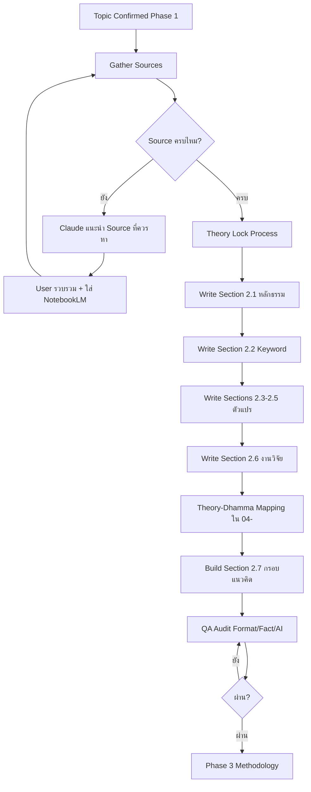
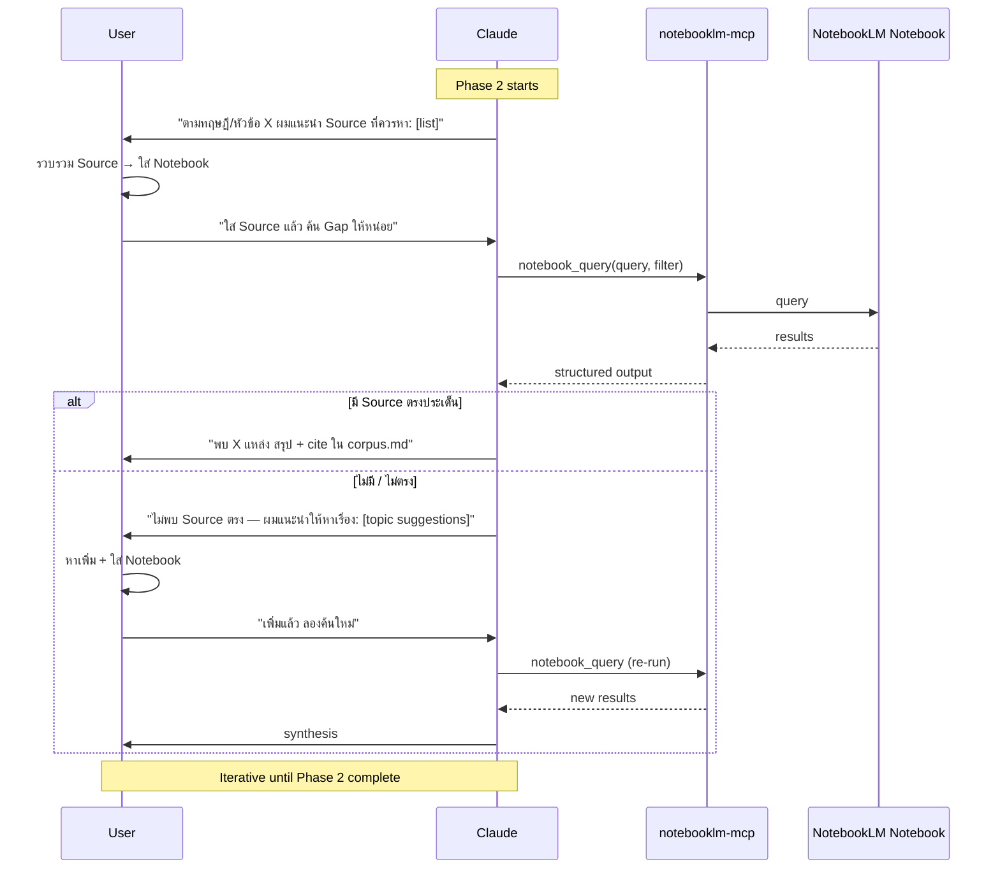

# 03 — Literature Review
## Phase 2 — การทบทวนวรรณกรรม + เตรียมจับคู่ทฤษฎี-หลักธรรม

**Version:** V01R04 | **Date:** 2026-06-19

---

## 1. Mission

ไฟล์นี้เป็น Practical Toolkit สำหรับ Phase 2 — สังเคราะห์วรรณกรรมตามมาตรฐาน มจร เพื่อเขียนบทที่ 2 ที่ผ่านการรีวิวของอาจารย์ที่ปรึกษาและกรรมการสอบ

**Boundary:**
- ไฟล์นี้ครอบ **Lit Review Process + Citation Discipline + Common Mistakes**
- ไฟล์ `04-pa-dhamma-mapping.md` ครอบ **Theory-Dhamma Mapping เชิงลึก** (ทฤษฎี รปศ. 43 หัวข้อ × หลักธรรม 61 หมวด)
- Reference ทั้งสอง **ใช้คู่กัน** ใน Phase 2

Skill จะอ่านไฟล์นี้เมื่อ
1. ผู้ใช้กล่าวถึง "ทบทวนวรรณกรรม", "บทที่ 2", "Lit Review", "ทฤษฎี", "หลักธรรม"
2. หลัง Gate 1 ผ่าน → เริ่ม Phase 2
3. ก่อน Phase 3 → ตรวจ Exit Criteria ของ Phase 2

---

## 2. Phase 2 Workflow Overview



---

## 3. Chapter 2 Structure (Default + Practical Detail)

### 3.1 Default Structure (ตามคู่มือ มจร)

ตามคู่มือการเขียนดุษฎีนิพนธ์ฯ มจร 2563 ระบุโครงสร้างพื้นฐาน

| Section | หัวข้อ | จำนวนหน้า/แหล่ง |
|---------|-------|----------------|
| 2.1 | แนวคิดและทฤษฎีที่เกี่ยวข้อง | ครอบทุกตัวแปร |
| 2.2 | หลักพุทธธรรมที่เกี่ยวข้อง | อ้างพระไตรปิฎก มจร |
| 2.3 | ข้อมูลบริบทเรื่องที่วิจัย | ระบุข้อมูลหน่วยงาน |
| 2.4 | งานวิจัยที่เกี่ยวข้อง | ≥ 3 เรื่อง/หัวข้อย่อย |
| 2.5 | กรอบแนวคิดในการวิจัย | แผนภาพ + ลูกศร |

### 3.2 Practical Structure (ตาม Note อาจารย์ที่ปรึกษา)

อาจารย์หลักสูตรปัจจุบันแนะนำลำดับนี้สำหรับงานบูรณาการพุทธธรรม

| Section | หัวข้อ | หมายเหตุ |
|---------|-------|----------|
| 2.1 | **หลักพุทธธรรม (X2)** | ขึ้นเป็น 2.1 — โชว์หลักธรรมก่อน + "pure" ห้ามผสม |
| 2.2 | **คำสำคัญ (Keyword)** | คำสำคัญที่เกี่ยวข้องกับหัวข้อวิจัย |
| 2.3 | แนวคิดและทฤษฎี IV1 | ≥ 1 หน้า A4 + ≥ 5 อ้างอิง |
| 2.4 | แนวคิดและทฤษฎี IV2 (ถ้ามี) | ≥ 1 หน้า A4 + ≥ 5 อ้างอิง |
| 2.5 | แนวคิดและทฤษฎี DV | ≥ 1 หน้า A4 + ≥ 5 อ้างอิง |
| 2.6 | งานวิจัยที่เกี่ยวข้อง | แยก 2.6.1 หลักธรรม / 2.6.2 IV / 2.6.3 DV |
| 2.7 | กรอบแนวคิด | 2 Parts: เกริ่น + แผนภาพ |

**กฎเหล็ก:**
- คู่มือ มจร เป็น Authoritative Source — ตามรูปแบบเสมอ
- Note อาจารย์เป็น Practical Tactical Layer — ใช้เมื่อต้องเลือกระหว่างทางเลือกที่คู่มือไม่ระบุ
- หากคู่มือ vs อาจารย์ขัดกัน → ตามคู่มือ มจร เสมอ + ปรึกษาอาจารย์

---

## 4. Section-by-Section Guide

### 4.1 Section 2.1 — หลักพุทธธรรม (X2)

**Mission:** นำเสนอหลักธรรมที่จะใช้ในการบูรณาการ

**กฎสำคัญ:**
- หลักธรรมต้อง "Pure" ห้ามผสมกับแนวคิดอื่นในส่วนนี้
- อ้างอิงพระไตรปิฎกฉบับ มจร (เล่ม/ข้อ/หน้า) เป็นหลัก
- การขยายความหลักธรรม อ้างจากหนังสือ (โดยเฉพาะ ป.อ. ปยุตฺโต)
- เชื่อมโยงหลักธรรมกับเรื่องที่วิจัยให้ชัดเจน
- เขียนสรุปเป็นตารางในท้ายสุดของแต่ละหัวข้อย่อย

**Output ที่ต้องมี:**
- เนื้อหาหลักธรรมแต่ละหมวด (ความหมาย + องค์ประกอบ + นัยต่องานวิจัย)
- อ้างพระไตรปิฎก เล่ม/ข้อ/หน้า ตามรูปแบบ มจร
- ตารางสรุปท้ายหัวข้อย่อย

**Cross-reference:** ดูรายละเอียดการ Map ทฤษฎีกับหลักธรรมใน `04-pa-dhamma-mapping.md`

---

### 4.2 Section 2.2 — คำสำคัญ (Keyword)

**Mission:** ระบุคำสำคัญของงานวิจัย พร้อมการทบทวนวรรณกรรมเบื้องต้น

**Process:**
1. ระบุคำสำคัญ 3-5 คำ จากชื่อหัวข้อ
2. แต่ละคำ เขียนนิยามสากล + นิยามที่ใช้ในงาน
3. ทบทวนวรรณกรรมแสดงพัฒนาการของคำสำคัญในวงวิชาการ

**ห้าม:**
- คำสำคัญใส่ "หมายถึง..." (จะต้องสอดคล้องกับแบบสอบถามทุกตัว — ไม่ทำให้)

---

#### 4.2.1 Search Strategy Builder (เครื่องมือเตรียมคำค้น — ดัดแปลงสาย วช./NRCT)

> **เจตนา:** ก่อน "ระบุคำสำคัญ 3-5 คำ" ข้างบนจะแม่นและครบ ให้ใช้ขั้นตอนนี้ *เตรียมคำค้นเชิงระบบ* ก่อน — ได้ทั้งคำสำคัญที่หนักแน่นขึ้น **และ** ชุดคำค้นไปใช้สืบค้น Source ใน §7 (NotebookLM / TCI / Google Scholar / ThaiLIS).
> **นี่คือ "ขั้นตอนคิด" ไม่ใช่รูปแบบที่เขียนลงเล่ม** — output สุดท้ายยังเขียนตามโครง Section 2.2 แบบ มจร (3-5 คำ + นิยามสากล + นิยามในงาน + พัฒนาการ).

**ขั้นที่ 1 — ตีความ PICO/PICo จากหัวข้อดุษฎีนิพนธ์**
แตกหัวข้อเป็นองค์ประกอบ (เชิงปริมาณใช้ PICO · เชิงคุณภาพ/ผสมใช้ PICo):
- **P** (Population) — ประชากร/กลุ่มเป้าหมาย เช่น ผู้สูงอายุภาคเกษตร, ข้าราชการ อปท.
- **I** (Intervention / Phenomenon of Interest) — สิ่งที่ศึกษา/ปรากฏการณ์ เช่น การใช้เทคโนโลยีดิจิทัล, ภาวะผู้นำ
- **C** (Comparator) — ถ้ามีกลุ่มเปรียบเทียบ (งานเชิงพรรณนา/คุณภาพ มัก *ไม่มี* → ปล่อยว่าง อย่าแต่งให้มี)
- **O** (Outcome) — ผลลัพธ์ที่สนใจ เช่น ความปลอดภัย, ประสิทธิผล
- **Context** — บริบทไทย/พื้นที่/มิติพุทธ (สำคัญต่องาน มจร — ใช้ผูกหลักธรรม Section 2.1 ภายหลัง)

**ขั้นที่ 2 — สร้างชุดคำค้น 2 ภาษา**
- **EN keyword 20-30 คำ** จัดกลุ่มตาม PICO (population / intervention-phenomenon / comparator-ถ้ามี / outcome / context)
- **TH keyword เทียบเคียง** ของแต่ละคำ + **คำพ้อง / การสะกดหลายแบบ** (เช่น "ผู้สูงอายุ / ผู้สูงวัย / วัยชรา"; "ดิจิทัล / ดิจิตอล")
- เสนอ **ศัพท์แคบ ↔ ศัพท์กว้าง** ของแต่ละกลุ่ม (กว้างไว้ค้นรอบแรก · แคบไว้คัดกรอง)

**ขั้นที่ 3 — ประกอบ Boolean string ต่อฐานข้อมูล**
- รูปแบบ: `(synonym1 OR synonym2 OR ...) AND (synonym1 OR ...) AND ...` ต่อกลุ่ม PICO
- เสนอ **คำตัดออก (NOT / exclusion)** ที่อาจทำให้เกิด false positives
- ปรับ syntax ตามฐาน: **TCI / ThaiLIS** (รองรับไทย) · **Google Scholar** (วลีในเครื่องหมายคำพูด, `intitle:`) — *ผู้วิจัยปรับตามหน้าจริงของแต่ละฐาน*

**ขั้นที่ 4 — Bridge กลับ มจร (บังคับ — ห้ามข้าม)**
| ผลจาก Search Strategy | ป้อนกลับเข้าโครง มจร ตรงไหน |
|---|---|
| คำสำคัญที่กลั่นแล้ว (เลือก 3-5 คำหลัก) | **Section 2.2** — เขียนนิยามสากล + นิยามในงาน + พัฒนาการ (ตาม Process ข้างบน) |
| ชุด keyword + Boolean | **§7 NotebookLM/ค้น Source** — โดยเฉพาะ pattern "ทฤษฎี X + มจร" ใน §7.2 (คงเกณฑ์ มจร ≥60%, ป.เอก only) |
| Context (พุทธ/ไทย) | ผูกเข้า **Section 2.1 หลักพุทธธรรม** + เป็น input ของ 04-pa-dhamma-mapping |

> ⚠️ คำค้นเป็น *เครื่องมือหา* ไม่ใช่ตัวเล่ม — อย่ายกตาราง PICO/Boolean ลงบทที่ 2 (ไม่ใช่รูปแบบ มจร).

**Guard (Anti-Hallucination — สืบจาก Prompt วช. + H3):**
- **ห้ามแต่งชื่อบทความ / ผู้แต่ง / ปี / อ้างอิงปลอม** จากการประกอบคำค้น — คำค้นคือ *สมมติฐานการสืบค้น* ผลจริงต้องมาจากการค้นของผู้วิจัย
- เมื่อไม่แน่ใจคำเทียบเคียง/ศัพท์เทคนิค → ระบุ **"ต้องตรวจโดยผู้วิจัย"**
- แยกชัด: **คำค้นที่เสนอ** (ของ Claude) ≠ **Source ที่พบจริง** (ของผู้วิจัย)

---

### 4.3 Sections 2.3-2.5 — แนวคิดและทฤษฎีตัวแปร

**Mission:** ทบทวนทฤษฎีทุกตัวแปรในกรอบแนวคิดให้ครบ

**กฎเหล็ก:**
- **ทุกตัวแปรในกรอบ ต้องมาจากการทบทวนใน Section นี้** (ห้ามมีตัวแปรในกรอบที่ไม่ทบทวน)
- **≥ 1 หน้า A4 ต่อตัวแปร** ห้ามเขียนแค่ 3 บรรทัด
- **≥ 5 แหล่งอ้างอิง ต่อตัวแปร** — ที่มาต้องเป็นตัวจริง
- **คงชื่อทฤษฎีตามต้นทาง** ห้ามดัดแปลงโดยพลการ
- **ไม่เขียนชื่อนักวิชาการอยู่ในเนื้อหา** — ใส่ในเชิงอรรถแทน (ยกเว้นมีคำเชื่อมโยงตลอดเนื้อหา)
- หัวข้อใส่ "**แนวคิดและทฤษฎี**" ไม่ใช่แค่ "แนวคิดเกี่ยวกับ..."

**Output ที่ต้องมี:**
- เนื้อหาทฤษฎีต้นทาง + พัฒนาการ + การประยุกต์
- ตารางสรุปท้ายแต่ละหัวข้อย่อย
- ความเรียงสรุปท้ายเนื้อหา

---

### 4.4 Section 2.6 — งานวิจัยที่เกี่ยวข้อง

**Mission:** นำเสนองานวิจัยที่เกี่ยวข้องโดยตรงกับเรื่องที่ทำ

**โครงสร้างที่แนะนำ (Note อาจารย์):**
- 2.6.1 งานวิจัยเกี่ยวกับหลักธรรม (≥ 3 เรื่อง)
- 2.6.2 งานวิจัยเกี่ยวกับตัวแปรอิสระ (≥ 3 เรื่อง/IV)
- 2.6.3 งานวิจัยเกี่ยวกับตัวแปรตาม (≥ 3 เรื่อง)

**กฎเหล็ก:**
- **อ้างอิงงานวิจัยของ มจร ≥ 60%** ในบทที่ 2 (Critical — ดู Section 5)
- **ระดับปริญญาเอก** ต้องอ้างงานวิจัย ป.เอก หรือบทความวิจัยเท่านั้น (ห้ามอ้าง ป.โท)
- งานวิจัยแต่ละเรื่องนำเสนอ **เฉพาะผลการวิจัย** ไม่นำระเบียบวิธีวิจัยของเล่มนั้นมาเขียน
- ความยาวต่อเรื่อง: **กระชับ** ห้าม 1-2 หน้าต่อเรื่อง
- ก่อนนำเสนอแต่ละกลุ่ม **เขียนเกริ่นนำ**
- เมื่อจบแต่ละหัวข้อย่อย **สรุปเป็นตาราง**

---

### 4.5 Section 2.7 — กรอบแนวคิดในการวิจัย

**Mission:** สร้างกรอบแนวคิดที่ Stable + ทุกตัวแปรมีที่มาจริง

**โครงสร้าง 2 Parts:**

**Part 1 — บทเกริ่นนำ (Introduction)**
- ทำไมเลือกทฤษฎีของใคร — ระบุชื่อ + เหตุผล
- ทำไม 5 ด้าน หรือ 10 ด้าน — ระบุเกณฑ์
- การเชื่อมโยงระหว่างทฤษฎี IV ↔ ทฤษฎี DV ↔ หลักธรรม

**Part 2 — แผนภาพกรอบ (Concept Framework)**
- แผนภาพมีลูกศรแสดงทิศทาง
- ทุกตัวแปรระบุชัด (ตัวแปรต้น/ตาม)
- ระบุเชิงอรรถอ้างอิงแหล่งที่มาของแต่ละตัวแปร
- หัวข้อแผนภาพ "**กรอบแนวคิด**" ห้าม "**แสดงกรอบแนวคิด**"

**กฎเหล็ก: Stable Framework**
- กรอบต้องนิ่ง — อย่างอื่นเติมได้แต่กรอบต้องนิ่ง
- ถ้าหาที่มาไม่ได้ = ยังไม่ Lock — ต้องเปลี่ยน
- ถ้ากรอบผิด อย่างอื่นผิดตามไปด้วย

---

## 5. Citation Density Rules

### 5.1 Hard Rules (Critical — Audit Block ถ้าไม่ผ่าน)

**(R1) มจร อ้างอิง ≥ 60% ในบทที่ 2**

นับจากบรรณานุกรมที่ใช้ในบทที่ 2 — ดุษฎีนิพนธ์/วิทยานิพนธ์/บทความ มจร ต้องเป็น 60% ขึ้นไป

**Exception:**
หากผู้ใช้แจ้งว่า **"หัวข้อใหม่ที่หาอ้างอิง มจร ไม่ได้"** → Skill จะอนุมัติให้ผ่าน Audit เป็นกรณีพิเศษ พร้อมหมายเหตุ

```
"ผมตรวจพบว่าอ้างอิง มจร ในบทที่ 2 = X% (< 60%)
ท่านระบุไว้ว่าหัวข้อนี้ใหม่ ไม่มีงาน มจร รองรับ
ผมจะปล่อยผ่านพร้อมใส่ Note ใน QA Report — กรุณาเตรียม
คำอธิบายให้กรรมการในห้องสอบ
ยืนยันหรือไม่?"
```

**(R2) ≥ 5 แหล่งอ้างอิงต่อตัวแปร**

แต่ละ section 2.3, 2.4, 2.5 ต้องมีอ้างอิง ≥ 5 แหล่ง — ที่มาต้องเป็นตัวจริง ไม่ใช่สักแต่ว่ามี

**Exception:** ตัวแปรใหม่ที่ยังไม่มีงานเดิม — แจ้งได้แต่ต้องมี ≥ 3 แหล่งขั้นต่ำ

**(R3) ระดับ ป.เอก เท่านั้น (ห้ามอ้าง ป.โท)**

ในบทที่ 2 + บทที่ 5 อ้างเฉพาะ
- ดุษฎีนิพนธ์ ป.เอก
- บทความวิจัยจากวารสาร
- งานวิจัยทั่วไปที่ผ่านการ peer-review

**ห้าม:** วิทยานิพนธ์ ป.โท / สารนิพนธ์ / รายงาน / textbook (เป็นหลัก)

### 5.2 Soft Rules (Warning — Audit ผ่านแต่เตือน)

**(S1) ≥ 3 งานวิจัย ต่อหัวข้อย่อย** (ในส่วน 2.6)

หากต่ำกว่า 3 → เตือน + ขอเหตุผล แต่ไม่ block

**(S2) งานวิจัยทันสมัย ≤ 5 ปี**

ถ้ามากกว่า 5 ปี ส่วนใหญ่ → เตือน + ขอเหตุผล

### 5.3 Audit Workflow

ก่อนปิด Phase 2 — Skill จะรัน Citation Audit
```
1. นับจำนวนอ้างอิงในบทที่ 2
2. คำนวณ % มจร / Total
3. นับแหล่ง/ตัวแปร แต่ละ section
4. Cross-check ระดับ degree ของอ้างอิง
5. รายงานผล + Pass/Fail
```

---

## 6. Theory Selection Process (Hybrid)

ผู้ใช้เลือก Hybrid — ทำสลับกัน 2-3 รอบจน Lock

### 6.1 Iterative Cycles


### 6.2 Lock Checkpoint

ก่อนเขยิบเขียน 2.7 กรอบแนวคิด ต้อง Lock ทฤษฎีให้ผ่าน Checkpoint นี้

✅ ทุกตัวแปรในกรอบ มีทฤษฎีต้นทาง 1 ทฤษฎีหลัก
✅ ที่มาทฤษฎี cite ได้ครบ (ผู้แต่ง + ปี + หนังสือ/บทความ)
✅ ทฤษฎีที่เลือกมีคำตอบให้ "ทำไมเลือกอันนี้ ไม่ใช่อื่น"
✅ ทฤษฎีอ้างอิงโดย ≥ 5 แหล่งในงานก่อน
✅ ทุกตัวแปรเขียนทบทวนใน 2.3-2.5 ครบ ≥ 1 หน้า/ตัว

### 6.3 ถ้ายัง Lock ไม่ได้

→ กลับไป Phenomenon — อ่านเอกสารเพิ่ม / เปลี่ยน Phenomenon angle / ปรึกษาอาจารย์

**ห้าม:** Lock กรอบโดยที่ทฤษฎีเขียนทบทวนไม่ได้ — กรรมการจะเห็นทันทีในห้องสอบ

---

## 7. NotebookLM Lit Review Workflow (Query-First Iterative)

ตามที่ผู้ใช้เลือก: Claude แนะนำ Source ที่ควรหา → ค้น NotebookLM → ถ้าไม่มี/ไม่ตรง → แนะนำหัวข้อ/เนื้อหาให้ผู้ใช้

### 7.1 Workflow Steps



### 7.2 Claude's Source Recommendation Pattern

เมื่อแนะนำ Source ควรหา ให้ Claude ใช้ Pattern นี้

```
**ทฤษฎี:** [ชื่อทฤษฎี + ผู้แต่ง]

**Source ระดับ Foundational (ต้องมี):**
1. งานต้นฉบับของผู้แต่งทฤษฎี — [ชื่อหนังสือ/บทความ + ปี]
2. งาน Review ของทฤษฎี — [แนะนำ keyword ค้น]

**Source ระดับ Empirical (ต้องมีอย่างน้อย 5):**
3-7. ดุษฎีนิพนธ์ มจร ที่ใช้ทฤษฎีนี้ — [keyword: "ทฤษฎี X + มจร"]
8-10. บทความวิจัย ป.เอก — [keyword + journal candidates]

**Source ระดับ Contemporary (ทันสมัย ≤ 5 ปี):**
11-13. งานล่าสุดในบริบทไทย/APAC

**Source สำหรับ Buddhist Integration:**
14-15. งานที่เคย Map ทฤษฎีนี้กับหลักธรรม [keyword]
```

### 7.3 Gap Analysis — 2 ชั้น (Source-Gap + Research-Gap)

> **แยกให้ชัด — ผิดพลาดบ่อย (CP-43a):** มี Gap *2 ชนิด* คนละเรื่อง
> - **Source-Gap** = "ยังหา *เอกสาร/แหล่งอ้างอิง* มาไม่ครบ" (เชิงปริมาณ/เกณฑ์ มจร) → §7.3a
> - **Research-Gap** = "*วงวิชาการ* ยังไม่รู้/ยังไม่ตอบอะไร" (เชิงเนื้อหา/วิชาการ) → §7.3b
> งานดุษฎีนิพนธ์ต้องการ **ทั้งคู่** — Source-Gap เพื่อให้บทที่ 2 ผ่านเกณฑ์; Research-Gap เพื่อให้หัวข้อ/กรอบมีเหตุผลรองรับ.

#### 7.3a Source-Gap Protocol (หาเอกสารให้ครบเกณฑ์ มจร)

หลังค้นแล้ว ถ้า Source ยังไม่ครบ → Claude แจ้งแบบ Structured

```
**ผลการค้น Notebook:**
- พบ X / Y Source ตามที่แนะนำ
- มจร: A% / 60% (ผ่าน/ตก)
- ระดับ ป.เอก: B / C ชิ้น

**Gap ที่พบ:**
1. [Gap 1] — แนะนำหา keyword: "..."
2. [Gap 2] — แนะนำหา journal: "..."
3. [Gap 3] — แนะนำติดต่อ: ห้องสมุด/อาจารย์ที่ปรึกษา

**ขั้นตอนถัดไป:**
1. ผู้ใช้หา Source ตามแนะนำ
2. ใส่เข้า Notebook + tag
3. แจ้ง Claude เพื่อ re-query
```

#### 7.3b Research-Gap Analysis — 7 ชนิด (เครื่องมือคิด · ดัดแปลงสาย วช./NRCT)

> **เจตนา:** หาช่องว่าง *เชิงวิชาการ* จากกองวรรณกรรมที่มี เพื่อ (1) ยืนยันว่าหัวข้อ/RQ มีเหตุผล (2) เขียน "สรุปช่องว่าง" ใน **Section 2.6** (3) หนุนความนิ่งของ **Section 2.7 กรอบแนวคิด**.
> **เป็นขั้นตอนวิเคราะห์ ไม่ใช่ฟอร์แมตลงเล่ม** — ผลที่ได้เรียบเรียงเข้าโครง มจร เดิม (ห้ามยกตาราง Gap Matrix ดิบลงบทที่ 2; ใช้เป็นวัตถุดิบเขียนความเรียง + ตารางสรุปตามสไตล์ มจร).

**ขั้นที่ 1 — สรุปองค์ความรู้ปัจจุบัน (Current Knowledge)**
จากวรรณกรรมที่อ่าน ระบุ: วงวิชาการ *รู้อะไรแล้ว* · ประเด็นที่ข้อค้นพบ *สอดคล้องกัน* · ประเด็นที่ *ขัดแย้งกัน* · ประเด็นที่ *หลักฐานยังไม่พอ*. (ข้อค้นพบที่ขัดแย้งกัน = แหล่งของ Research-Gap ที่ดี — ระบุให้ชัดว่าเป็น gap หรือไม่ เพราะอะไร)

**ขั้นที่ 2 — จำแนกช่องว่าง 7 ชนิด** (ใช้เท่าที่มีหลักฐานจริง — ไม่ครบ 7 ก็ได้)
| ชนิด Gap | คำถามวินิจฉัย |
|---|---|
| **Theoretical** | ทฤษฎีที่ใช้ยังอธิบายปรากฏการณ์นี้ไม่ครบ/ขัดกันหรือไม่ |
| **Conceptual** | นิยาม/กรอบมโนทัศน์ยังคลุมเครือ/ไม่ลงรอยหรือไม่ |
| **Methodological** | วิธีวิจัยเดิมมีข้อจำกัดอะไร (เช่น เชิงปริมาณล้วน ยังขาดเชิงคุณภาพ) |
| **Empirical/Contextual** | ยังไม่เคยศึกษาในบริบทไทย/พื้นที่/ช่วงเวลานี้หรือไม่ |
| **Population** | กลุ่มประชากรนี้ยังไม่ถูกศึกษา/ศึกษาน้อยหรือไม่ |
| **Practical/Policy** | ยังขาดข้อเสนอเชิงปฏิบัติ/นโยบายที่นำไปใช้ได้หรือไม่ |
| **Temporal** | องค์ความรู้เก่า/ไม่ทันบริบทปัจจุบันหรือไม่ |

แต่ละ Gap ที่พบ ระบุ 5 ช่อง: **(1) ศึกษาแล้ว · (2) ยังขาด · (3) หลักฐานหนุน (จากวรรณกรรมจริง) · (4) เหตุผลที่ถือเป็น gap · (5) ศักยภาพพัฒนาเป็นโจทย์**

**ขั้นที่ 3 — จัดลำดับความสำคัญ → Top-5**
ให้คะแนนแต่ละ Gap ตาม 4 เกณฑ์: **ความสำคัญทางวิชาการ × ความสำคัญเชิงนโยบาย/สังคม × ความใหม่ (Novelty) × ความเป็นไปได้ในการวิจัยจริง** → จัดอันดับ Top-5

**ขั้นที่ 4 — พัฒนาโจทย์ + Novelty Statement** (สำหรับ Gap อันดับ 1)
เสนอ: ประเด็นวิจัย · คำถามวิจัย · วัตถุประสงค์ · ตัวแปร/แนวคิดสำคัญ · กรอบเบื้องต้น · **องค์ความรู้ใหม่ที่คาดว่าจะได้ (Novelty Statement)**

**ขั้นที่ 5 — Bridge กลับ มจร (บังคับ — ห้ามข้าม)**
| ผลจาก Research-Gap | ป้อนกลับเข้าโครง มจร ตรงไหน |
|---|---|
| สรุปช่องว่างจากงานวิจัยที่เกี่ยวข้อง | **Section 2.6** — เขียนเป็นความเรียง + ตารางสรุปท้ายหัวข้อ (ตามสไตล์ §4.4) |
| Top-1 Gap + กรอบเบื้องต้น | หนุน **Section 2.7 กรอบแนวคิด** ให้ *Stable* (ทุกตัวแปรมีที่มา — กัน Cross-H5) |
| โจทย์/RQ/Novelty | ป้อนกลับ **Phase 1** (`02-topic-development.md`) ถ้าต้องปรับหัวข้อ/RQ ให้คม |
| Context พุทธ | ตรวจว่า Buddhist Integration ไม่ผิวเผิน (กัน Cross-H6) — ผูกหลักธรรมเข้า gap จริง ไม่ใช่ใส่ประดับ |

**3 Variant การใช้งาน (เลือกตามสถานการณ์ — สืบจาก Prompt วช.):**
1. **ไม่มีไฟล์แนบ** — วิเคราะห์จากข้อมูลวรรณกรรมที่ผู้ใช้วาง/สรุปให้เท่านั้น (ห้ามดึงความจำมาเติม)
2. **มีไฟล์แนบ** — อ่านครบทุกไฟล์ → เน้น *เชื่อมโยง/เปรียบเทียบ* ระหว่างเรื่อง (ไม่สรุปทีละเรื่อง)
3. **NotebookLM** — สั่งทำ "ตารางสังเคราะห์วรรณกรรมเชิงวิเคราะห์" (ประเด็น × สอดคล้อง × ขัดแย้ง × ทฤษฎี × วิธีวิจัย × ข้อจำกัดร่วม × ช่องว่างเบื้องต้น) ผ่าน workflow §7.1

**Guard (Anti-Hallucination — สืบจาก Prompt วช. + H3):**
- **วิเคราะห์เฉพาะข้อมูลที่ได้รับ** — ห้ามแต่งชื่องานวิจัย/บทความ/อ้างอิง/ผลการวิจัยที่ไม่มีหลักฐาน
- ข้อมูลไม่พอ/สรุปไม่ได้ → ระบุ **"ต้องตรวจโดยผู้วิจัย"** หรือ **"ข้อมูลไม่ปรากฏในเอกสาร"**
- **แยก 3 ชั้นให้ชัด:** ข้อค้นพบจากวรรณกรรม · การตีความเชิงวิเคราะห์ (ของ Claude) · ข้อเสนอสำหรับวิจัยอนาคต

---

## 8. Common Mistakes Library (25 Checkpoints)

### 8.1 จาก Comment รีวิวจริง (Lit-B Series)

**[CP-21] ไม่มีทบทวนทฤษฎี IV1 ในบทที่ 2** [CRITICAL]
- ✗ อ้าง Spencer ในกรอบ แต่เปิดบทที่ 2 ไม่เจอ
- ✓ เพิ่มหัวข้อ 2.3 ทบทวน Spencer 5 ด้าน + อ้างอิง ≥ 5
- *Source: Lit-B1*

**[CP-22] เนื้อหาตัวแปรน้อยเกินไป** [High]
- ✗ แต่ละตัวแปรมี 2-3 บรรทัด
- ✓ ≥ 1 หน้า A4 ต่อตัวแปร
- *Source: Lit-B2 + XL-22*

**[CP-23] ไม่เชื่อมโยงหลักธรรมกับตัวแปร** [High]
- ✗ เขียนหลักธรรมแยกส่วน ไม่เชื่อมกับ X1, Y
- ✓ เพิ่มย่อหน้าสรุปการเชื่อมโยง + ตาราง
- *Source: Lit-B3*

**[CP-24] ลำดับหัวข้อบทที่ 2 ผิด** [High]
- ✗ X1 และ Y ขึ้นก่อน หลักธรรมอยู่ด้านหลัง
- ✓ 2.1 หลักธรรม → 2.2 Keyword → 2.3-2.5 ตัวแปร → 2.6 งานวิจัย → 2.7 กรอบ
- *Source: Lit-B4 + XL-29*

**[CP-25] Theory ใช้ผิด (Theory-Variable Mismatch)** [CRITICAL]
- ✗ "การเรียนรู้เทคโนโลยีดิจิทัล" ใช้ทฤษฎี Nadler (ที่พูดเรื่องฝึกอบรม-ศึกษา-พัฒนา) ทั้งที่ scope ไม่ตรง
- ✓ ตรวจ Theory-Variable fit ก่อน Lock — ถ้าไม่ fit ต้องเปลี่ยนทฤษฎี
- *Source: Lit-B5*

**[CP-26] งานวิจัยแต่ละเรื่องยาวเกิน** [Medium]
- ✗ 1-2 หน้าต่อเรื่อง
- ✓ กระชับ 5-10 บรรทัด — เน้นผลการวิจัย ไม่เอา methodology
- *Source: Lit-B6*

**[CP-27] X2 หลักธรรมไม่ระบุชัด** [High]
- ✗ ยังไม่ระบุหมวดธรรม ไม่เชื่อมกับ Spencer 5 ด้าน
- ✓ เลือกหมวดธรรม (เช่น อิทธิบาท ๔) อ้างพระไตรปิฎก มจร
- *Source: Lit-B7*

### 8.2 จาก Note อาจารย์ (Excel Sheet)

**[CP-28] หลักธรรมไม่ "Pure"** [High]
- ✗ ผสมหลักธรรมกับแนวคิดอื่นใน 2.1
- ✓ 2.1 หลักธรรมต้องบริสุทธิ์ — ตัดคำขยายออก
- *Source: XL-16*

**[CP-29] Keyword ไม่ตอบโจทย์** [High]
- ✗ Keyword ทั่วไป ไม่เชื่อมกับงานวิจัย
- ✓ Keyword ต้องเกี่ยวข้องกับหัวข้อจริง (เช่น Buddhist Competency / Digital Learning)
- *Source: XL-17*

**[CP-30] อ้างอิง < 5 แหล่งต่อตัวแปร** [CRITICAL]
- ✗ เขียนแต่ไม่ cite / cite ไม่ครบ
- ✓ ≥ 5 แหล่งจากนักวิชาการ/งานวิจัย — ตัวจริง ไม่สักแต่ว่ามี
- *Source: XL-19 + XL-43*

**[CP-31] แก้ชื่อทฤษฎีจากต้นทาง** [CRITICAL]
- ✗ "การมีส่วนร่วม" ของ Cohen → ดัดแปลงเป็น "การบริหารจากรากฐาน"
- ✓ คงชื่อทฤษฎีตามต้นทางทุกแห่ง
- *Source: XL-20*

**[CP-32] งานวิจัย 2.6 ไม่จัดหมวด** [High]
- ✗ รวมเป็นก้อนเดียว
- ✓ 2.6.1 หลักธรรม / 2.6.2 IV / 2.6.3 DV
- *Source: XL-21*

**[CP-33] งานวิจัยเกี่ยวกับหลักธรรมไม่ตรงประเด็น** [CRITICAL]
- ✗ งานวิจัยพุทธทั่วไปที่ไม่เชื่อมกับหลักธรรมที่เลือกใช้
- ✓ งานวิจัยที่ใช้หลักธรรมที่เลือกในงานเรา ≥ 5 เรื่อง
- *Source: XL-22*

**[CP-34] กรอบแนวคิดขาด Part 1 (เกริ่น)** [High]
- ✗ จู่ ๆ มีแผนภาพเลย
- ✓ Part 1 บทเกริ่น (อธิบายทำไมเลือกทฤษฎี/หลักธรรม) → Part 2 แผนภาพ
- *Source: XL-23*

**[CP-35] กรอบไม่นิ่ง (ตัวแปรหาที่มาไม่ได้)** [CRITICAL]
- ✗ มีตัวแปรในกรอบที่ไม่มีอ้างอิง / ไม่ได้ทบทวน
- ✓ ทุกตัวแปรในกรอบมีที่มาจริง อ้างอิงได้
- *Source: XL-24 + Cross-H3*

**[CP-36] ใส่คำว่า "แสดง" หน้าหัวข้อ** [Medium]
- ✗ "แสดงกรอบแนวคิด" / "แสดงโครงสร้าง"
- ✓ "กรอบแนวคิด" / "โครงสร้าง" (ตัด "แสดง" ออก)
- *Source: XL-25 + XL-45*

**[CP-37] ตำแหน่ง "ประยุกต์/บูรณาการ" ผิด** [Medium]
- ✗ "Y ประยุกต์/บูรณาการ" (ห้อยข้างหลัง)
- ✓ "พุทธบูรณาการ Y" (ข้างหน้า) หรือ "Y เชิงพุทธ" (ตามชื่องาน)
- *Source: XL-26 + XL-47*

**[CP-38] หัวข้อขาด "และทฤษฎี"** [Medium]
- ✗ "แนวคิดเกี่ยวกับการพัฒนาทรัพยากรมนุษย์"
- ✓ "แนวคิดและทฤษฎีเกี่ยวกับการพัฒนาทรัพยากรมนุษย์"
- *Source: XL-27*

**[CP-39] ความซ้ำซ้อน "แนวคิด" vs "พุทธบูรณาการ"** [High]
- ✗ มีทั้ง "แนวคิดเกี่ยวกับ..." และ "พุทธบูรณาการเกี่ยวกับ..." ในเรื่องเดียวกัน
- ✓ หลักธรรมจริงอยู่ใน 2.1 แล้ว — ไม่ทำซ้ำในส่วน 2.3-2.5
- *Source: XL-28*

**[CP-40] Chapter Outline ไม่ตามลำดับ** [Medium]
- ✗ มีหัวข้อ 2.8 หรือเกิน
- ✓ จำกัดที่ 2.7 — หลักธรรม → Keyword → ตัวแปร → งานวิจัย → กรอบ
- *Source: XL-29*

**[CP-41] สารบัญไม่ตรงเนื้อหา** [High]
- ✗ สารบัญถูกแต่เนื้อหาไม่ตรง
- ✓ สารบัญ ↔ เนื้อหา ตรง 100% (Update TOC)
- *Source: XL-30*

**[CP-42] ขาด "Why-this-Theory" ในกรอบ** [CRITICAL]
- ✗ ใส่ทฤษฎีโดยไม่อธิบายเหตุผล
- ✓ เขียนย่อหน้าเหตุผลเลือกทฤษฎี/หลักธรรม (หลักธรรมมี 80,000 พระธรรมขันธ์)
- *Source: XL-48*

**[CP-43] ลำดับเก็บคุณภาพ vs ปริมาณ ไม่ตรงสารบัญ** [High] *(ข้ามมาตรวจใน Phase 3)*
- ✗ สารบัญบอกปริมาณก่อน แต่ย่อหน้าเปิดบอกคุณภาพก่อน
- ✓ ตรวจให้ตรง → จะใช้ใน Phase 3

### 8.3 จาก Search Strategy + Research-Gap (Lit-C Series · ดัดแปลงสาย วช.)

> หมายเหตุ ID: ใช้ suffix-letter (CP-43a/CP-43b) เพื่อไม่ชน global sequence — CP-44 ขึ้นไปถูกจองโดย `04-pa-dhamma-mapping.md` แล้ว

**[CP-43a] สับสน Source-Gap กับ Research-Gap** [High]
- ✗ บอกว่า "มี research gap" ทั้งที่ความจริงคือยังหา *เอกสาร* มาไม่ครบ (เป็น source-gap)
- ✓ แยก 2 ชั้นตาม §7.3 — Source-Gap = เอกสารยังไม่ครบเกณฑ์ มจร · Research-Gap = วงวิชาการยังไม่รู้/ไม่ตอบ
- *Source: ดัดแปลง Prompt Research Gap (วช.)*

**[CP-43b] Novelty Statement / Gap ไม่ผูกกับ RQ-กรอบ** [CRITICAL]
- ✗ วิเคราะห์ gap สวยแต่ลอย — ไม่ feed กลับเข้า Section 2.6/2.7 หรือ RQ; กรอบยังไม่ Stable
- ✓ ทุก gap ที่ใช้ ต้อง map กลับ มจร (2.6 สรุปช่องว่าง / 2.7 หนุนกรอบ / Phase 1 ปรับ RQ) — Novelty ผูกกับโจทย์จริง
- *เชื่อมโยง: Cross-H5 (ตัวแปรหาที่มาไม่ได้), CP-42 (Why-this-Theory)*

---

## 9. Pre-Phase 3 Checklist (Exit Criteria ของ Phase 2)

ก่อนเขยิบไป Phase 3 (Methodology) ต้องผ่าน

✅ Section 2.1 หลักธรรม "Pure" + อ้างพระไตรปิฎก มจร ครบ
✅ Section 2.2 Keyword ระบุชัด
✅ Sections 2.3-2.5 ทุกตัวแปร ≥ 1 หน้า + ≥ 5 อ้างอิง
✅ Section 2.6 งานวิจัย แยกเป็น 2.6.1-2.6.3
✅ Section 2.7 กรอบ มี 2 Parts (เกริ่น + แผนภาพ)
✅ มจร อ้างอิง ≥ 60% (หรือมี Exception note)
✅ ระดับ ป.เอก เท่านั้น (ไม่มี ป.โท)
✅ ทุกตัวแปรในกรอบมาจาก 2.3-2.5
✅ Theory-Variable fit ตรง (ไม่มี mismatch)
✅ Theory Lock — ทฤษฎีหลัก lock แล้ว
✅ ผ่าน Common Mistakes 25 Checkpoints (CP-21 ถึง CP-43b ยกเว้น CP-43 ที่ข้ามไป Phase 3)
✅ NotebookLM corpus.md มี search entry ครบทุก section ที่ใช้ MCP
✅ Format Audit ผ่าน (อ้างอิงรูปแบบ มจร)

---

## 10. Routing Map ออกจากไฟล์นี้

| สถานการณ์ | Load Reference ถัดไป |
|-----------|---------------------|
| ต้องการจับคู่ทฤษฎี-หลักธรรมเชิงลึก | `04-pa-dhamma-mapping.md` |
| ค้นวรรณกรรมผ่าน NotebookLM | `01-notebooklm-protocol.md` |
| Theory-Dhamma mapping table | `04-pa-dhamma-mapping.md` |
| ออกแบบ Methodology (Phase 3) | `05-methodology-design.md` |
| เขียนเชิงอรรถ/บรรณานุกรม | `11-citation-footnote.md` |
| ตรวจ Citation Verify | `09-fact-audit.md` + `01-notebooklm-protocol.md` |
| เตรียมคำค้น / วิเคราะห์ research gap ก่อนเขียน | §4.2.1 + §7.3b ในไฟล์นี้ + `templates/lit-search-and-gap.md` |
| ปรับหัวข้อ/RQ จากผล research-gap | `02-topic-development.md` (Phase 1) |

---

## 11. Versioning

**Version:** V01R04
**Date:** 2026-06-19
**Source:**
- คู่มือการเขียนดุษฎีนิพนธ์ฯ มจร — บทที่ 2
- PPTX วิจัยบทที่ 1-5 — สไลด์ 32-37
- Note อาจารย์ (Excel Sheet 02 — บทที่ 2 = 15 รายการ)
- รีวิวจริง (Lit-B1 ถึง B7)
- Common Mistakes 25 ข้อ (CP-21 ถึง CP-43 + CP-43a/43b) จาก _staging/extracted-common-mistakes.md
- §4.2.1 + §7.3b ดัดแปลงจาก Prompt อบรมนักวิจัยรุ่นใหม่ (วช./NRCT) — Literature Review Search Strategy + Research Gap Analysis (adapt process, keep มจร output)
**Change Log:**
- V01R01 (2026-05-03): Initial release
- V01R04 (2026-06-19): เพิ่ม §4.2.1 Search Strategy Builder (PICO→TH/EN keyword→Boolean + Guard) ใน Section 2.2; ยกระดับ §7.3 เป็น §7.3a Source-Gap + §7.3b Research-Gap 7-type (Current Knowledge → Gap Matrix → Top-5 → Novelty + 3 variant) ทุกขั้นมี Bridge กลับ มจร (2.2/2.6/2.7/Phase 1); เพิ่ม CP-43a/43b; อัปเดต §10 Routing. รูปแบบ/ลำดับบทที่ 2 ยึด มจร เดิม
**Update Rule:** Minor edit → V01R05; Major rewrite → V02R01
