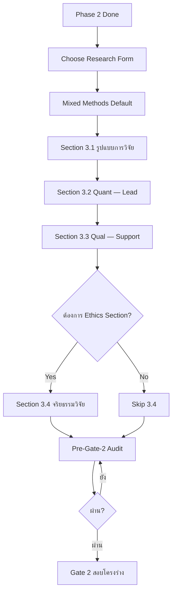
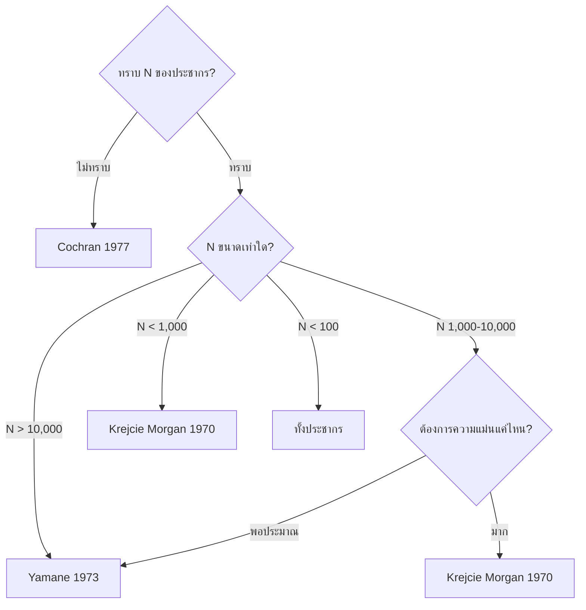

# 05 — Methodology Design
## Phase 3 — ระเบียบวิธีวิจัย + บทที่ 3 + เตรียม Gate 2 (สอบโครงร่าง)

**Version:** V01R01 | **Date:** 2026-05-03

---

## 1. Mission

ไฟล์นี้เป็น Practical Toolkit สำหรับ Phase 3 — ออกแบบระเบียบวิธีวิจัยตามมาตรฐาน ปร.ด. รปศ. มจร พร้อมเขียนบทที่ 3 ของ Proposal ให้ผ่านกรรมการสอบโครงร่าง

**Authority Hierarchy:**
- **Level 1 (Authoritative):** คู่มือการเขียนดุษฎีนิพนธ์ฯ มจร 2563 — บทที่ 3
- **Level 2 (Frame):** Template `09 Template บทที่ 3.docx` + `การสร้างเครื่องมือการวิจัย.pdf`
- **Level 3 (Practical):** Note อาจารย์ที่ปรึกษา (Excel — บทที่ 3 = 11 รายการ)
- **Level 4 (Example):** `11 ตัวอย่าง แบบสอบถาม.docx` + `11 IOC.docx`

**กฎเหล็ก:** ขัดกัน → ตาม Level 1 (คู่มือ มจร)

Skill จะอ่านไฟล์นี้เมื่อ
1. ผู้ใช้กล่าวถึง "ระเบียบวิธี", "บทที่ 3", "Methodology", "Mixed Methods", "เครื่องมือ", "IOC", "Try out", "ประชากร", "กลุ่มตัวอย่าง"
2. หลัง Gate 1 ผ่าน + Lit Review เสร็จ → เริ่ม Phase 3
3. ก่อน Gate 2 (สอบโครงร่าง)

---

## 2. Phase 3 Workflow



---

## 3. Chapter 3 Structure (Mixed Methods — Default)

ตามคู่มือ มจร + Note อาจารย์

### 3.1 Outline ที่ใช้

```
3.1 รูปแบบการวิจัย (Research Design)
3.2 การวิจัยเชิงปริมาณ (Quantitative — Lead)
    3.2.1 ประชากรและกลุ่มตัวอย่าง
    3.2.2 เครื่องมือที่ใช้ในการวิจัย
    3.2.3 การเก็บรวบรวมข้อมูล
    3.2.4 การวิเคราะห์ข้อมูล
3.3 การวิจัยเชิงคุณภาพ (Qualitative — Support)
    3.3.1 ผู้ให้ข้อมูลสำคัญ
    3.3.2 เครื่องมือที่ใช้ในการวิจัย
    3.3.3 การเก็บรวบรวมข้อมูล
    3.3.4 การวิเคราะห์ข้อมูล
3.4 จริยธรรมการวิจัย (Optional — ถ้าผู้ใช้ระบุ)
```

**กฎเหล็ก:**
- ห้ามเขียน "เชิงปริมาณ"/"เชิงคุณภาพ" ใน sub-section 3.2.x หรือ 3.3.x (เพราะอยู่ภายใต้แล้ว)
- ลำดับสารบัญต้องตรงกับลำดับการเก็บข้อมูล — ถ้าสารบัญบอก Quant ก่อน ต้องเก็บ Quant ก่อน
- Outline กระชับ ไม่เกิน 3.4

---

## 4. Section 3.1 — รูปแบบการวิจัย

**Mission:** ระบุรูปแบบ Mixed Methods + ลำดับการเก็บข้อมูล

### 4.1 Default Choice

**Mixed Methods แบบ Sequential Explanatory** (Quant → Qual)

```
1. เก็บข้อมูลเชิงปริมาณก่อน (แบบสอบถาม → กลุ่มตัวอย่าง)
2. วิเคราะห์ผลปริมาณ
3. เก็บข้อมูลเชิงคุณภาพต่อ (สัมภาษณ์ + FGD)
4. ใช้ Qual ขยายความ Quant
5. Triangulation
```

**ตัวเลือกอื่น (กรณีพิเศษ):**
- **Sequential Exploratory** (Qual → Quant) — เมื่อยังไม่มีตัวแปรชัด
- **Concurrent Triangulation** — เก็บพร้อมกัน
- **Concurrent Embedded** — Method หนึ่งหลัก อีกอันเสริม

### 4.2 ระบุตัวนำ-ตัวสนับสนุน

ต้องเขียนชัดเจนว่า
- "การวิจัยครั้งนี้ใช้รูปแบบผสานวิธี โดยใช้การวิจัยเชิงปริมาณเป็นตัวนำ และการวิจัยเชิงคุณภาพเป็นตัวสนับสนุน"

---

## 5. Section 3.2 — การวิจัยเชิงปริมาณ

### 5.1 ประชากรและกลุ่มตัวอย่าง

**ประชากร:**
- ระบุกลุ่มชัด (เช่น "บุคลากรของมหาวิทยาลัยในกำกับของรัฐ X แห่ง")
- ระบุจำนวน N + อ้างอิงข้อมูลประชากร

**กลุ่มตัวอย่าง — เลือกสูตรตามเงื่อนไข:**

| เงื่อนไข | สูตรที่ใช้ | เหตุผล |
|---------|-----------|--------|
| **N รู้แน่ + ใหญ่ (>10,000)** | Yamane (1973) | n = N / (1 + Ne²) |
| **N รู้แน่ + กลาง-เล็ก** | Krejcie & Morgan (1970) | ตารางสำเร็จรูป |
| **N ไม่ทราบ / Population เปิด** | Cochran (1977) | n = z²pq/e² |

**ตัวอย่าง:**
```
ประชากร: 5,000 คน → ใช้ Yamane ที่ e=0.05
n = 5000 / (1 + 5000 × 0.0025) = 370 คน

ประชากร: 500 คน → ใช้ Krejcie & Morgan
n = 217 คน (จากตาราง)
```

**วิธีสุ่ม (เลือกตามบริบท):**
- Simple Random / Stratified / Cluster / Multi-stage / Systematic / Quota / Purposive

ต้องระบุ
- วิธีสุ่ม (พร้อมเหตุผล)
- ตารางจำแนกสัดส่วนประชากร × กลุ่มตัวอย่าง
- แนบสูตร/ตารางใน Appendix

### 5.2 เครื่องมือที่ใช้ในการวิจัย

**ประเภท:** แบบสอบถาม (Questionnaire)

**โครงสร้างมาตรฐาน (ตามคู่มือ มจร):**

```
ตอนที่ 1: ข้อมูลทั่วไปของผู้ตอบ (Demographic)
   - เพศ / อายุ / การศึกษา / ตำแหน่ง / ประสบการณ์

ตอนที่ 2: คำถามตามตัวแปรต้น (IV)
   - ทุกตัวแปร IV ในกรอบ → คำถามครบ
   - มาตรวัด: 5-Point Likert Scale
     1.00-1.80 = น้อยที่สุด
     1.81-2.60 = น้อย
     2.61-3.40 = ปานกลาง
     3.41-4.20 = มาก
     4.21-5.00 = มากที่สุด

ตอนที่ 3: คำถามตามตัวแปรตาม (DV)
   - ทุกตัวแปร DV ในกรอบ → คำถามครบ

ตอนที่ 4: คำถามปลายเปิด (ถ้าต้องการ)
   - ข้อเสนอแนะเพิ่มเติม
```

**Mini Example (จาก `11 ตัวอย่าง แบบสอบถาม.docx`):**
```
ตอนที่ 2 ข้อ 2.1.1 [การมุ่งผลสัมฤทธิ์]
"องค์กรของท่านส่งเสริมให้พนักงานมีความตั้งใจในการทำงานอย่างเต็มที่"
☐ น้อยที่สุด ☐ น้อย ☐ ปานกลาง ☐ มาก ☐ มากที่สุด
```

**กฎเหล็ก:**
- ครอบทุกตัวแปรในกรอบแนวคิด
- สอดคล้องกับนิยามศัพท์เฉพาะที่ระบุในบทที่ 1
- คำสำคัญต้องสอดคล้องกับแบบสอบถามทุกตัว

### 5.3 การตรวจคุณภาพเครื่องมือ

**ขั้นที่ 1 — ความเที่ยงตรง (Validity) ผ่าน IOC**

```
1. คัดเลือกผู้เชี่ยวชาญ 5 รูป/คน
   - ภายนอก ≥ 2 รูป/คน
   - ครอบคลุม 3 ด้าน:
     ① ด้านเนื้อหา/ทฤษฎี
     ② ด้านระเบียบวิธีวิจัย
     ③ ด้านพระพุทธศาสนา หรือด้านการปฏิบัติงาน

2. ส่งเครื่องมือ + แบบประเมิน IOC
   เกณฑ์ +1 (ตรง) / 0 (ไม่แน่ใจ) / -1 (ไม่ตรง)

3. คำนวณ IOC = Σคะแนน / N(ผู้เชี่ยวชาญ)
   เกณฑ์ผ่าน: IOC ≥ 0.5 (บางที่ใช้ 0.6)

4. ปรับปรุงข้อที่ IOC < 0.5
```

**Mini Example (จาก `11 IOC.docx`):**
```
ข้อ 2.1.1 — IOC = (1+1+0+1+1)/5 = 0.80 ผ่าน
ข้อ 2.1.2 — IOC = (1+0+0+1+1)/5 = 0.60 ผ่าน
ข้อ 2.1.3 — IOC = (1+1+0+0+1)/5 = 0.60 ผ่าน
ข้อ 2.1.4 — IOC = (-1+0+1+0+0)/5 = 0.00 ไม่ผ่าน — แก้ไข
```

**ขั้นที่ 2 — ความเชื่อมั่น (Reliability) ผ่าน Try out 30 ชุด**

```
1. ทดลองใช้กับกลุ่มที่มีลักษณะใกล้เคียงกลุ่มตัวอย่างจริง 30 ชุด
2. คำนวณค่า Cronbach's Alpha (α)
   - α ≥ 0.70 = ผ่าน
   - α 0.80-0.89 = ดี
   - α ≥ 0.90 = ดีเยี่ยม
3. หาก α < 0.70 → ปรับข้อที่มี Item-Total Correlation ต่ำ
```

### 5.4 การเก็บรวบรวมข้อมูล

ต้องระบุ
- วิธีเก็บ (ตนเอง / ไปรษณีย์ / Google Form / e-mail)
- ระยะเวลา (วันเริ่ม-สิ้นสุด)
- ผู้เก็บข้อมูล
- จำนวนแบบสอบถามส่ง / ตอบกลับ + Response Rate %

**เกณฑ์ Response Rate ที่ยอมรับได้:** ≥ 70%

### 5.5 การวิเคราะห์ข้อมูล

**สถิติพรรณนา (Descriptive):**
- ความถี่ (Frequency)
- ร้อยละ (Percentage)
- ค่าเฉลี่ย (Mean)
- ส่วนเบี่ยงเบนมาตรฐาน (SD)

**สถิติอนุมาน Basic (Inferential):**
- t-test (เปรียบเทียบ 2 กลุ่ม)
- One-way ANOVA + F-test (เปรียบเทียบ 3+ กลุ่ม)
- Pearson Correlation (ความสัมพันธ์)

**สถิติอนุมาน Multivariate (สำหรับ ปร.ด.):**
- Multiple Regression Analysis (ปัจจัยที่ส่งผลต่อ DV)
- Path Analysis (ความสัมพันธ์เชิงสาเหตุ)
- SEM (Structural Equation Modeling) — *Optional, ต้อง Sample ≥ 200*

**โปรแกรม:** SPSS / AMOS / R / SmartPLS

**กฎเหล็ก:**
- ระบุชัดเจนว่าตัวแปรไหนใช้สถิติใด
- กำหนดเกณฑ์การให้คะแนน (Likert) + เกณฑ์แปลค่าเฉลี่ย
- Hypothesis ต้องทดสอบได้ทางสถิติจริง

---

## 6. Section 3.3 — การวิจัยเชิงคุณภาพ

### 6.1 ผู้ให้ข้อมูลสำคัญ (Key Informants)

**กฎเหล็ก จากคู่มือ มจร:**
- **Mixed Methods:** ≥ 17 รูป/คน
- **Qualitative Only:** ≥ 25 รูป/คน

**โครงสร้างกลุ่มผู้ให้ข้อมูล (แนะนำ):**

| กลุ่มที่ | ประเภท | จำนวน |
|---------|-------|------|
| 1 | ผู้กำหนดนโยบาย / ผู้บริหาร | 3-5 |
| 2 | ผู้ปฏิบัติงาน | 3-5 |
| 3 | ผู้รับบริการ / ผู้เกี่ยวข้อง | 3-5 |
| 4 | นักวิชาการในประเด็นที่วิจัย | 3-5 |
| 5 | นักวิชาการด้านพระพุทธศาสนา | 2-3 |

**กฎเหล็ก:** ทุกกลุ่มจำนวนต้องสมดุล — ห้ามกลุ่มหนึ่ง 2 คน อีกกลุ่ม 6 คน

### 6.2 ผู้ทรงคุณวุฒิสนทนากลุ่มเฉพาะ (Focus Group)

- **จำนวน:** 8-12 รูป/คน (ตามคู่มือ มจร) หรือ 9-12 (ตาม Note อาจารย์)
- **ห้ามซ้ำ** กับผู้ให้ข้อมูลสัมภาษณ์เชิงลึก
- **ต้องมีอาจารย์ประจำหลักสูตร** ≥ 1 รูป/คน
- ระบุองค์ประกอบ: จำนวนต่อกลุ่ม + ตำแหน่ง + ความเกี่ยวข้อง

### 6.3 เครื่องมือเชิงคุณภาพ

**ประเภทเครื่องมือ:**
1. แบบสัมภาษณ์เชิงลึก (Semi-structured Interview Guide)
2. แบบบันทึกการสนทนากลุ่มเฉพาะ (FGD Recording Form)
3. แบบสังเกตการณ์ (Observation Form) — *ถ้าใช้*

**โครงสร้างแบบสัมภาษณ์:**
```
ส่วนที่ 1: ข้อมูลผู้ให้สัมภาษณ์
ส่วนที่ 2: คำถามตามวัตถุประสงค์ข้อ 1
ส่วนที่ 3: คำถามตามวัตถุประสงค์ข้อ 2
ส่วนที่ 4: คำถามตามวัตถุประสงค์ข้อ 3
ส่วนที่ 5: ข้อเสนอแนะเพิ่มเติม
```

**Mini Example (จาก `11 ตัวอย่าง แบบสัมภาษณ์`):**
```
ส่วนที่ 2: ตามวัตถุประสงค์ข้อ 1 (เพื่อศึกษาสมรรถนะ...)

Q1. ในมุมมองของท่าน บุคลากรในมหาวิทยาลัยควรมีสมรรถนะดิจิทัล
   ในด้านใดบ้าง? เพราะเหตุใด?

Q2. หลักธรรมใดในพุทธศาสนาที่ท่านเห็นว่าสามารถส่งเสริม
   การพัฒนาสมรรถนะดิจิทัลได้? อย่างไร?
```

**การตรวจคุณภาพ:** IOC อย่างน้อย (จากผู้เชี่ยวชาญ 5 รูป/คน)

### 6.4 การเก็บรวบรวมข้อมูล (Qualitative)

ระบุ
- ขั้นตอน (เป็นข้อ ๆ)
- วิธีบันทึก (audio + ถอดเทป + field note)
- ผู้สัมภาษณ์
- ระยะเวลา
- การ anonymize (รหัสผู้ให้ข้อมูล)

### 6.5 การวิเคราะห์ข้อมูล (Qualitative)

**เทคนิคที่ใช้บ่อย:**
- **Content Analysis** — วิเคราะห์เนื้อหา (ตามรหัส)
- **Thematic Analysis** — สังเคราะห์เป็นธีม
- **Narrative Analysis** — วิเคราะห์เรื่องเล่า

**Process มาตรฐาน:**
```
1. ถอดเทป + Anonymize
2. Coding (Open → Axial → Selective)
3. ระบุ Themes
4. Triangulation (เทียบกับ Quant + เอกสาร + ผู้เชี่ยวชาญ)
5. ปรโตโฆสะ + โยนิโสมนสิการ (ตามคู่มือ มจร)
```

---

## 7. Section 3.4 — จริยธรรมการวิจัย (Optional)

> **Note:** Section นี้ใส่เมื่อผู้ใช้ระบุ — รายละเอียดเชิงลึกใน `phd-buddhist-public-admin/references/methodology.md`

โครงร่างเบื้องต้น
- การขออนุมัติจริยธรรม IRB
- การพิทักษ์สิทธิผู้ให้ข้อมูล
- การ anonymize PII
- การเก็บรักษาข้อมูล
- เอกสารยินยอม (Informed Consent)

---

## 8. Population/Sample Calculation Decision Tree



**สูตรอ้างอิง:**
- **Yamane (1973):** n = N / (1 + Ne²) ที่ e = 0.05
- **Krejcie & Morgan (1970):** ใช้ตารางสำเร็จรูป — แนบใน Appendix
- **Cochran (1977):** n = z²pq/e² (z=1.96, p=0.5, e=0.05) → 384

---

## 9. Common Mistakes Library (19 Checkpoints)

### 9.1 Methodology Design Layer

**[CP-49] รูปแบบวิจัยขัดแย้ง (Quant Dominant + Sequential Exploratory)** [CRITICAL]
- ✗ "Quantitative Dominant" แต่ใช้ "Sequential Exploratory" (Qual→Quant)
- ✓ Sequential Explanatory (Quant→Qual) สำหรับ Quant Dominant
- *Source: Meth-C1 + XL-31*

**[CP-50] ลำดับเก็บคุณภาพ vs ปริมาณ ไม่ตรงสารบัญ** [High]
- ✗ สารบัญบอก Quant ก่อน แต่ย่อหน้าเปิดบอก Qual ก่อน
- ✓ ปรับถ้อยคำเปิดให้ตรงสารบัญ
- *Source: Meth-C2 + CP-43*

**[CP-51] เลขหัวข้อผิด/ข้าม** [Medium]
- ✗ "3.3.33" (ขาดจุด) / ข้าม 3.3.4
- ✓ ไล่ลำดับ 3.3.1 → 3.3.2 → 3.3.3 → 3.3.4 → ...
- *Source: Meth-C3*

**[CP-52] ตัด "เชิงปริมาณ"/"เชิงคุณภาพ" ใน sub-section** [High]
- ✗ "3.2 การวิจัยเชิงปริมาณ → 3.2.4 การวิเคราะห์เชิงปริมาณ"
- ✓ "3.2 การวิจัยเชิงปริมาณ → 3.2.4 การวิเคราะห์ข้อมูล"
- *Source: XL-32 + XL-37*

**[CP-53] Outline บทที่ 3 ยาวเกิน** [Medium]
- ✗ มีถึง 3.10
- ✓ จำกัด: 3.1 รูปแบบ / 3.2 ปริมาณ / 3.3 คุณภาพ / 3.4 จริยธรรม (ถ้ามี)
- *Source: XL-41*

### 9.2 Population & Sample Layer

**[CP-54] ขอบเขตประชากรไม่ชัดเจน** [High]
- ✗ "บุคลากรของมหาวิทยาลัย"
- ✓ "บุคลากรของมหาวิทยาลัยในกำกับของรัฐ X แห่ง = N คน" + อ้างอิง
- *Source: XL-33*

**[CP-55] ใช้สูตรกลุ่มตัวอย่างไม่เหมาะกับ N** [High]
- ✗ ใช้ Yamane กับ N=200 (ผิดเพราะ N เล็ก)
- ✓ N>10,000 → Yamane / N<1,000 → Krejcie & Morgan
- *Source: คู่มือ มจร P3.2.1*

**[CP-56] ผู้ให้ข้อมูลจำนวนไม่สมดุล** [High]
- ✗ 5 กลุ่ม กลุ่ม 1 = 2 คน, กลุ่ม 5 = 6 คน
- ✓ 3-4 คน/กลุ่ม สมดุล
- *Source: Meth-C5*

**[CP-57] ผู้ให้ข้อมูล < เกณฑ์** [CRITICAL]
- ✗ Mixed: < 17 / Qual: < 25
- ✓ Mixed ≥ 17 / Qual ≥ 25
- *Source: คู่มือ มจร P3.2.1 + XL-38*

**[CP-58] ผู้ทรงคุณวุฒิ FGD < 8 หรือ > 12** [High]
- ✗ 5 คน หรือ 15 คน
- ✓ 8-12 รูป/คน + อาจารย์ประจำหลักสูตร ≥ 1
- *Source: Meth-C6 + คู่มือ มจร*

**[CP-59] ผู้ทรงคุณวุฒิซ้ำกับผู้ให้ข้อมูล** [High]
- ✗ คน A อยู่ทั้ง interview + FGD
- ✓ ห้ามซ้ำ — เลือกใหม่
- *Source: คู่มือ มจร P3.2.1*

### 9.3 Instrument Layer

**[CP-60] เครื่องมือไม่ครอบทุกตัวแปร** [CRITICAL]
- ✗ กรอบมี 5 ตัวแปร แต่แบบสอบถามมีคำถามเฉพาะ 3 ตัว
- ✓ ทุกตัวแปรใน IV/DV → คำถามครบ
- *Source: คู่มือ มจร P3.2.2*

**[CP-61] มาตรวัด 5 ระดับไม่ครบ** [High]
- ✗ มี 4 ช่วง / ขาดช่วง
- ✓ ครบ 5 ช่วง: 1.00-1.80 / 1.81-2.60 / 2.61-3.40 / 3.41-4.20 / 4.21-5.00
- *Source: Meth-C4*

**[CP-62] ผู้เชี่ยวชาญ < 5 หรือไม่มีภายนอก ≥ 2** [CRITICAL]
- ✗ 4 คน / ทั้งหมดเป็นภายใน
- ✓ 5 รูป/คน + ภายนอก ≥ 2 + ครอบ 3 ด้าน
- *Source: คู่มือ มจร P3.2.2 + XL-34*

**[CP-63] IOC ไม่ตรงเกณฑ์** [High]
- ✗ ใช้เกณฑ์ต่างกันใน Quant vs Qual
- ✓ มาตรฐานเดียว ≥ 0.5 (หรือ 0.6 ถ้าระบุชัดในเล่ม)
- *Source: Meth-C8*

**[CP-64] Try out < 30 ชุด** [CRITICAL]
- ✗ ทดลอง 20 หรือ 25 ชุด
- ✓ Try out 30 ชุดขั้นต่ำ
- *Source: คู่มือ มจร P3.2.2 + XL-34*

**[CP-65] Cronbach Alpha ยังไม่ได้กรอก/คำนวณ** [High]
- ✗ "ค่าความเชื่อมั่น = ........"
- ✓ ค่าจริงหลัง Try out + ≥ 0.70
- *Source: Meth-C7*

### 9.4 Data Analysis Layer

**[CP-66] ไม่ระบุสถิติที่ใช้** [High]
- ✗ "ใช้สถิติพรรณนา" (ไม่ระบุชนิด)
- ✓ "Frequency, %, Mean, SD" + Inferential ที่ระบุชัด
- *Source: XL-36*

**[CP-67] Statistics ใหญ่กว่า Sample size** [High]
- ✗ ออกแบบ SEM แต่ Sample = 100 คน
- ✓ SEM ต้องการ ≥ 200 — ถ้าไม่ถึง ให้ใช้ Multiple Regression
- *Source: XL-46*

---

## 10. Pre-Gate-2 Checklist (ก่อนสอบโครงร่าง)

✅ Section 3.1 ระบุ Mixed Methods + Sequential Explanatory
✅ ลำดับการเก็บข้อมูลตรงสารบัญ
✅ Section 3.2 ครบ 4 sub-sections (3.2.1-3.2.4)
✅ Section 3.3 ครบ 4 sub-sections (3.3.1-3.3.4)
✅ ตัด "เชิงปริมาณ"/"เชิงคุณภาพ" ใน sub-section
✅ ประชากรชัด + N + อ้างอิง
✅ สูตรกลุ่มตัวอย่างเหมาะกับ N
✅ ผู้ให้ข้อมูลสำคัญ ≥ 17 (Mixed)
✅ ผู้ทรงคุณวุฒิ FGD 8-12 + ไม่ซ้ำ + อาจารย์ ≥ 1
✅ ผู้เชี่ยวชาญ 5 รูป/คน + ภายนอก ≥ 2 + 3 ด้าน
✅ เครื่องมือครอบทุกตัวแปร
✅ มาตรวัด 5 ระดับครบ
✅ Try out 30 ชุด (วางแผน)
✅ สถิติระบุชัด (Descriptive + Inferential + Multivariate)
✅ จริยธรรมการวิจัย (ถ้าใส่)
✅ ผ่าน Common Mistakes 19 Checkpoints (CP-49 ถึง CP-67)

---

## 11. Routing Map ออกจากไฟล์นี้

| สถานการณ์ | Load Reference ถัดไป |
|-----------|---------------------|
| ออกแบบเครื่องมือกลับไปดู ทฤษฎี-หลักธรรม | `04-pa-dhamma-mapping.md` |
| ตรวจ Citation พระไตรปิฎก | `01-notebooklm-protocol.md` + `09-fact-audit.md` |
| Format ของ Proposal | `08-template-audit.md` + `06-writing-standard.md` |
| เชิงอรรถ + บรรณานุกรม | `11-citation-footnote.md` |
| เตรียมสอบโครงร่าง — Comment Processing | `00-lifecycle-map.md` (Gate 2 detail) |
| Pre-defense Checklist | `12-common-review-mistakes.md` (เมื่อสร้างเสร็จ) |
| จริยธรรมเชิงลึก | `phd-buddhist-public-admin/references/methodology.md` (Tier 3) |

---

## 12. Versioning

**Version:** V01R01
**Date:** 2026-05-03
**Source:**
- คู่มือการเขียนดุษฎีนิพนธ์ฯ มจร — บทที่ 3
- การสร้างเครื่องมือการวิจัย.pdf (User-attached)
- Template `09 Template บทที่ 3.docx` (Frame)
- `11 ตัวอย่าง แบบสอบถาม.docx` + `11 IOC.docx` (Examples)
- Note อาจารย์ Excel — บทที่ 3 = 11 รายการ
- Common Mistakes 19 ข้อ จาก _staging/extracted-common-mistakes.md
**Update Rule:** Minor edit → V01R02; Major rewrite → V02R01
