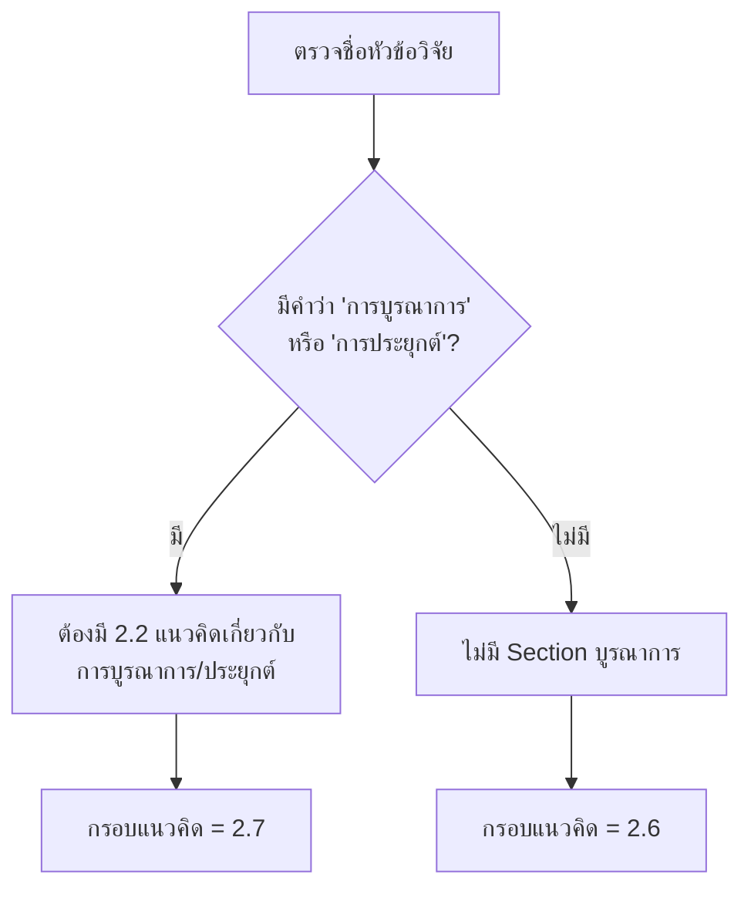
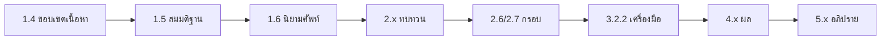

# 06 — Writing Standard
## Phase 4 — มาตรฐานการเขียนทุกบท + Academic Thai + Consistency Chain

**Version:** V01R01 | **Date:** 2026-05-03

---

## 1. Mission

ไฟล์นี้คือ **มาตรฐานการเขียนทุกบทของดุษฎีนิพนธ์** — ครอบคลุม Cross-cutting Writing Rules + Chapter-specific Quick Guide + Academic Thai Vocabulary + Cross-Chapter Consistency Audit

**Authority Hierarchy:**
- **Level 1:** คู่มือการเขียนดุษฎีนิพนธ์ฯ มจร 2563 (มาตรฐานสูงสุด)
- **Level 2:** Templates `07 บทที่ 1.docx` / `08 บทที่ 2.docx` / `09 บทที่ 3.docx`
- **Level 4:** `วิจัยบทที่ 1-5.pdf` (Worked Example สำหรับบท 4-5 ที่ไม่มี Template)

Skill จะอ่านไฟล์นี้เมื่อ
1. ผู้ใช้กล่าวถึง "เขียนบทที่ X", "ร่างบท", "writing", "มาตรฐานการเขียน"
2. ก่อนเขียน chapter ใด ๆ — โหลดคู่กับ MD เฉพาะบท
3. Cross-Audit Consistency ทั้งเล่ม

**Cross-reference:**
- Chapter 1 detail → `02-topic-development.md`
- Chapter 2 detail → `03-literature-review.md` + `04-pa-dhamma-mapping.md`
- Chapter 3 detail → `05-methodology-design.md`
- Chapter 4-5 → ไฟล์นี้ (Quick Guide) + `วิจัยบทที่ 1-5.pdf`
- Anti-AI Voice → `07-academic-thai-voice.md`
- Format Audit → `08-template-audit.md`
- Citation/Footnote → `11-citation-footnote.md`

---

## 2. Universal Writing Standards (Cross-cutting)

### 2.1 Typography Specification (ตามคู่มือ มจร)

| ส่วน | ขนาด | รูปแบบ | หมายเหตุ |
|-----|------|--------|----------|
| บทที่ + ชื่อบท | 20 pt | ตัวหนา กลาง | "บทที่ ๑" + บรรทัดถัดไป "บทนำ" |
| หัวข้อใหญ่ (1.1) | 18 pt | ตัวหนา ชิดซ้าย | — |
| หัวข้อย่อย (1.1.1) | 16 pt | ตัวหนา ชิดซ้าย | — |
| เนื้อหา + เลขหน้า | 16 pt | ตัวปกติ | TH SarabunPSK |
| เชิงอรรถ | 14 pt | ตัวปกติ | Indent 0.7 นิ้ว |

**กฎเหล็ก:**
- ฟอนต์ = TH SarabunPSK (ตลอดทั้งเล่ม)
- กระดาษ A4 ขาว 80 แกรม พิมพ์หน้าเดียว
- ขอบ บน+ซ้าย = 1.5 นิ้ว / ล่าง+ขวา = 1 นิ้ว
- Justify both sides ทุกย่อหน้า (ห้ามจัดกลาง/ชิดซ้ายอย่างเดียว)
- First Line Indent = 0.7 นิ้ว (1.75 ซม.)

### 2.2 Paragraph Structure (โครงสร้างย่อหน้า)

**ย่อหน้ามาตรฐาน 4-7 ประโยค:**
```
[Topic Sentence — 1 ประโยค]
[Supporting Sentences — 2-5 ประโยค]
[Linking/Closing Sentence — 1 ประโยค ที่นำไปย่อหน้าถัดไป]
```

**ห้าม:**
- ย่อหน้า 1-2 ประโยค (สั้นเกินไป)
- ย่อหน้า > 12 ประโยค (ยาวเกินไป — แตกเป็น 2 ย่อหน้า)
- ย่อหน้าถัดกันโดยไม่มี Transition Sentence

### 2.3 Heading Hierarchy

```
บทที่ ๑ บทนำ                              ← 20pt bold center
๑.๑ ความเป็นมาและความสำคัญของปัญหา       ← 18pt bold
   ๑.๑.๑ ความเป็นมา                       ← 16pt bold
      [เนื้อหา 16pt regular]
      [เนื้อหาต่อ ...]
   ๑.๑.๒ ความสำคัญของปัญหา                 ← 16pt bold
๑.๒ คำถามการวิจัย                          ← 18pt bold
   [เนื้อหา]
```

**กฎเหล็ก:**
- เลขลำดับชั้น: 1.1 → 1.1.1 → 1.1.1.1 (ไม่เกิน 4 ชั้น)
- ห้าม "ลูกพี่ 1.3 ลูกน้อง 1.2" — ต้องไล่ลำดับ
- ไม่ใส่ "**แสดง**" หน้าหัวข้อ — "**กรอบแนวคิด**" ไม่ใช่ "**แสดงกรอบแนวคิด**"

---

## 3. Academic Thai Vocabulary (กรอบสั้น)

> รายละเอียดเชิงลึก + Anti-AI vocabulary → `07-academic-thai-voice.md`

### 3.1 First-Person Convention

**ใช้ "ผู้วิจัย"** แทน "ผม/ดิฉัน/ฉัน/I"
- ✓ "ผู้วิจัยจึงสนใจศึกษา..."
- ✓ "ผู้วิจัยขอเสนอ..."
- ✗ "ผมจึงสนใจศึกษา..."
- ✗ "หาก[เรา]พิจารณา..." (เลี่ยง "เรา" ในงานวิชาการ)

### 3.2 Standard Academic Register

**ใช้คำสุภาพทางวิชาการ:**
- "พิจารณา" (ไม่ใช่ "ดู")
- "ปรากฏ" (ไม่ใช่ "เห็น")
- "ระบุ" (ไม่ใช่ "บอก")
- "เสนอ" (ไม่ใช่ "พูด")
- "วิเคราะห์" (ไม่ใช่ "ดูแล้วบอก")
- "ค้นพบ" (ไม่ใช่ "เจอ")

### 3.3 ห้ามใช้ในงานวิชาการ

- ✗ คำพูดติดปาก: "ก็", "นะ", "ครับ", "ค่ะ"
- ✗ คำลดน้อย: "นิดหน่อย", "นิดเดียว"
- ✗ คำพูดสนิท: "เพราะว่า..." (ใช้ "เนื่องจาก..." แทน)
- ✗ คำเชื่อมพูดอย่างเดียว: "พอ...", "เลย..."

### 3.4 Connector Words ที่นิยมใน รปศ. มจร

| ความสัมพันธ์ | คำเชื่อม |
|-------------|---------|
| เพิ่มเติม | นอกจากนี้, อนึ่ง, ทั้งนี้ |
| เหตุ-ผล | เนื่องจาก, เพราะเหตุนี้, ดังนั้น |
| ตัดสินใจ | ด้วยเหตุผลข้างต้น, ดังที่กล่าว |
| เปรียบเทียบ | ในขณะเดียวกัน, ตรงกันข้าม |
| สรุป | สรุปได้ว่า, กล่าวโดยสรุป |
| ตัวอย่าง | กล่าวคือ, อาทิ, เช่น |

---

## 4. Sentence-level Examples (Comprehensive)

### 4.1 Topic Sentence (ประโยคหลัก)

**Pattern:** [Subject] + [Verb of Statement] + [Concept]

✓ "การพัฒนาสมรรถนะเชิงพุทธมีความสำคัญต่อการเรียนรู้เทคโนโลยีดิจิทัลของบุคลากร"
✓ "ทฤษฎีสมรรถนะของ Spencer ประกอบด้วย 5 องค์ประกอบหลัก"
✗ "เรามาดูเรื่องสมรรถนะกัน" (ไม่เป็นวิชาการ)

### 4.2 Citation Sentence (ประโยคอ้างอิง)

**Pattern:** [Concept] + ตามที่ [Author] ([Year]) ระบุไว้ ว่า "[Quote/Paraphrase]"

✓ "ตามที่ Spencer และ Spencer (1993) ระบุไว้ สมรรถนะประกอบด้วย Knowledge, Skill, Self-Concept, Trait และ Motive"
✓ "พระพรหมคุณาภรณ์ (ป.อ. ปยุตฺโต) อธิบายอิทธิบาท ๔ ว่าเป็นหลักของความสำเร็จ"
✗ "Spencer พูดว่าสมรรถนะมี 5 อย่าง" (ไม่สุภาพ + ไม่ระบุปี)

### 4.3 Comparison Sentence (ประโยคเปรียบเทียบ)

**Pattern:** [A] + [Verb] + ในขณะที่ + [B] + [Contrasting Verb]

✓ "ในขณะที่ McClelland (1973) เน้นแรงจูงใจเป็นหลัก Spencer และ Spencer (1993) ขยายเป็น 5 องค์ประกอบ"
✓ "การวิจัยเชิงปริมาณวัดได้ในเชิงตัวเลข ในขณะที่การวิจัยเชิงคุณภาพให้บริบทเชิงลึก"
✗ "Spencer ก็คล้าย McClelland แต่ก็ต่างกันบ้าง" (ไม่ชัดเจน)

### 4.4 Cause-Effect Sentence (เหตุ-ผล)

**Pattern:** เนื่องจาก [Cause] จึง [Effect] / [Effect] เป็นผลของ [Cause]

✓ "เนื่องจากบุคลากรขาดทักษะดิจิทัล จึงส่งผลต่อประสิทธิภาพการให้บริการ"
✓ "การพัฒนาสมรรถนะที่ดีเป็นผลของการฝึกฝนตามหลักอิทธิบาท ๔"
✗ "เพราะมันแย่ ก็เลยไม่ดี" (ภาษาพูด)

### 4.5 Synthesis Sentence (ประโยคสังเคราะห์)

**Pattern:** จากการทบทวนข้างต้น + [Conclusion]

✓ "จากการทบทวนแนวคิดสมรรถนะ ผู้วิจัยจึงสังเคราะห์ตัวแปรอิสระเป็น 5 ด้าน ได้แก่..."
✓ "เมื่อพิจารณาในภาพรวม สมรรถนะดิจิทัลและหลักอิทธิบาท ๔ มีจุดร่วมคือการมุ่งสู่ความสำเร็จ"
✗ "สรุปก็คือ..." (ไม่เป็นวิชาการ)

### 4.6 Recommendation Sentence (ข้อเสนอแนะ)

**Pattern:** [Stakeholder] + ควร + [Action] + เพื่อ [Outcome]

✓ "หน่วยงานในกำกับของรัฐควรพัฒนาหลักสูตรอบรมสมรรถนะดิจิทัลตามหลักอิทธิบาท ๔ เพื่อยกระดับประสิทธิภาพการให้บริการ"
✓ "ผู้วิจัยขอเสนอแนะเชิงนโยบาย ดังนี้..."
✗ "ควรทำให้ดีกว่านี้" (ไม่เฉพาะเจาะจง)

### 4.7 Hypothesis Sentence (สมมติฐาน)

**Pattern:** [Variable A] + มี + [Relation] + ต่อ + [Variable B]

✓ H1: "สมรรถนะเชิงพุทธมีความสัมพันธ์เชิงบวกต่อการเรียนรู้เทคโนโลยีดิจิทัล"
✓ H2: "อิทธิบาท ๔ ส่งผลต่อสมรรถนะดิจิทัลของบุคลากร"
✗ "การวิจัยจะค้นพบว่าสมรรถนะดี" (เป็นข้อสรุป ไม่ใช่สมมติฐาน)

### 4.8 Definition Sentence (นิยาม) — บทที่ 1.6 ห้ามอ้างอิง

**Pattern:** [Term] + หมายถึง + [Definition โดยผู้วิจัยเอง]

✓ "สมรรถนะเชิงพุทธ หมายถึง องค์ประกอบของสมรรถนะตามทฤษฎี Spencer ที่ผู้วิจัยบูรณาการกับหลักอิทธิบาท ๔ ได้แก่ ฉันทะ วิริยะ จิตตะ วิมังสา"
✗ "สมรรถนะเชิงพุทธ หมายถึง... [Spencer, 1993]" (ห้ามอ้างอิง)

---

## 5. Section Numbering Rules (กรอบแนวคิด)

> ⭐ **CRITICAL Rule** — ตำแหน่งของกรอบแนวคิดในบทที่ 2 เปลี่ยนตามชื่อหัวข้อวิจัย

### 5.1 Decision Logic



### 5.2 Outline เมื่อมี "บูรณาการ/ประยุกต์"

```
2.1 หลักพุทธธรรม (X2)
2.2 แนวคิดเกี่ยวกับการบูรณาการ / การประยุกต์
2.3 แนวคิดและทฤษฎี IV1
2.4 แนวคิดและทฤษฎี IV2 (ถ้ามี)
2.5 แนวคิดและทฤษฎี DV
2.6 งานวิจัยที่เกี่ยวข้อง
2.7 กรอบแนวคิด ⭐
```

### 5.3 Outline เมื่อไม่มี "บูรณาการ/ประยุกต์"

```
2.1 หลักพุทธธรรม (X2)
2.2 แนวคิดและทฤษฎี IV1
2.3 แนวคิดและทฤษฎี IV2 (ถ้ามี)
2.4 แนวคิดและทฤษฎี DV
2.5 งานวิจัยที่เกี่ยวข้อง
2.6 กรอบแนวคิด ⭐
```

### 5.4 ตัวอย่างหัวข้อ

| หัวข้อตัวอย่าง | มี "บูรณาการ/ประยุกต์"? | กรอบ = ข้อใด |
|-------------|----------------------|------------|
| "การพัฒนาสมรรถนะเชิงพุทธ..." | ไม่มี (เป็น "เชิงพุทธ") | 2.6 |
| "การบูรณาการพุทธธรรมในการบริหาร..." | ✓ มี | 2.7 |
| "การประยุกต์หลักธรรมาภิบาล..." | ✓ มี | 2.7 |
| "การพัฒนาภาวะผู้นำตามหลักพรหมวิหาร..." | ไม่มี | 2.6 |

> **หมายเหตุงานท่าน:** หัวข้อ "การพัฒนาสมรรถนะ**เชิงพุทธ**..." → ไม่มี "บูรณาการ/ประยุกต์" → **กรอบแนวคิด = 2.6**

---

## 6. Cross-Chapter Consistency Audit + Map

### 6.1 Variable Consistency Chain

ตัวแปรทุกตัวต้องตรงกันใน 6 จุดของเล่ม



### 6.2 Cross-Reference Map (ตัวอย่างจากหัวข้อท่าน)

| ตัวแปร | บท 1 ขอบเขต | บท 1 นิยาม | บท 2 ทบทวน | บท 2 กรอบ | บท 3 เครื่องมือ | บท 4 ผล | บท 5 อภิปราย |
|--------|-----------|-----------|-----------|-----------|---------------|---------|--------------|
| IV1: สมรรถนะ Spencer 5 | 1.4.1 ✓ | 1.6 ✓ | 2.3 (1 หน้า + 5 อ้าง) ✓ | 2.6 (กรอบ) ✓ | 3.2.2 ตอนที่ 2 ✓ | 4.1.1 ✓ | 5.2.1 ✓ |
| X2: อิทธิบาท ๔ | 1.4.1 ✓ | 1.6 ✓ | 2.1 (Pure) ✓ | 2.6 (กรอบ) ✓ | 3.2.2 ตอนที่ 2 ✓ | 4.1.2 ✓ | 5.2.2 ✓ |
| DV: การเรียนรู้ดิจิทัล | 1.4.1 ✓ | 1.6 ✓ | 2.5 ✓ | 2.6 (กรอบ) ✓ | 3.2.2 ตอนที่ 3 ✓ | 4.2 ✓ | 5.2.3 ✓ |

### 6.3 Audit Workflow

ก่อน Phase 4 จบ → รัน Cross-Chapter Audit
```
1. List ทุกตัวแปรในกรอบ (บท 2)
2. ตรวจชื่อตัวแปร = ขอบเขตเนื้อหา (1.4) — ตรงทุกตัว?
3. ตรวจชื่อตัวแปร = นิยามศัพท์ (1.6) — ตรงทุกตัว?
4. ตรวจชื่อตัวแปร = ทบทวน (2.3-2.5) — ตรงทุกตัว?
5. ตรวจชื่อตัวแปร = เครื่องมือ (3.2.2) — ตรงทุกตัว?
6. ตรวจชื่อตัวแปร = ผล (4.x) — ตรงทุกตัว?
7. ตรวจชื่อตัวแปร = อภิปราย (5.x) — ตรงทุกตัว?
8. Pass = ทั้ง 6 จุด ตรง 100% / Fail = ระบุจุดผิด
```

---

## 7. Chapter-Specific Quick Guides

### 7.1 Chapter 1 — บทนำ

→ **Detail:** `02-topic-development.md`

**Quick Reference:**
- ความเป็นมา + ความสำคัญ รวม 4-5 หน้า
- คำถามวิจัย + วัตถุประสงค์ จำนวนเท่ากัน (3 ข้อ)
- วัตถุประสงค์ขึ้นต้น "เพื่อ..."
- นิยามศัพท์ห้ามมีอ้างอิง
- Variable Consistency: 1.4, 1.5, 1.6, 2.6/2.7

### 7.2 Chapter 2 — แนวคิด ทฤษฎี และงานวิจัยที่เกี่ยวข้อง

→ **Detail:** `03-literature-review.md` + `04-pa-dhamma-mapping.md`

**Quick Reference:**
- Section numbering ตาม §5 ในไฟล์นี้
- หลักธรรม 2.1 ต้อง Pure
- ทุกตัวแปร ≥ 1 หน้า + ≥ 5 อ้างอิง
- มจร อ้างอิง ≥ 60%
- ระดับ ป.เอก เท่านั้น (ห้าม ป.โท)

### 7.3 Chapter 3 — วิธีดำเนินการวิจัย

→ **Detail:** `05-methodology-design.md`

**Quick Reference:**
- Mixed Methods Sequential Explanatory (Default)
- 3.1 รูปแบบ / 3.2 Quant / 3.3 Qual / 3.4 Ethics (Optional)
- ตัด "เชิงปริมาณ"/"เชิงคุณภาพ" ใน sub-section
- ผู้ให้ข้อมูล ≥ 17 (Mixed) + ผู้เชี่ยวชาญ 5 + Try out 30

### 7.4 Chapter 4 — ผลการวิเคราะห์ข้อมูล

> ⚠️ ไม่มี Template — ใช้คู่มือ มจร + `วิจัยบทที่ 1-5.pdf`

**โครงสร้างมาตรฐาน:**
```
4.1 การนำเสนอข้อมูลเชิงปริมาณ (ก่อนเพราะเป็นตัวนำ)
   - ตอนที่ 1: ข้อมูลทั่วไปของผู้ตอบ (Demographic)
   - ตอนที่ 2: ผลการวิเคราะห์ตัวแปรต้น
   - ตอนที่ 3: ผลการวิเคราะห์ตัวแปรตาม
   - ตอนที่ 4: ผลการทดสอบสมมติฐาน
4.2 การนำเสนอข้อมูลเชิงคุณภาพ
   - ตามวัตถุประสงค์ข้อ 1-3
4.3 องค์ความรู้
   - 4.3.1 องค์ความรู้ที่ได้รับจากการวิจัย (≥ 3 หน้า)
   - 4.3.2 องค์ความรู้ที่ได้สังเคราะห์จากการวิจัย (≥ 2 หน้า)
```

**กฎเหล็ก สำหรับ Chapter 4 (CRITICAL):**
- ✗ **ห้าม** ดึงผลจากหนังสือ — ผลต้องมาจากสัมภาษณ์/แบบสอบถามจริงเท่านั้น
- ✓ ใช้ ปรโตโฆสะ + โยนิโสมนสิการ — สรุปจากที่ได้สัมภาษณ์ + วิเคราะห์ของผู้วิจัย
- ✓ องค์ความรู้ ≥ 3 หน้า (4.3.1) + สังเคราะห์ ≥ 2 หน้า (4.3.2)
- ✓ แผนภาพองค์ความรู้สังเคราะห์ ห้ามซ้ำ 4.3.1 — ต้องเป็นเชิงนวัตกรรม

### 7.5 Chapter 5 — สรุป อภิปรายผลและข้อเสนอแนะ

> ⚠️ ไม่มี Template — ใช้คู่มือ มจร + `วิจัยบทที่ 1-5.pdf`

**โครงสร้างมาตรฐาน:**
```
5.1 สรุปผลการวิจัย
   - สรุปตามวัตถุประสงค์แต่ละข้อ
   - มิให้แยกสรุป Quant/Qual — รวมตามวัตถุประสงค์
5.2 อภิปรายผลการวิจัย
   - เชื่อมโยงกับงานวิจัยในบทที่ 2
   - ระดับ ป.เอก เท่านั้น
   - ครอบคลุมทุกตัวแปรหรือ องค์ความรู้ใหม่
5.3 ข้อเสนอแนะ
   - 5.3.1 ข้อเสนอแนะเชิงนโยบาย (เรื่องใหญ่)
   - 5.3.2 ข้อเสนอแนะเชิงปฏิบัติการ (มากกว่า 5.3.1)
   - 5.3.3 ข้อเสนอแนะเพื่อการวิจัยครั้งต่อไป
```

**กฎเหล็ก:**
- 5.1 สรุปรวม ไม่แยก Quant/Qual
- 5.2 อภิปรายอ้างเฉพาะ ป.เอก ในบทที่ 2 (ห้าม ป.โท)
- 5.3.1 ข้อเสนอแนะมาจาก
  - Quant: ค่าเฉลี่ยต่ำ (น้อย/น้อยที่สุด)
  - Qual: ที่ผู้ให้สัมภาษณ์เคยเสนอแนะ
- 5.3.2 ละเอียดกว่า 5.3.1
- 5.3.3 เสนอเรื่องใกล้เคียง / ระเบียบวิธี

---

## 8. Common Mistakes Library (10 Checkpoints)

**[CP-68] ขาดโยนิโสมนสิการในบทที่ 4** [High]
- ✗ ไม่มีส่วนที่ผู้วิจัยวิเคราะห์/สังเคราะห์เอง — ปล่อยข้อมูลดิบ
- ✓ ทุกประเด็นหลักหลังนำเสนอข้อมูล (ปรโตโฆสะ) ต้องมีย่อหน้าวิเคราะห์/สังเคราะห์ของผู้วิจัย (โยนิโสมนสิการ)
- *Source: Wri-D1*

**[CP-69] องค์ความรู้ขาดคำอธิบาย** [High]
- ✗ มีแผนภาพแต่ไม่มีอธิบาย
- ✓ แผนภาพ + คำอธิบาย ≥ 3 หน้า (4.3.1)
- *Source: Wri-D2*

**[CP-70] องค์ความรู้สังเคราะห์ซ้ำกรอบเดิม** [High]
- ✗ 4.3.2 เหมือน 4.3.1 / ใช้แผนภาพเดิม
- ✓ ต้องสังเคราะห์ใหม่เชิงนวัตกรรม + ≥ 2 หน้า
- *Source: Wri-D3*

**[CP-71] ประโยชน์ถ้อยคำผิดมาตรฐาน** [High]
- ✗ "ทำให้ได้ความรู้"
- ✓ "ได้องค์ความรู้..." / "ได้รูปแบบ..." / "ได้นำเสนอ..."
- *Source: Wri-D4*

**[CP-72] สารบัญบทที่ 4 ไม่เป็นมาตรฐาน** [High]
- ✗ ไม่ตรงกับ Template หลักสูตร
- ✓ ตรงตาม Template มาตรฐาน
- *Source: XL-42*

**[CP-73] Section Numbering ของกรอบแนวคิดผิด** [CRITICAL]
- ✗ หัวข้อมี "บูรณาการ" แต่กรอบอยู่ 2.6 / หัวข้อไม่มี "บูรณาการ" แต่กรอบอยู่ 2.7
- ✓ ตามกฎ §5 — มี "บูรณาการ/ประยุกต์" → 2.7 / ไม่มี → 2.6
- *Source: User Rule (กฎพิเศษ)*

**[CP-74] ผลวิจัยบทที่ 4 ดึงจากหนังสือ** [CRITICAL]
- ✗ พบเชิงอรรถหนังสือใน 4.x
- ✓ ผลทั้งหมดต้องจากสัมภาษณ์/แบบสอบถามจริง — ไม่อ้างหนังสือ
- *Source: คู่มือ มจร P4 + Cross-H*

**[CP-75] อ้างงานวิจัย ป.โท ใน Discussion** [CRITICAL]
- ✗ บทที่ 5 อภิปรายอ้างวิทยานิพนธ์ ป.โท
- ✓ อ้างเฉพาะ ป.เอก หรือบทความวิจัย
- *Source: คู่มือ มจร P5 + ระดับ ป.เอก*

**[CP-76] อภิปรายไม่เชื่อมบทที่ 2** [High]
- ✗ พูดผลของตนเองโดยไม่อ้างงานวิจัยอื่น
- ✓ ทุกประเด็นอภิปรายต้องเชื่อมงานวิจัยที่ระบุไว้ในบทที่ 2 (ตรง/ไม่ตรงกับใคร อย่างไร)
- *Source: คู่มือ มจร P5*

**[CP-77] ข้อเสนอแนะ 3 ระดับไม่สอดคล้องผลจริง** [High]
- ✗ เสนอแนะที่ไม่ได้มาจากผลวิจัย
- ✓ เสนอแนะมาจาก Quant ต่ำ + Qual ที่ผู้ให้สัมภาษณ์เสนอจริง
- *Source: คู่มือ มจร P5*

---

## 9. Pre-Phase 4 Exit Checklist (ก่อนปิด Writing Phase)

### Cross-Chapter Consistency

✅ Variable Consistency Chain — ตรงทุก 6 จุด (Section 6.2)
✅ Section Numbering ของกรอบแนวคิดถูกต้อง (§5)
✅ ตัวแปรทุกตัวในกรอบ มาจากการทบทวนในบท 2.x

### Typography & Format

✅ TH SarabunPSK ทุกขนาดถูก
✅ Justify both sides ทุกย่อหน้า
✅ First Line Indent 0.7 นิ้ว
✅ ขอบกระดาษ 1.5/1 นิ้ว ถูก
✅ เลขหน้าต่อเนื่องทุกบท

### Chapter-specific

✅ Ch1: บทนำ 4-5 หน้า + นิยามไม่อ้างอิง + RQ = วัตถุประสงค์
✅ Ch2: ตามมาตรฐาน 03-literature-review.md
✅ Ch3: ตามมาตรฐาน 05-methodology-design.md
✅ Ch4: ผลจากสัมภาษณ์จริง + องค์ความรู้ ≥ 3 หน้า + สังเคราะห์ ≥ 2 หน้า
✅ Ch5: สรุปรวม + อภิปรายเชื่อมบท 2 + ข้อเสนอแนะ 3 ระดับ

### Voice & Quality

✅ ใช้ "ผู้วิจัย" first-person
✅ Academic Thai register ถูก
✅ Sentence patterns ครบ 8 ประเภท
✅ ผ่าน Common Mistakes 10 Checkpoints (CP-68 ถึง CP-77)

---

## 10. Routing Map ออกจากไฟล์นี้

| สถานการณ์ | Load Reference ถัดไป |
|-----------|---------------------|
| ตรวจ Anti-AI / Voice Profile | `07-academic-thai-voice.md` |
| ตรวจ Format/Typography | `08-template-audit.md` |
| ตรวจเชิงอรรถ/บรรณานุกรม | `11-citation-footnote.md` |
| ตรวจ Citation Verify | `09-fact-audit.md` |
| ตรวจ AI Score | `10-ai-detection.md` |
| Detail Chapter 1 | `02-topic-development.md` |
| Detail Chapter 2 | `03-literature-review.md` |
| Detail Chapter 3 | `05-methodology-design.md` |
| Theory-Dhamma | `04-pa-dhamma-mapping.md` |

---

## 11. Versioning

**Version:** V01R01
**Date:** 2026-05-03
**Source:**
- คู่มือการเขียนดุษฎีนิพนธ์ฯ มจร — บทที่ 4-5 + Typography
- Templates `07 บทที่ 1.docx` / `08 บทที่ 2.docx` / `09 บทที่ 3.docx`
- `วิจัยบทที่ 1-5.pdf` (Worked Example สำหรับ บท 4-5)
- User Rule: Section Numbering ของกรอบแนวคิด (มี/ไม่มี บูรณาการ-ประยุกต์)
- Common Mistakes 10 ข้อ (CP-68 ถึง CP-77) จาก Wri-D + XL-42 + User Rule
**Update Rule:** Minor edit → V01R02; Major rewrite → V02R01
