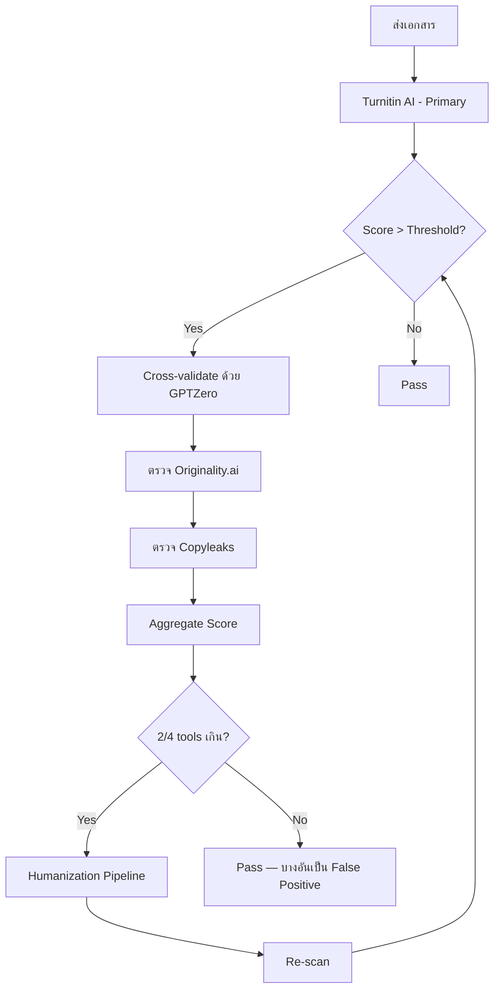
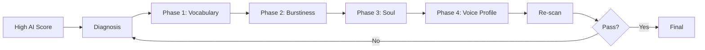

# 10 — AI Detection
## AI Score Detection + Multi-tool Cross-validation + Humanization Pipeline

**Version:** V01R01 | **Date:** 2026-05-03

---

## 1. Mission

ไฟล์นี้คือ **AI Detection Workflow Reference** — รวมเครื่องมือ + threshold + วิธีรัน detection + Humanization Pipeline สำหรับดุษฎีนิพนธ์ที่จะส่ง มจร

**Authority Hierarchy:**
- **Level 1:** มจร Turnitin AI requirement (≤ 30% Default)
- **Level 2:** Multi-tool Cross-validation (Turnitin + GPTZero + Originality + Copyleaks)
- **Level 3:** Humanization Workflow → `07-academic-thai-voice.md`

**Cross-reference:**
- AI Vocabulary + Patterns + Soul → `07-academic-thai-voice.md`
- Voice Profile → `07-academic-thai-voice.md` §6

Skill จะอ่านไฟล์นี้เมื่อ
1. ผู้ใช้กล่าวถึง "AI score", "Turnitin", "GPTZero", "Originality.ai", "Copyleaks", "AI detection", "humanize"
2. ก่อน Gate 2 + Gate 3
3. หลัง Detection ตรวจ score สูง — เริ่ม Humanization

---

## 2. AI Detection Tools (Multi-tool Cross-validation)

### 2.1 Tool Comparison

| Tool | Strength | Weakness | มจร ใช้? |
|------|---------|---------|---------|
| **Turnitin AI** | Default ของ มจร, ใช้ในระบบ | ยังพัฒนา — false positive ใน Thai | ✓ Default |
| **GPTZero** | ตรวจ Thai ได้ดีระดับหนึ่ง | Score ผันผวนตาม version | Optional |
| **Originality.ai** | Cross-language detection ดี | ไม่ฟรี | Optional |
| **Copyleaks** | Multi-model detection | UI ภาษาอังกฤษเป็นหลัก | Optional |

### 2.2 Recommended Workflow



---

## 3. Threshold Standards

### 3.1 Default Thresholds (per tool)

| Tool | Pass | Warning | Fail |
|------|------|---------|------|
| **Turnitin AI** | ≤ 30% | 30-40% | > 40% |
| **GPTZero** | ≤ 25% | 25-35% | > 35% |
| **Originality.ai** | ≤ 20% | 20-30% | > 30% |
| **Copyleaks** | ≤ 25% | 25-35% | > 35% |

### 3.2 Aggregate Decision Rule

- **All Pass:** ✅ ส่งเล่มได้
- **1 Warning + 3 Pass:** ⚠️ Re-check section ที่เตือน
- **2+ Warning:** 🔴 Run Humanization
- **Any Fail:** 🚫 ห้ามส่ง — ต้อง Humanize

### 3.3 User Override

ถ้าผู้ใช้ระบุ threshold อื่น (เช่น วารสารต่างประเทศใช้ ≤ 5%) — ใช้ override

---

## 4. Detection Workflow

### 4.1 Pre-Detection Preparation

```
Step 1: เตรียมไฟล์
   - ตรวจ Format (08)
   - ตรวจ Citation (09)
   - ตรวจ AI Vocabulary (07) — Pre-flight clean

Step 2: ทำ AI Score Pre-Audit ก่อนส่งจริง
   - Run Turnitin AI ใน Working Mode
   - Identify high-AI sections
   - Apply Humanization (07)
   - Re-test
```

### 4.2 Manual Detection Workflow

ผู้ใช้ทำเอง (Default — เพราะ MCP สำหรับ AI Detection ส่วนใหญ่ยังไม่มี)

```
Step 1: Submit เอกสารไปยัง tool
   - Turnitin AI (ผ่านระบบ มจร)
   - GPTZero (web)
   - Originality.ai (subscription)
   - Copyleaks (subscription)

Step 2: Capture Score + Highlighted Sections
   - Save report PDF
   - Note: section/page ที่ AI score สูง

Step 3: Paste back to Claude
   - "Turnitin AI = X% / GPTZero = Y% / ..."
   - แนบ highlighted sections (paste)

Step 4: Claude วิเคราะห์ + แนะนำ Action
```

### 4.3 Optional MCP Workflow (เมื่อมี MCP)

หากในอนาคตมี MCP สำหรับ AI detection — ใช้ workflow นี้
```
1. Claude → MCP `ai_detection.scan(document)`
2. MCP returns: Score + sections
3. Claude analyze + recommend
```

ปัจจุบัน — ใช้ Manual workflow

---

## 5. Diagnostic Report Format

เมื่อรับ Score กลับมา Claude สร้างรายงาน

### 5.1 Report Template

```markdown
# AI Detection Report
## ดุษฎีนิพนธ์ [ชื่อเรื่อง]
**Date:** YYYY-MM-DD

## 1. Score Summary

| Tool | Score | Status |
|------|-------|--------|
| Turnitin AI | X% | Pass / Warning / Fail |
| GPTZero | Y% | Pass / Warning / Fail |
| Originality.ai | Z% | Pass / Warning / Fail |
| Copyleaks | W% | Pass / Warning / Fail |

**Aggregate:** Pass / Need Humanization / Fail

## 2. High-AI Sections

| บท | Section | AI Score | Pattern พบ |
|----|---------|----------|-----------|
| 1 | 1.1 ความเป็นมา | 65% | P22 Filler / AI Vocabulary 8 ครั้ง |
| 2 | 2.3 ทฤษฎี | 45% | P10 Rule of three / AI verb 5 ครั้ง |
| ... | ... | ... | ... |

## 3. Diagnosis

**Top Issues:**
1. AI Vocabulary Density เกิน threshold ใน บท 1.1
2. Sentence Length SD < 5 ใน บท 2.3
3. ขาด first-person "ผู้วิจัย" ในบทที่ 1
4. Em dash overuse ในบทที่ 5

## 4. Action Plan

**Phase 1 — Quick Fix (1-2 hours):**
- [Action 1]: ลบ AI vocabulary ใน บท 1.1
- [Action 2]: เพิ่ม "ผู้วิจัย" first-person

**Phase 2 — Burstiness Adjustment (2-4 hours):**
- [Action 3]: เพิ่มประโยคสั้น 3-12 คำ ใน บท 2.3
- [Action 4]: Vary sentence opening

**Phase 3 — Soul Injection (4-6 hours):**
- [Action 5]: Apply S6 (specific reactions) ใน บท 4
- [Action 6]: Apply S3 (acknowledge complexity) ใน บท 5

**Re-scan after each phase**

## 5. Estimated Time

Total: X hours (Quick Fix → Burstiness → Soul)
Expected score reduction: from Y% to Z%
```

---

## 6. Humanization Pipeline (Cross-reference 07)

### 6.1 Pipeline Steps



### 6.2 Phase Detail (อ้าง 07)

**Phase 1 — Vocabulary (07 §2):**
- ลบ Thai Confirmed AI signatures (§2.1)
- ลบ Dissertation-specific AI signatures (§2.2)
- ลด Moderate-use density (§2.3)
- ลบ English AI verbs/adj/nouns/phrases (§2.5-§2.8)

**Phase 2 — Burstiness (07 §4):**
- เพิ่มประโยคสั้น 3-12 คำ
- เพิ่มประโยคยาว 25-35 คำ
- Sentence Opening Variety ≥ 5 patterns
- Paragraph size variation

**Phase 3 — Soul (07 §5):**
- S1: Have Opinions (บทอภิปราย)
- S3: Acknowledge Complexity (Discussion + Limitation)
- S4: First-person "ผู้วิจัย" (ตลอด)
- S6: Specific Reactions (ผลวิจัย)

**Phase 4 — Voice Profile (07 §6):**
- ใช้ Voice Profile match ทั้งเล่ม
- ตรวจ consistency
- Update profile ถ้ามีงานเขียนใหม่

### 6.3 Iteration Cycle

หลังทุก Phase → Re-scan ด้วย Tool หลัก (Turnitin AI)
- ถ้า score ลด → ทำ Phase ถัดไป
- ถ้า score ไม่ลด → กลับ diagnosis + ตรวจ pattern อื่น

---

## 7. Section-level Humanization (เน้นจุดที่ score สูง)

### 7.1 Targeted Approach

แทนที่จะ Humanize ทั้งเล่ม — เน้นเฉพาะ section ที่ score สูง

```
1. Identify high-AI sections (>50% AI probability)
2. Apply targeted Humanization
3. Keep low-AI sections unchanged
4. Re-scan
```

### 7.2 Common High-AI Sections

จากประสบการณ์รีวิวที่ผ่านมา section เหล่านี้มัก score สูง

| Section | เหตุผล | Quick Fix |
|---------|--------|-----------|
| บทที่ 1.1 ความเป็นมา | ใช้ AI ช่วยเขียน intro | ลบ "ในยุคปัจจุบัน" + เพิ่ม specific year |
| บทที่ 2.x ทบทวน | Paraphrase จาก source | เพิ่ม transition + first-person |
| บทที่ 5.2 อภิปราย | Generic discussion | เพิ่ม S1 opinions + S3 complexity |
| บทคัดย่อ | สรุปกระชับเกิน | เพิ่ม specific numbers (S6) |

---

## 8. Pre-Submission AI Audit Checklist

### Pre-Detection

✅ Format Audit ผ่าน (08)
✅ Fact Audit ผ่าน (09)
✅ AI Vocabulary clean (07 §2)
✅ Burstiness adjusted (07 §4)
✅ Soul applied (07 §5)
✅ Voice Profile match (07 §6)

### During Detection

✅ ใช้อย่างน้อย 2 tools (Turnitin + GPTZero)
✅ Submit ฉบับสมบูรณ์ — ไม่ใช่ draft
✅ Save report ทุก tool

### Post-Detection

✅ Aggregate score ≤ threshold
✅ ไม่มี section > 50% AI
✅ Action plan ครบ (ถ้าต้อง Humanize)
✅ Re-scan หลัง Humanization

### Final Pass Criteria

✅ Turnitin AI ≤ 30%
✅ ≥ 2/4 tools Pass
✅ ไม่มี Fail ใน tool ใด
✅ Voice Profile consistency ≥ 85%

---

## 9. Common Mistakes Library (8 Checkpoints)

**[CP-104] ส่ง Detection ทั้ง draft โดยไม่ Pre-audit** [High]
- ✗ Run Turnitin บน first draft → score 70%
- ✓ Pre-audit (07) ก่อน → score เริ่มที่ 35-40%
- *Source: §4.1*

**[CP-105] ใช้ tool เดียว** [Medium]
- ✗ Turnitin score = 25% → Pass — แต่ GPTZero = 60%
- ✓ Cross-validate ≥ 2 tools
- *Source: §2.1*

**[CP-106] Humanize เกินจำเป็น (over-correction)** [High]
- ✗ Humanize ทั้งเล่มทำให้ academic tone หาย
- ✓ Targeted humanization เฉพาะ high-AI sections
- *Source: §7*

**[CP-107] Humanize ผิด — เพิ่ม Fake Voice** [CRITICAL]
- ✗ ใส่ "ผมรู้สึกว่า..." (informal) เพื่อลด AI score
- ✓ ใช้ "ผู้วิจัยสังเกตว่า..." (academic) แต่ specific
- *Source: 07 §5.7*

**[CP-108] Score ลดแล้วเลิก** [High]
- ✗ Score 65% → 35% → ส่ง
- ✓ Re-scan + ตรวจ section-level — ต้องไม่มี > 50% ใน section ใด
- *Source: §8*

**[CP-109] ไม่ตรวจหลัง Edit** [High]
- ✗ Humanize แล้วส่ง โดยไม่ Re-scan
- ✓ Re-scan ทุกครั้งหลัง Humanization
- *Source: §6.3*

**[CP-110] เปลี่ยนเนื้อหาเพื่อลด AI score** [CRITICAL]
- ✗ แก้ผลวิจัยเพื่อให้ "ดูเป็นมนุษย์"
- ✓ เปลี่ยนเฉพาะการเขียน — ห้ามเปลี่ยนข้อมูล
- *Source: 07 §8.4*

**[CP-111] AI score ผ่าน แต่ Voice Profile ไม่ตรง** [Medium]
- ✗ score ผ่าน แต่ style บท 1 ≠ บท 5
- ✓ Voice Profile consistency ≥ 85%
- *Source: 07 §6*

---

## 10. Quick Reference Card

### Tool URLs
- Turnitin AI: ผ่านระบบ มจร / Turnitin.com
- GPTZero: https://gptzero.me
- Originality.ai: https://originality.ai
- Copyleaks: https://copyleaks.com

### Score Targets (Default)
- Turnitin AI ≤ 30%
- GPTZero ≤ 25%
- Originality.ai ≤ 20%
- Copyleaks ≤ 25%

### Humanization Cycle Time
- Phase 1 Vocabulary: 1-2 hrs
- Phase 2 Burstiness: 2-4 hrs
- Phase 3 Soul: 4-6 hrs
- Phase 4 Voice Profile: 1-2 hrs
- Total: 8-14 hrs (ทั้งเล่ม)

---

## 11. Routing Map

| สถานการณ์ | Load Reference ถัดไป |
|-----------|---------------------|
| Humanization detail | `07-academic-thai-voice.md` |
| Voice Profile | `07-academic-thai-voice.md` §6 |
| AI Vocabulary | `07-academic-thai-voice.md` §2 |
| Format Audit | `08-template-audit.md` |
| Fact Audit | `09-fact-audit.md` |
| Citation/Footnote | `11-citation-footnote.md` |

---

## 12. Versioning

**Version:** V01R01
**Date:** 2026-05-03
**Source:**
- มจร Turnitin AI requirement (≤ 30%)
- Multi-tool Cross-validation (Turnitin + GPTZero + Originality + Copyleaks)
- Humanization Pipeline → `07-academic-thai-voice.md`
- 4-Phase Humanization Workflow
- Common Mistakes 8 ข้อ (CP-104 ถึง CP-111)
**Update Rule:** Minor edit → V01R02; Major rewrite → V02R01
