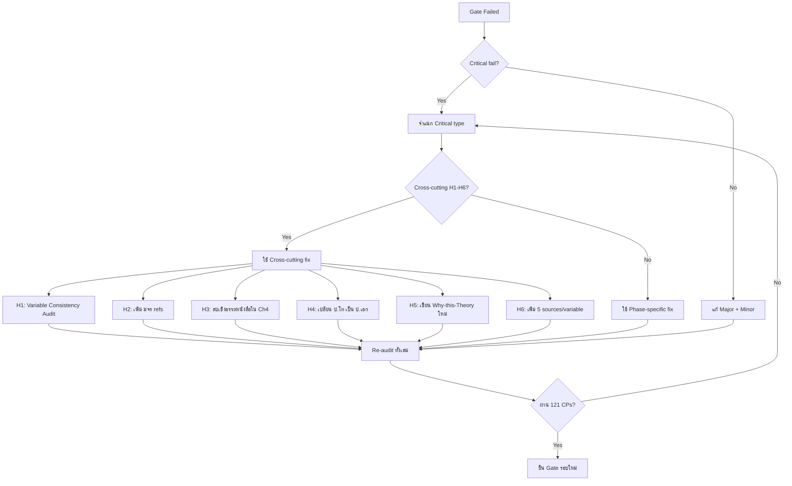

# 12 — Common Review Mistakes (Master Library)
## Pre-defense Cross-cutting Checklist + 121 CPs Index + Gate Audits

**Version:** V01R01 | **Date:** 2026-05-03

---

## 1. Mission

ไฟล์นี้คือ **Master Library** สำหรับเตรียมสอบทุก Gate — รวม Common Mistakes ทั้งหมด 121 Checkpoints ที่กระจายอยู่ใน MD 00-11 + Cross-cutting Pattern ที่ปรากฏซ้ำ

**Authority Hierarchy:**
- **Level 1:** คู่มือ มจร 2563 — มาตรฐานสูงสุด
- **Level 2:** รีวิวจริงของผู้ใช้ + Note อาจารย์ (Excel V02R01)
- **Level 3:** Pattern จากดุษฎีนิพนธ์ มจร ที่ผ่านสอบ

Skill จะอ่านไฟล์นี้เมื่อ
1. ผู้ใช้กล่าวถึง "ก่อนสอบ", "pre-defense", "review checklist", "common mistakes"
2. ก่อน Gate 1 / Gate 2 / Gate 3 (ทั้ง 3 จุด)
3. หลัง Gate ใด Gate หนึ่งไม่ผ่าน — ตรวจ Pattern กลับ

---

## 2. Master CP Index (121 Checkpoints)

### 2.1 By Source MD

| MD | Range | จำนวน | Topic |
|----|-------|------|-------|
| `00-lifecycle-map.md` | (Master Pitfall Library 12 ข้อ) | — | Universal pitfalls |
| `02-topic-development.md` | CP-1 ถึง CP-20 | 20 | Topic + Gate 1 |
| `03-literature-review.md` | CP-21 ถึง CP-43 | 23 | Lit Review + Theory |
| `04-pa-dhamma-mapping.md` | CP-44 ถึง CP-48 | 5 | Theory-Dhamma Map |
| `05-methodology-design.md` | CP-49 ถึง CP-67 | 19 | Methodology + Gate 2 |
| `06-writing-standard.md` | CP-68 ถึง CP-77 | 10 | Writing + Cross-Chapter |
| `07-academic-thai-voice.md` | CP-78 ถึง CP-85 | 8 | Anti-AI + Voice |
| `08-template-audit.md` | CP-86 ถึง CP-93 | 8 | Format + Typography |
| `09-fact-audit.md` | CP-94 ถึง CP-103 | 10 | Fact + Hallucination |
| `10-ai-detection.md` | CP-104 ถึง CP-111 | 8 | AI Detection |
| `11-citation-footnote.md` | CP-112 ถึง CP-121 | 10 | Citation + Bibliography |
| **TOTAL** | **CP-1 ถึง CP-121** | **121** | — |

### 2.2 By Severity

| Severity | จำนวน | คำอธิบาย |
|----------|------|----------|
| **CRITICAL** | ~38 | ตกแน่นอนถ้าเจอ — ต้องแก้ก่อนยื่น |
| **High** | ~58 | สำคัญ — ส่งผลกระทบต่อคุณภาพและ Pass Rate |
| **Medium** | ~25 | ควรแก้ — แต่ไม่ block Pass |

### 2.3 By Phase

| Phase | จำนวน CP | Critical |
|-------|----------|---------|
| Phase 1 (Topic) | 20 | 6 |
| Phase 2 (Lit Review) | 28 | 8 |
| Phase 3 (Methodology) | 19 | 5 |
| Phase 4 (Writing) | 10 | 4 |
| Phase 5-6 (Data + Analysis) | (in 06) | — |
| Phase 7-8 (Audit + Submit) | 36 | 15 |

---

## 3. Cross-cutting Patterns (Critical 6)

จากการวิเคราะห์ Common Mistakes ทั้งหมด พบ **6 Cross-cutting Patterns** ที่ปรากฏซ้ำ และเป็น **Critical Threat** สำหรับการสอบ

### 3.1 Pattern Cross-H1 — Variable Consistency Chain ขาด

**ปรากฏใน:** CP-7, CP-10, CP-13, CP-15, CP-20, CP-35, CP-103
**ปรากฏกี่ครั้ง:** 7+ ครั้ง
**Severity:** CRITICAL

**คำอธิบาย:**
ตัวแปรในเล่มไม่ตรงกันใน 6 จุด — ขอบเขต (1.4) → สมมติฐาน (1.5) → นิยาม (1.6) → ทบทวน (2.x) → กรอบ (2.6/2.7) → เครื่องมือ (3.2.2) → ผล (4.x) → อภิปราย (5.x)

**ตัวอย่างจริง:**
- บท 1 ขอบเขต = "สมรรถนะ 5 ด้าน" / กรอบบท 2 = "4 ด้าน"
- นิยามใช้ชื่อ A / กรอบใช้ชื่อ B

**Fix:**
- ใช้ Variable Consistency Audit Map (ใน `06-writing-standard.md` §6.2)
- Lock ตัวแปรครั้งเดียว → propagate ทุกบท

### 3.2 Pattern Cross-H2 — มจร อ้างอิง < 60% ในบทที่ 2

**ปรากฏใน:** CP-2, CP-30
**ปรากฏกี่ครั้ง:** 2 ครั้ง — แต่ Critical Mass
**Severity:** CRITICAL

**คำอธิบาย:**
อ้างอิงดุษฎีนิพนธ์/บทความ มจร น้อยกว่า 60% ในบรรณานุกรมบทที่ 2

**Fix:**
- เพิ่มอ้างอิง มจร ผ่าน NotebookLM (filter: tags:["mcu-thesis"])
- Exception: หัวข้อใหม่ที่ไม่มี มจร — แจ้งล่วงหน้า

### 3.3 Pattern Cross-H3 — ผลบทที่ 4 ดึงจากหนังสือ

**ปรากฏใน:** CP-3, CP-74, CP-99
**ปรากฏกี่ครั้ง:** 3 ครั้ง — Critical Threat
**Severity:** CRITICAL

**คำอธิบาย:**
บทที่ 4 ผลการวิเคราะห์ พบเชิงอรรถหนังสือ — ตามคู่มือ มจร ผลทั้งหมดต้องจากสัมภาษณ์/แบบสอบถามจริงเท่านั้น

**Fix:**
- ลบเชิงอรรถหนังสือใน 4.x ทั้งหมด
- ใช้ ปรโตโฆสะ (จากผู้ให้สัมภาษณ์) + โยนิโสมนสิการ (วิเคราะห์ของผู้วิจัย)

### 3.4 Pattern Cross-H4 — อ้างงานวิจัย ป.โท ในระดับ ป.เอก

**ปรากฏใน:** CP-4, CP-75, CP-98, CP-119
**ปรากฏกี่ครั้ง:** 4 ครั้ง
**Severity:** CRITICAL

**คำอธิบาย:**
อ้างวิทยานิพนธ์ ป.โท ในบทที่ 2 หรือ 5 — ตามมาตรฐาน ป.เอก ห้าม

**Fix:**
- ตรวจ degree ของทุก citation
- แทนด้วย ป.เอก หรือบทความวิจัย peer-reviewed

### 3.5 Pattern Cross-H5 — Buddhist Integration เปลือก

**ปรากฏใน:** CP-23, CP-25, CP-33, CP-42, CP-44, CP-47
**ปรากฏกี่ครั้ง:** 6 ครั้ง
**Severity:** CRITICAL

**คำอธิบาย:**
ใส่หลักธรรมโดยไม่อธิบายเหตุผล / Mapping เปลือก / ไม่เชื่อมโยงกับตัวแปรจริง

**Fix:**
- เขียนย่อหน้า "Why-this-Theory" ใน บท 1 ความสำคัญ + บท 2 กรอบ
- ใช้ตาราง Mapping จาก หนังสือรวมทฤษฎี หน้า 144-145

### 3.6 Pattern Cross-H6 — 5 แหล่งต่อตัวแปร ขาด

**ปรากฏใน:** CP-9, CP-30, CP-43
**ปรากฏกี่ครั้ง:** 3 ครั้ง
**Severity:** CRITICAL

**คำอธิบาย:**
แต่ละตัวแปรในกรอบ มีอ้างอิง < 5 แหล่ง — ตามกฎ มจร ต้อง ≥ 5

**Fix:**
- ใช้ NotebookLM ค้นเพิ่ม
- Citation Database (Mendeley/Zotero) ≥ 5 ต่อตัวแปร
- ที่มาต้องเป็นตัวจริง ไม่ใช่สักแต่ว่ามี

---

## 4. Top 20 Critical Mistakes (Hall of Shame)

จัดเรียงตามความสำคัญ — แก้ครบ 20 ข้อนี้ก่อนยื่นทุก Gate

| Rank | CP | Mistake | Phase | MD |
|------|----|----|-----|-----|
| 1 | CP-103 | Variable Consistency Chain ขาดทั้งเล่ม | Cross | 09 |
| 2 | CP-74 | ผลบทที่ 4 ดึงจากหนังสือ | 6 | 06 |
| 3 | CP-2 | มจร อ้างอิง < 60% บทที่ 2 | 2 | 02 |
| 4 | CP-30 | < 5 แหล่งต่อตัวแปร | 2 | 03 |
| 5 | CP-14 | นิยามศัพท์มีอ้างอิง | 1 | 02 |
| 6 | CP-25 | Theory-Variable Mismatch | 2 | 03 |
| 7 | CP-35 | กรอบไม่นิ่ง (ตัวแปรหาที่มาไม่ได้) | 2 | 03 |
| 8 | CP-42 | ขาด "Why-this-Theory" | 2 | 03 |
| 9 | CP-46 | อ้างพระไตรปิฎกผิด/ไม่ครบ | 2 | 04 |
| 10 | CP-57 | ผู้ให้ข้อมูล < 17 (Mixed) | 3 | 05 |
| 11 | CP-62 | ผู้เชี่ยวชาญ < 5 / ภายนอก < 2 | 3 | 05 |
| 12 | CP-64 | Try out < 30 ชุด | 4 | 05 |
| 13 | CP-73 | Section Numbering กรอบผิด | 2 | 06 |
| 14 | CP-75 | อ้าง ป.โท ในบทที่ 5 | 6 | 06 |
| 15 | CP-79 | ใช้คำ AI ใน บทนำ | 4 | 07 |
| 16 | CP-84 | AI Detection > 30% | 7 | 10 |
| 17 | CP-86 | Margin ไม่ตรง มจร | 7 | 08 |
| 18 | CP-94 | Citation ไม่มีในบรรณานุกรม | 7 | 09 |
| 19 | CP-96 | Quote ไม่ verbatim | 7 | 09 |
| 20 | CP-102 | Hallucinated Author | 7 | 09 |

---

## 5. Pre-Gate-1 Checklist (สอบวิพากษ์หัวข้อ)

### 5.1 Critical 6 ข้อต้องผ่าน

✅ **CP-2:** หัวข้อใหม่ ไม่ทับซ้อน TDC + มจร
✅ **CP-7:** RQ = วัตถุประสงค์ จำนวนเท่ากัน
✅ **CP-9:** ที่มาตัวแปรชัด + cite ได้
✅ **CP-14:** นิยามศัพท์ไม่มีอ้างอิง
✅ **CP-20:** Variable Consistency Chain — ขอบเขต ↔ นิยาม
✅ **CP-42:** Why-this-Theory paragraph มีครบ 4 คำถาม

### 5.2 High Priority 9 ข้อ

✅ CP-1: ความเป็นมา 4-5 หน้า
✅ CP-3: หน้าแรกมีเชิงอรรถ ≥ 1-2
✅ CP-4: Justify ทั้งฉบับ
✅ CP-5: วัตถุประสงค์ขึ้นต้น "เพื่อ"
✅ CP-6: โครงสร้างวัตถุประสงค์ตามรูปแบบ มจร
✅ CP-8: คำถามวิจัยตัวแปรชัด
✅ CP-11: ตัวแปรตามมีคำขยาย
✅ CP-12: ใช้ชื่อตัวแปรเดียวกัน
✅ CP-18: ขอบเขตประชากรชัด

### 5.3 Pre-Gate-1 Action

ก่อนยื่นสอบวิพากษ์หัวข้อ → ต้องผ่าน 15 ข้อข้างต้น (Critical 6 + High 9)

---

## 6. Pre-Gate-2 Checklist (สอบโครงร่าง)

### 6.1 ต่อจาก Gate 1 + เพิ่มเติม

**คงต้องผ่าน Gate 1 ทั้งหมด (15 ข้อ)** + เพิ่มต่อไปนี้

### 6.2 Critical 8 ข้อ (Lit Review + Methodology)

✅ **CP-21:** ทบทวนทุก IV ในบทที่ 2 ครบ
✅ **CP-25:** Theory-Variable fit ตรง (ไม่ mismatch)
✅ **CP-30:** ≥ 5 แหล่งต่อตัวแปร
✅ **CP-33:** งานวิจัยพุทธธรรมตรงประเด็น ≥ 5
✅ **CP-35:** กรอบนิ่ง — ทุกตัวแปรมีที่มา
✅ **CP-49:** รูปแบบวิจัยไม่ขัดแย้ง (Quant Dominant + Sequential Explanatory)
✅ **CP-57:** ผู้ให้ข้อมูล ≥ 17 (Mixed)
✅ **CP-62:** ผู้เชี่ยวชาญ 5 + ภายนอก ≥ 2

### 6.3 High Priority 11 ข้อ

✅ CP-22: ตัวแปร ≥ 1 หน้า
✅ CP-24: ลำดับบท 2 ถูก (2.1-2.6 หรือ 2.7)
✅ CP-31: คงชื่อทฤษฎีจากต้นทาง
✅ CP-32: งานวิจัย 2.6 จัดหมวด 2.6.1-2.6.3
✅ CP-34: กรอบมี Part 1 (เกริ่น) + Part 2 (แผนภาพ)
✅ CP-50: ลำดับสารบัญ ↔ เก็บข้อมูลตรง
✅ CP-52: ตัด "เชิงปริมาณ/คุณภาพ" ใน sub-section
✅ CP-58: FGD 8-12 + ไม่ซ้ำ + อาจารย์ ≥ 1
✅ CP-60: เครื่องมือครอบทุกตัวแปร
✅ CP-61: มาตรวัด 5 ระดับครบ
✅ CP-66: สถิติระบุชัด

### 6.4 Pre-Gate-2 Action

ก่อนยื่นสอบโครงร่าง → ต้องผ่าน 34 ข้อ (Gate 1: 15 + Gate 2: 19)

---

## 7. Pre-Gate-3 Checklist (สอบดุษฎีพิจารณ์ / ป้องกัน)

### 7.1 ต่อจาก Gate 1 + Gate 2 + เพิ่มเติม

**คงต้องผ่าน Gate 1 + 2 (34 ข้อ)** + เพิ่มต่อไปนี้

### 7.2 Critical 12 ข้อ (Results + Discussion + Format)

✅ **CP-64:** Try out 30 ชุด + Cronbach ≥ 0.70
✅ **CP-68:** มีโยนิโสมนสิการในบทที่ 4
✅ **CP-69:** องค์ความรู้ ≥ 3 หน้า
✅ **CP-70:** องค์ความรู้สังเคราะห์ใหม่ ≥ 2 หน้า
✅ **CP-73:** Section Numbering กรอบ (2.6/2.7) ถูก
✅ **CP-74:** ผลบทที่ 4 จากสัมภาษณ์จริงเท่านั้น (ห้ามหนังสือ)
✅ **CP-75:** อ้าง ป.เอก เท่านั้น (ห้าม ป.โท) ในบทที่ 2 + 5
✅ **CP-76:** อภิปรายเชื่อมบทที่ 2
✅ **CP-77:** ข้อเสนอแนะ 3 ระดับสอดคล้องผลจริง
✅ **CP-84:** AI Detection ≤ 30%
✅ **CP-86:** Margin ตามคู่มือ มจร
✅ **CP-103:** Variable Consistency Chain ตรง 100%

### 7.3 High Priority 21 ข้อ

✅ CP-67: Statistics เหมาะสม Sample size
✅ CP-71: ประโยชน์ใช้ "ได้องค์ความรู้/รูปแบบ"
✅ CP-78: First-person "ผู้วิจัย"
✅ CP-80: Burstiness SD ≥ 5
✅ CP-87: First Line Indent 0.7"
✅ CP-88: Paragraph Spacing Before 6pt
✅ CP-89: เลขหน้าต่อเนื่องทุกบท
✅ CP-90: หน้าแรกบทไม่ใส่เลขหน้า
✅ CP-94: Citation ↔ Bibliography ครบ
✅ CP-96: Quote verbatim
✅ CP-97: เลขพระไตรปิฎกถูก
✅ CP-100: ตัวเลขตรง raw data
✅ CP-102: ไม่มี Hallucinated Author
✅ CP-112: รูปแบบเชิงอรรถครบ
✅ CP-114: พระไตรปิฎกระบุ บาลี/ไทย
✅ CP-116: บรรณานุกรมหมวดถูก
✅ CP-120: In-text ↔ Bibliography ตรง
✅ บทคัดย่อ ≤ 2 หน้า
✅ ผ่าน Multi-tool AI Detection
✅ Voice Profile match ≥ 85%
✅ Cross-Chapter Consistency Audit ครบ

### 7.4 Pre-Gate-3 Action

ก่อนยื่นสอบป้องกัน → ต้องผ่านทั้งหมด **66 ข้อ** (Gate 1: 15 + Gate 2: 19 + Gate 3: 33)

---

## 8. Master Decision Tree (เมื่อสอบไม่ผ่าน)



---

## 9. Severity-prioritized Action Plan

### Phase A — Critical Fix (ห้ามข้าม)

```
1. Run Cross-cutting Pattern Detection (H1-H6)
2. Fix CRITICAL CPs ในลำดับ
   - Variable Consistency (H1)
   - มจร 60% (H2)
   - ผลบทที่ 4 จากสัมภาษณ์ (H3)
   - ระดับ ป.เอก (H4)
   - Why-this-Theory (H5)
   - 5 sources/variable (H6)
3. Re-audit Critical CPs ทุกข้อ
```

### Phase B — High Fix (ควรครบ)

```
1. Fix High CPs ตาม Phase
   - Phase 1 → CP-1 ถึง CP-20 (High)
   - Phase 2 → CP-21 ถึง CP-43 (High)
   - Phase 3 → CP-49 ถึง CP-67 (High)
   - Phase 4 → CP-68 ถึง CP-77 (High)
   - Phase 7 → CP-86 ถึง CP-121 (High)
2. Re-audit
```

### Phase C — Medium Fix (Polish)

```
1. แก้ Medium CPs
2. Voice Profile consistency
3. Final pass
```

---

## 10. Pre-defense Pep Talk

ก่อนเข้าห้องสอบ ตรวจ Pep Checklist 5 ข้อ

✅ **Mind:** หายใจลึก เตรียมจิตใจ ฟังคำถามจนจบ
✅ **Notes:** เตรียมโน้ตสรุปดุษฎีนิพนธ์ 1 หน้า
✅ **Backup:** เอกสารสำรองครบ (Topic Brief / Lit Review / Methodology / Results)
✅ **Quote:** จำ Citation สำคัญ 3-5 ตัว เพื่ออ้างได้คล่อง
✅ **Humble:** กรรมการให้ Comment → ฟัง รับ note ห้ามโต้แย้งทันที

**Gold Rule:** อย่าตอบ Comment ทันทีในห้องสอบ — รอเป็นลายลักษณ์อักษร

---

## 11. Routing Map

| สถานการณ์ | Load Reference ถัดไป |
|-----------|---------------------|
| ตรวจ specific CP | กลับ MD ต้นทาง (00-11) |
| Cross-cutting fix H1 | `06-writing-standard.md` §6 |
| Cross-cutting fix H2 | `03-literature-review.md` §5 |
| Cross-cutting fix H3 | `06-writing-standard.md` §7.4 |
| Cross-cutting fix H4 | `03-literature-review.md` + `06-writing-standard.md` §7.5 |
| Cross-cutting fix H5 | `04-pa-dhamma-mapping.md` + `02-topic-development.md` §5 |
| Cross-cutting fix H6 | `03-literature-review.md` §5.1 |
| AI Detection | `10-ai-detection.md` |
| Format Audit | `08-template-audit.md` |
| Fact Audit | `09-fact-audit.md` |
| Citation Verify | `11-citation-footnote.md` |

---

## 12. Versioning

**Version:** V01R01
**Date:** 2026-05-03
**Source:**
- 121 Common Mistakes จาก references/00-11.md
- Cross-cutting Patterns 6 (H1-H6) จาก _staging/extracted-common-mistakes.md
- คู่มือ มจร — Master Authority
- Note อาจารย์ Excel V02R01 (50 รายการ Common Mistakes จริง)
- Top 20 Critical Mistakes (Hall of Shame)
**Update Rule:** Minor edit → V01R02; Major rewrite → V02R01
