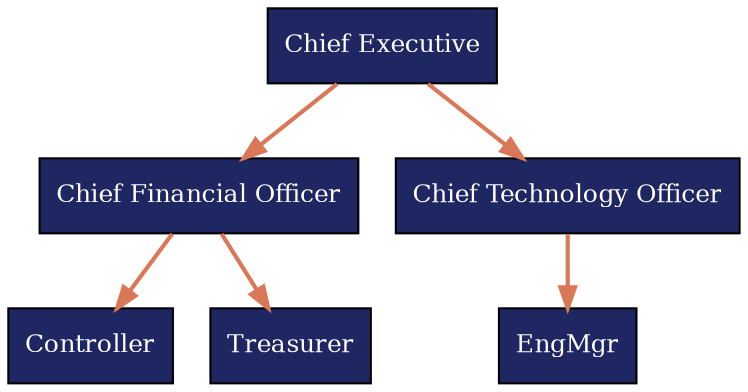

# Reference 07 — Infographics & Visual Methods

This reference documents the four methods for creating infographics in this skill. Every slide in a B2B deck must have a visual element; the four methods below cover the spectrum from editable-in-PowerPoint to pixel-perfect code-generated diagrams.

Each method has trade-offs: native shapes are light and editable; SVG renders are precise but locked; AI imagery provides impact but no technical fidelity; icons are reusable and on-brand.

---

## Decision Tree

Use this table to pick the right method for your slide's purpose.

| Purpose | Recommended Method | Why | Caveat |
|---|---|---|---|
| Process flow with 3–6 named steps | Native PPTX Shapes | Editable post-export; inherits theme colors | Can't handle complex curves; limited geometry |
| System architecture, 10+ nodes, dependencies | SVG via Mermaid or Graphviz | Automatic layout; pixel-perfect; supports arbitrary node counts | Not editable in PowerPoint; must align colors to theme |
| Title slide hero image, section divider, abstract background | AI-Generated Imagery | High visual impact; unique to your deck | Never contains text or logos; always review for quality |
| Capability row (3–5 items with short labels) | Icon Library (Lucide) | Consistent, professional, on-brand, fast to assemble | Icons must match theme's stroke weight and color |
| Data visualization (bar, line, donut, scatterplot) | Matplotlib/Plotly SVG OR Native PPTX Chart | SVG: precise control; Native: lighter, editable | Matplotlib must output theme colors |
| Organizational chart, reporting structure | Native PPTX Shapes | Clear hierarchy; avoids over-design | Manual layout; not suitable for 50+ nodes |
| Gantt chart, Sankey, advanced flow | SVG via D3.js or Graphviz | Supports dynamic data; automatic spacing | Requires JSON data input; render time longer |
| Callout box, highlighted stat, small annotation | Icon Library + Native Text | Fast assembly; low cognitive load | Icons must be restrained (max 32–48px) |

---

## Method 1 — Native PPTX Shapes

**Use when:** Process flows, org charts, swim lanes, 2×2 matrices, capability grids that the user might later customize in PowerPoint.

**Tools:** `python-pptx` (primary) or `pptxgenjs` (Node.js alternative).

**Strengths:**
- Editable after export — the user can move, resize, recolor shapes
- Small file size (XML primitives, no embedded images)
- Inherits theme colors without manual override
- Works in all PowerPoint versions back 10+ years
- No rendering dependency (no Chromium, no external server)

**Limitations:**
- Geometry restricted to rectangles, circles, arcs, lines, connectors
- No Bézier curves or complex SVG paths
- Circles must be perfect; ellipses require workaround
- Connectors don't auto-route around obstacles
- Text-in-shapes has limited formatting (no multi-color inline, no em-dash ligatures)

**Code Pattern: 4-Step Process Flow**

```python
from pptx import Presentation
from pptx.util import Inches, Pt
from pptx.enum.shapes import MSO_SHAPE
from pptx.dml.color import RGBColor

prs = Presentation('template.pptx')
slide = prs.slides.add_slide(prs.slide_layouts[6])  # blank layout

# Theme colors
PRIMARY = RGBColor(0x1E, 0x27, 0x61)  # Trust Navy
ACCENT = RGBColor(0xD9, 0x77, 0x57)

# Step 1: Draw 4 boxes
step_positions = [
    (Inches(1.0), Inches(3.0)),
    (Inches(3.0), Inches(3.0)),
    (Inches(5.0), Inches(3.0)),
    (Inches(7.0), Inches(3.0))
]

box_width, box_height = Inches(1.2), Inches(1.2)
for i, (x, y) in enumerate(step_positions, start=1):
    # Draw rounded rectangle
    shape = slide.shapes.add_shape(
        MSO_SHAPE.ROUNDED_RECTANGLE,
        x, y, box_width, box_height
    )
    shape.fill.solid()
    shape.fill.fore_color.rgb = PRIMARY
    shape.line.color.rgb = PRIMARY
    
    # Add text
    text_frame = shape.text_frame
    text_frame.text = f"Step {i}"
    text_frame.paragraphs[0].font.size = Pt(14)
    text_frame.paragraphs[0].font.bold = True
    text_frame.paragraphs[0].font.color.rgb = RGBColor(255, 255, 255)

# Step 2: Draw connecting arrows between boxes
for i in range(len(step_positions) - 1):
    x_start = step_positions[i][0] + box_width
    y_start = step_positions[i][1] + (box_height / 2)
    x_end = step_positions[i + 1][0]
    y_end = step_positions[i + 1][1] + (box_height / 2)
    
    connector = slide.shapes.add_connector(1, x_start, y_start, x_end, y_end)
    connector.line.color.rgb = ACCENT
    connector.line.width = Pt(2)

prs.save('output.pptx')
```

**Swim Lane Pattern:** Use rows (separate grouped shapes) for each actor or phase. Each row is a rectangle spanning slide width; shapes within inherit the row's background shade (10% primary fill).

**2×2 Matrix Pattern:** Four quadrants (2px line, primary stroke) labeled with axis headers. Content placed in quadrants as text boxes or small grouped shapes.

**When NOT to use Native PPTX:**
- Org charts with 30+ nodes (manual layout becomes tedious)
- Diagrams with curved arrows or Bézier paths
- System architecture requiring automatic layout
- Time-series or dependency graphs (no auto-route)

---

## Method 2 — SVG/PNG via Code

### Mermaid (Best for system architecture, flowcharts, sequence diagrams)

**Use when:** System architecture with 10+ components, sequence diagrams, UML-style flowcharts.

**Strengths:**
- Natural syntax for graphs (nodes, edges, labels)
- Automatic layout algorithm (no manual x, y)
- Supports subgraphs, clusters, styling
- Renders to SVG or PNG via CLI or Puppeteer
- Small text size

**Caveat:** Mermaid's default colors must be overridden. The deck's theme colors must be passed into the config.

**Render Pattern:**

```bash
# Install mermaid-cli
npm install -g @mermaid-js/mermaid-cli

# Create diagram.mmd
graph LR
    A[API Gateway] -->|Route| B[Auth Service]
    A -->|Route| C[Content Service]
    B -->|Validate| D[Token Cache]
    C -->|Read| E[Database]
    style A fill:#1E2761,stroke:#D97757,color:#fff
    style B fill:#1E2761,stroke:#D97757,color:#fff
    style C fill:#1E2761,stroke:#D97757,color:#fff
    style D fill:#CADCFC,stroke:#1E2761,color:#141413
    style E fill:#CADCFC,stroke:#1E2761,color:#141413

# Render to PNG
mmdc -i diagram.mmd -o diagram.png -w 1200 -H 700 -c '{"theme": "neutral"}'
```

**Pass Theme Colors to Mermaid:**

Create a `mermaid-config.json`:

```json
{
  "theme": "neutral",
  "primaryColor": "#1E2761",
  "primaryTextColor": "#ffffff",
  "primaryBorderColor": "#D97757",
  "secondaryColor": "#CADCFC",
  "secondaryTextColor": "#141413",
  "secondaryBorderColor": "#1E2761",
  "tertiaryColor": "#ffffff",
  "tertiaryTextColor": "#141413",
  "lineColor": "#5C5C5C",
  "textColor": "#141413",
  "fontSize": "16px",
  "fontFamily": "sans-serif"
}
```

Pass to CLI:

```bash
mmdc -i diagram.mmd -o diagram.png --configFile mermaid-config.json
```

**Embed in PPTX:**

```python
from pptx.util import Inches

slide = prs.slides.add_slide(prs.slide_layouts[6])
left, top = Inches(0.5), Inches(1.5)
pic = slide.shapes.add_picture('diagram.png', left, top, width=Inches(9))
```

**Output format:** SVG preferred (native PowerPoint support since 2019, smaller file); PNG acceptable if compressed (use `--scale 1` in mermaid-cli to reduce dimensions).

### D3.js (Best for custom data-driven visualizations)

**Use when:** Interactive-style network graphs, hierarchical trees, bubble charts, or any diagram tied to live data.

**Strengths:**
- Data-driven rendering (JSON input → shape positions)
- Arbitrary SVG geometry (curves, arcs, paths)
- Color gradients and advanced styling

**Caveat:** Requires Puppeteer or similar headless browser; slower render time.

**Minimal Example:**

```javascript
// chart.js
const d3 = require('d3');
const fs = require('fs');
const JSDOM = require('jsdom').JSDOM;

const theme = {
  primary: '#1E2761',
  accent: '#D97757',
  secondary: '#CADCFC'
};

const data = [
  { name: 'Node A', value: 10 },
  { name: 'Node B', value: 20 },
  { name: 'Node C', value: 15 }
];

const dom = new JSDOM('<svg></svg>');
global.window = dom.window;
global.document = dom.window.document;

const width = 1200, height = 600;
const svg = d3.select(dom.window.document.querySelector('svg'))
  .attr('width', width)
  .attr('height', height);

// Render circles
svg.selectAll('circle')
  .data(data)
  .enter()
  .append('circle')
  .attr('r', d => d.value * 2)
  .attr('cx', (d, i) => 200 + i * 300)
  .attr('cy', height / 2)
  .attr('fill', theme.primary);

// Output SVG
fs.writeFileSync('chart.svg', dom.serialize());
```

Render with Puppeteer to PNG if needed:

```javascript
const puppeteer = require('puppeteer');
const browser = await puppeteer.launch();
const page = await browser.newPage();
await page.goto('file:///path/to/chart.html');
await page.screenshot({ path: 'chart.png', omitBackground: true });
await browser.close();
```

### Matplotlib / Plotly (Python, for data charts)

**Use when:** Business charts (bar, line, donut, scatter) where data is tabular.

**Strengths:**
- Native Python; no external rendering service
- Supports all standard chart types
- Theme colors passed directly to palette

**Example:**

```python
import matplotlib.pyplot as plt
from matplotlib import rcParams

# Theme colors
primary = '#1E2761'
accent = '#D97757'
secondary = '#CADCFC'

# Sample data
categories = ['Q1', 'Q2', 'Q3', 'Q4']
values = [45, 52, 48, 61]

fig, ax = plt.subplots(figsize=(10, 6))
ax.bar(categories, values, color=primary, edgecolor=accent, linewidth=1.5)
ax.set_ylabel('Revenue (M)', color=primary, fontweight='bold')
ax.set_title('Quarterly Performance', color=primary, fontweight='bold', fontsize=14)
ax.spines['top'].set_visible(False)
ax.spines['right'].set_visible(False)

plt.tight_layout()
plt.savefig('chart.svg', format='svg', facecolor='white', edgecolor='none', dpi=150)
plt.close()
```

**Output as SVG:** `format='svg'` preserves theme colors and allows post-export editing in Inkscape or Adobe Illustrator. PNG is acceptable for charts that won't be edited.

### Graphviz / DOT (For org charts and dependency graphs)

**Use when:** Organizational hierarchies, dependency trees, or call graphs where hierarchical layout is critical.

**Example:**



Render:

```bash
dot -Tpng orgchart.dot -o orgchart.png
# or for SVG:
dot -Tsvg orgchart.dot -o orgchart.svg
```

---

## Method 3 — AI-Generated Imagery

**Use when:** Title slide hero, section dividers, abstract backgrounds that provide visual energy without technical accuracy.

**Engine — เลือก skill ตามงาน:**
| งาน | engine | skill (เปิดตัวนี้) |
|---|---|---|
| hero/divider/background ภายใน เร็ว | **Gemini image** (rlabs/gemini-mcp · Nano Banana Pro) `mcp__gemini__gemini-generate-image` | `nanobanana-connection` |
| image/video/3D/audio ทั่วไป, 4K hero, animate, motion | **Higgsfield** (GPT Image 2 / Seedance 2.0 / Nano Banana Pro / Kling 3.0) | **`higgsfield-generate`** |
| product shot / DTC ad / brand visual (10 modes) | **Higgsfield product-photoshoot** (GPT Image 2 enhanced) | **`higgsfield-product-photoshoot`** |
| character/avatar คงหน้าข้ามหลายสไลด์ | **Higgsfield Soul ID** → chain `--soul-id` เข้า generate | **`higgsfield-soul-id`** |
| marketplace listing card / A+ content (e-commerce) | **Higgsfield marketplace-cards** | **`higgsfield-marketplace-cards`** |

> **เลือกอย่างไร:** ภาพ hero/พื้นหลังภายในที่ไม่ต้อง 4K → **nanobanana** (เร็ว, quota Google, ไม่เปลืองเครดิต). งานคุณภาพสูง/video/ad/brand/character → **Higgsfield official skill** ที่ตรงงาน (generate ทั่วไป · product-photoshoot ภาพสินค้า · soul-id avatar · marketplace-cards e-commerce) — credit-based, **preflight cost (`hf generate cost` / `get_cost: true`) ก่อนสั่ง**. การต่อ/auth/execution-path (CLI Claude Code · MCP Desktop/Web) → `higgsfield-connection`. deliverable-gen-agent (เจนนี่) bind ครบทั้ง connection + 4 official + MCP แล้ว — เรียกได้ตอน build deck.

**When NOT to use:**
- Any diagram claiming to show the customer's actual system
- Any technical specification or architecture diagram
- Any slide with numerical claims (use data charts instead)
- Any context where inaccuracy could harm credibility

**Prompt Pattern:**

```
Wide editorial photograph of [scene] with [activity], 
in a [color mood] palette, photographed in style of [photographic tradition], 
high resolution, professional, no text, no logos, no people's faces visible.
```

Examples:
- "Wide editorial photograph of a modern office lobby with natural light streaming through tall windows, in a cool blue and steel grey palette, photographed in style of architectural photography, high resolution, no text, no logos."
- "Wide photograph of abstract geometric shapes and data flows in soft Trust Navy and coral tones, in style of contemporary illustration, high resolution, clean, no text."

**Constraints:**
- Never request text in the prompt (AI struggles; PowerPoint text placement is cleaner)
- Never request logos or brand marks
- Avoid stock-photo clichés: handshakes, businesspeople in suits at conference tables, diverse hands in a circle, generic "teamwork"
- Use "no faces visible" or "no people" if human subjects could distract

**Workflow:**

1. Generate 3–5 candidate images (different seeds / variations)
2. Preview each in context (does the color palette match the theme?)
3. Select one; download at highest available resolution
4. Place on slide at 70–100% slide width
5. Overlay with a semi-transparent shape (10–20% opacity, primary color) to ensure text legibility

**Output format:** PNG at 300 dpi minimum for print; 150 dpi acceptable for screen-only decks. File size typically 1.5–3 MB; compress with tinypng.com if > 4 MB.

**Example placement code:**

```python
# Add hero image
left, top, width = Inches(0), Inches(0), slide.slide_width
pic = slide.shapes.add_picture('hero.png', left, top, width=width)

# Add semi-transparent overlay for text legibility
overlay = slide.shapes.add_shape(
    MSO_SHAPE.RECTANGLE,
    left, top, width, slide.slide_height
)
overlay.fill.solid()
overlay.fill.fore_color.rgb = PRIMARY  # Trust Navy
overlay.fill.transparency = 0.85  # 15% opacity
overlay.line.fill.background()

# Move overlay behind hero
slide.shapes._spTree.remove(overlay._element)
slide.shapes._spTree.insert(2, overlay._element)

# Add title text on top
title_box = slide.shapes.add_textbox(Inches(0.5), Inches(2), Inches(9), Inches(2))
text_frame = title_box.text_frame
text_frame.text = "Strategic Initiative"
text_frame.paragraphs[0].font.size = Pt(54)
text_frame.paragraphs[0].font.bold = True
text_frame.paragraphs[0].font.color.rgb = RGBColor(255, 255, 255)
```

---

## Method 4 — Icon Library

**Library:** Lucide (default, MIT license, ~1,500 icons) at https://lucide.dev

**Alternatives:**
- Material Symbols (Google, Apache 2.0, full icon library + glyph fonts)
- Tabler Icons (MIT, 4,600+ solid and outline icons)
- Heroicons (Tailwind Labs, MIT, minimal but high-quality)

**Use when:**
- Capability rows (3–6 items with labels below)
- Step-by-step visual agendas (icon + label pairs)
- Callout highlights (icon + short text)
- Feature lists (icon grid with short descriptions)

**Sizing Guidelines:**

| Context | Size | Notes |
|---|---|---|
| Icon row (5 icons per row) | 48px | Includes 8–12px padding around |
| Inline with text (within paragraph) | 24px | Baseline-aligned |
| Hero icon (single, section-level) | 64–80px | Centered, with breathing room |
| Small callout (tip, warning) | 32px | Next to 1–2 lines of text |

**Color Application:**

- **Stroke color:** Match theme primary or accent (no fill)
- **Fill:** Rare; use only for "active" or "highlighted" state
- **Container background:** Filled circle (10% opacity of theme accent) behind the icon

**Signature Container Pattern:**

```python
# 48px icon in 64px circle with 10% accent fill
container_size = Inches(0.667)
x, y = Inches(1.0), Inches(1.0)

# Circle background
circle = slide.shapes.add_shape(MSO_SHAPE.OVAL, x, y, container_size, container_size)
circle.fill.solid()
circle.fill.fore_color.rgb = ACCENT  # e.g., #D97757 (Trust Navy accent)
circle.fill.transparency = 0.9  # 10% opacity
circle.line.color.rgb = ACCENT
circle.line.width = Pt(1)

# SVG icon embedded on top (8px inset)
icon_svg = load_svg('lucide/chart-bar.svg')  # e.g., 48px export
icon_pic = slide.shapes.add_picture(
    icon_svg, x + Inches(0.05), y + Inches(0.05), width=Inches(0.57)
)
```

**Storage:** Keep all Lucide icons in `/assets/icons/lucide/` as SVG files (uncompressed, for offline build independence). Download from Lucide website; rename to kebab-case (e.g., `chart-bar.svg`).

**Icon Selection for B2B Themes:**

| Theme | Icon Style | Examples |
|---|---|---|
| Trust Navy | Sharp, minimal stroke (1.5–2px) | chart-bar, shield, lock, trending-up |
| Civic Indigo | Authoritative, heavier stroke | checkmark, clipboard, award, file |
| Steel Forge | Industrial, geometric | settings, wrench, zap, box |
| Calm Teal | Rounded corners, humanistic | heart, user, users, smile |
| Vibrant Coral | Bold, energetic | zap, flame, star, rocket |
| Future Slate | Ultra-minimal, elegant | code, package, terminal, github |
| Signal Magenta | Dynamic, layered | signal, broadcast, megaphone, send |
| Scholar Olive | Refined, serif-friendly | book, lightbulb, microscope, pen-tool |
| Heritage Burgundy | Sophisticated, minimal | crown, feather, pen, bookmark |

**Anti-Patterns:**
- Don't mix icon families (e.g., Lucide + Material in same deck)
- Don't use colorful, cartoony icon packs (clashes with professional themes)
- Don't exceed 6 icons per slide (cognitive overload)
- Don't scale icons below 20px (illegible)
- Don't place icons without breathing room (min 8px padding on all sides)

---

## Theme Alignment & Color Passing

All four methods must consume the active theme's color palette. Store theme colors in a JSON file at `assets/themes/active-theme.json`:

```json
{
  "name": "Trust Navy",
  "primary": "#1E2761",
  "secondary": "#CADCFC",
  "accent": "#D97757",
  "background": "#FFFFFF",
  "text": "#141413",
  "muted": "#6E6B66",
  "chart_palette": ["#1E2761", "#D97757", "#CADCFC", "#6E6B66"]
}
```

**Mermaid config pattern:**
```javascript
const theme = JSON.parse(fs.readFileSync('assets/themes/active-theme.json'));
const mermaidConfig = {
  theme: 'neutral',
  primaryColor: theme.primary,
  primaryTextColor: '#ffffff',
  primaryBorderColor: theme.accent,
  // ... pass all tokens to Mermaid's config
};
```

**Matplotlib pattern:**
```python
theme = json.load(open('assets/themes/active-theme.json'))
plt.rcParams['axes.facecolor'] = theme['background']
plt.rcParams['axes.edgecolor'] = theme['primary']
colors = [theme['primary'], theme['accent'], theme['secondary']]
ax.bar(categories, values, color=colors[0])
```

---

## Performance & File Size

| Method | File Size Per Slide | Notes |
|---|---|---|
| Native PPTX | < 100 KB | XML primitives; best for complex decks |
| SVG embed | 50–300 KB | Preferred; vector scale-free; supported in modern PPTX |
| PNG embed (150 dpi) | 200–800 KB | Acceptable for screen; watch cumulative size |
| PNG embed (300 dpi) | 800 KB–2 MB | Print quality; use sparingly |
| AI-generated hero (PNG) | 1–3 MB | Compress with tinypng.com |
| Icon library (SVG) | 5–50 KB per icon | Negligible; reuse across slides |

**Recommendation:** Prefer SVG over PNG when the rendering tool supports it (D3, Mermaid, Matplotlib). Reserve PNG for cases where SVG export is not available or for final print delivery.

---

## Anti-Patterns

**Don't:**
- Use stock-photo businesspeople or generic handshakes (Method 3)
- Generate AI imagery with embedded text (illegible, often broken)
- Use clip-art-style icons with cartoony fills and thick outlines
- Override Mermaid's default colors without passing theme JSON
- Place 12+ icons on one slide (visual noise)
- Mix icon families within a deck (e.g., Lucide on one slide, Material on another)
- Embed PNG at 300 dpi for every chart (bloats file to unusable size; 150 dpi is sufficient for screen)
- Use "AI-generated imagery" for technical accuracy claims (always use data charts or system diagrams instead)
- Create native PPTX org charts with 50+ nodes (manual layout is unmaintainable; switch to Graphviz)

---

## Quick Reference: Which Method?

| Situation | Method | Reason |
|---|---|---|
| "I need the customer to edit this after I hand off the deck" | Native PPTX | Only editable method |
| "I have a system with 15 components and dependencies" | SVG (Mermaid or D3) | Automatic layout; pixel-perfect |
| "I need a beautiful title slide with visual impact" | AI-Generated (hero) | Unique, high-impact, saves design time |
| "I need to show 4 key capabilities" | Icon Library | Fast, consistent, on-brand |
| "I need a bar chart with live data" | Matplotlib/Plotly | Programmatically data-driven; theme-aligned |
| "I need a 4-step process flow that looks professional" | Native PPTX | Editable; inherits theme; no rendering dependency |
| "I need an org chart with 25 people" | Graphviz | Automatic hierarchy; scales; outputs SVG |
| "I need a data-driven network visualization" | D3.js | Arbitrary geometry; color mapping; interactive-ready |

---

**End of 07-infographics.md.** Continue to `06-data-driven-slides.md` for real-time chart integration, or `08-color-system.md` for theme color detail.
